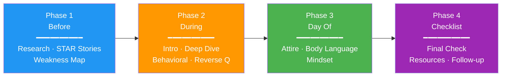
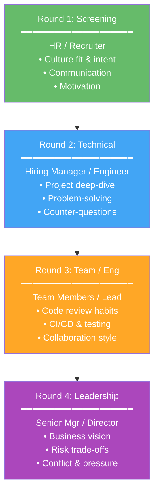
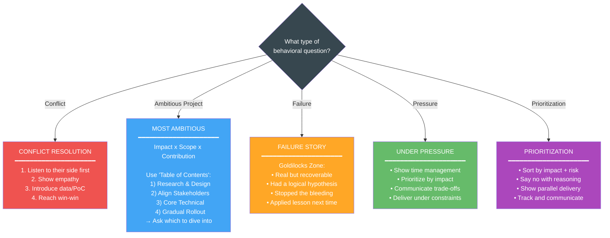
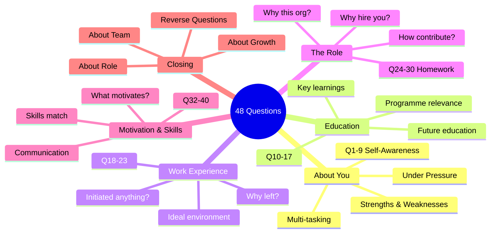

# Interview Guide

Your one-stop interview workflow. From preparation to interview day to follow-up — everything's here.

> **Source of truth**: `kb/*.yaml` and `projects/*/facts.yaml`
> **Full oral scripts**: `core/BehavioralCommonQA.md` (STAR complete answers)

---

# Phase 1 — Before the Interview



---

## Core Interview Mindset (CITANZ Mentorship)

> 🖊️ NZ 面试是**双向选择**，不是单方面被考核。技术过硬 ≠ 一定拿 offer，雇主更看重你能否让团队变得更强。

- **价值导向**：跳出技术术语，用商业语言说明你如何解决业务痛点。定位自己为"解决方案提供者"，而非"答题的候选人"。
- **结论先行**：先抛结论，再层层递进讲方案和结果。背景描述不超过回答时长的 1/3。
- **软技能是决定性因素**：成长型思维（面对未知展示学习路径）、结构化解决问题（而非"直接问 AI/Google"）、Senior 视角（技术决策对产品/架构/团队的长期影响 + 任务拆解与授权）。

---

## 1.1 Job Application Process

### When You Get a JD — 3 Things to Think About
1. What **attracts** me to this company? (**Product**, **values**, **culture**)
2. What key **requirements** does the JD list?
3. What experiences do I have that directly match?

### CV Principles

- Write using the **JD's language**, but express it through **your own experience**
- Full CV guide, action verbs list, Cover Letter structure → see [CareerBook.md §8](CareerBook.md)
- Every bullet: "**what you did** + **result**"
- Only write what's relevant to the role, don't spread all experiences evenly
- **Quantify everything** — prepare a few key stories with numbers
- Keep building projects and put them on your CV; get them **live/deployed** if possible
- Use GitHub as your portfolio showcase — active code speaks louder than keywords
- Startup/创业 projects: consider carefully whether to include — not always加分
- Major-to-job relevance matters — highlight alignment where it exists

### After Applying
- No response in 1 week → polite **follow-up**
- Keep LinkedIn **updated**
- Network in **parallel**

> 🖊️ **My notes:** 
> Recruiters are **flooded** with AI-generated CVs. Stand out through personal narrative — **website**, connect, **chat**, tell your story. Structure yourself, explain clearly in English, **sell your value** to the company. Reduce keyword stuffing, reduce "AI feel". Emphasize ability and technology through stories, not keyword lists.

---

## 1.2 Company & Role Research

Before any interview:
- [ ] Read company website — **products, values, recent news**
- [ ] Check **LinkedIn** — company page, employees in similar roles
- [ ] Read recent news or blog **posts**
- [ ] Map **JD keywords** to your own experience
- [ ] **Prepare 2–3 questions** that show you did your homework


---

## 1.3 Story Framework — STAR & CARL

### Core Philosophy

Behavioral interviewing is the most common interview format in NZ. **How you handled problems in the past = how you'll handle them in the future.**

### 🖊️ Response Structure Pattern
When answering any question, follow this flow:
1. **结论 (Conclusion)** — State your answer up front
2. **主题 (Topic)** — Frame the context briefly
3. **细化 (Details)** — Elaborate with specifics
4. **补充 (Supplement)** — Add supporting evidence
5. **强化 (Reinforce)** — Tie back to the role/business value

This keeps answers structured, concise, and impactful — no filler.

### STAR Method — Classic

| Step | Meaning | Weight |
|---|---|---|
| **S / T** | Situation / Task — Scenario + task | 10% |
| **A** | Action — **What you** specifically did | 60% |
| **R** | Result — Outcome + quantification + reflection | 30% |

**Key:** Tell specific, particular situations — don't be vague. One real case + your specific actions + positive results.

> 🖊️ **Personal note:** Speak with structure and hit the key points — no filler. Practice at home, **record yourself**, listen back, and iterate. YouTube videos are helpful references, but real interviews feel different — be relaxed and conversational, not robotic.

### CARL Framework — Advanced (for experienced candidates)

| Step              | Meaning                                                                                                                   | Weight |
| ----------------- | ------------------------------------------------------------------------------------------------------------------------- | ------ |
| **C — Context**   | Situation + Task in one. Keep to ~10%. Interviewers pattern-match quickly; don't overload with jargon.                    | 10%    |
| **A — Action**    | **Must be 60%.** Describe what *you* did — research, alignment, decomposition, empowerment. Replace "we" with "I".        | 60%    |
| **R — Result**    | Hard business data (e.g. latency reduced 50%) **and** relationship state — did collaborators want to work with you again? | 20%    |
| **L — Learnings** | System-level insight, management model improvements. This separates senior from junior.                                   | 10%    |

### 8 Capability Dimensions

| Dimension | What the interviewer is asking |
|---|---|
| **Problem Solving** | Anticipating problems? Handling unexpected obstacles? |
| **Decision Making** | Major decisions and influencing factors? |
| **Leadership** | Leadership style? Team success stories? |
| **Team Work** | Your team role? Handling disagreements? |
| **Initiative** | Taking initiative? Going beyond your role? |
| **Communication** | Strengthening relationships? Conveying complex information? |
| **Conflict Resolution** | Handling conflict? Mediating disputes? |
| **Adaptability** | Working under pressure? Juggling multiple tasks? |

### Big Tech 4 Quadrants (Ex-Meta / Ex-Amazon Rubric)

| Quadrant | What They're Looking For |
|---|---|
| **Initiative & Perseverance** | Proactively identify ambiguous, long-term problems and drive through difficulty |
| **Conflict Resolution & Empathy** | Reach win-win aligned with business goals — not just "win the argument" |
| **Communication & Judgment** | Choose the right channel; show clear, rational logic |
| **Growth Mindset** | Reflect honestly, accept failure, turn it into future action |

### Preparation Strategy
- At least 1 story per capability
- No full-time experience → university projects / part-time work / volunteering all count
- Practice telling a complete STAR in 2 minutes

### How Behavioral Interviews Determine Leveling

| Level | Story Scope |
|---|---|
| **L4 & below** | Feature-level (1–4 weeks), guided by precedent |
| **L5 (Senior)** | Project-level (1–3 months), cross-functional, technical leadership |
| **L6+ (Staff/Principal)** | Strategic/organisational change (6–12+ months), breaking team boundaries, systemic solutions |

### STAR vs CARL — Side by Side

```
┌─────────────────────────────────────────────────────────┐
│                    STAR (Classic)                        │
├──────────┬──────────────────────────────┬───────────────┤
│   S/T    │           A                  │       R       │
│ Context  │       Action                 │    Result     │
│  10%     │       60%                    │     30%       │
└──────────┴──────────────────────────────┴───────────────┘
         ↓ Add "L" layer ↓
┌──────────┬──────────────────────────────┬───────┬───────┐
│    C     │           A                  │   R   │   L   │
│ Context  │       Action                 │Result │Learn- │
│  10%     │       60%                    │ 20%   │ ings  │
└──────────┴──────────────────────────────┴───────┴───────┘
                                    10%

  STAR  = Action-heavy + Result.      Great for mid-level.
  CARL  = Adds Learnings layer.       Shows SYSTEM thinking → Senior signal.
  ━━━━━━━━━━━━━━━━━━━━━━━━━━━━━━━━━━━━━━━━━━━━━━━━━━━━━━━━
  KEY: 60% must always be ACTION — what YOU did, not the team.
```

---

## 1.4 🖊️ My Key Stories — Master Table

Map each story to the capabilities it covers:

| Story Name | Capabilities | STAR/CARL Outline | Ready? |
|---|---|---|---|
| *(e.g. Release config failure)* | Failure, Adaptability | S: ..., T: ..., A: ..., R: ... | ☐ |
| *(e.g. Technical direction conflict)* | Conflict Resolution, Communication | S: ..., T: ..., A: ..., R: ... | ☐ |
| *(e.g. Multi-project delivery)* | Prioritization, Problem Solving | S: ..., T: ..., A: ..., R: ... | ☐ |
| | | | ☐ |

### Recommended Main Storylines to Prepare
- **Failure:** Release config accidentally pointed to test environment
- **Conflict:** Review style or technical direction disagreement
- **Pressure:** Post-launch bug flood or on-site issues
- **Prioritization:** Multi-project parallel — sort by impact and risk

---

## 1.5 🖊️ My Weakness Map

| Weakness | Why It's Not Fatal | How I'm Addressing It |
| -------- | ------------------ | --------------------- |
|          |                    |                       |
|          |                    |                       |

---

## 1.6 🖊️ Interview Rounds Structure (Typical NZ)

Most companies run **3–4 rounds**. Each tests different signals:

| Round | Who | What They Assess |
|---|---|---|
| **1. Screening** | HR/Recruiter | Risk, intent, motivation, culture fit — company situation, rapport building, flexible expression |
| **2. Technical** | Hiring Manager / Engineer | Technical ability, problem-solving approach, teamwork — core project deep-dive, business value, follow-up questions |
| **3. Team / Engineering** | Team members / Lead | Engineering practices, code quality, CI/CD habits, testing culture, collaboration style |
| **4. Leadership** | Senior manager / Director | Long-term vision, business perspective, self-drive, risk awareness, conflict management, 4-quadrant thinking, pressure handling |

### Key Takeaways
- **Round 1** is about vibe & intent — be natural, adapt on the fly, mention similar projects
- **Round 2** is the hardest gate — prepare deep project dives with business value, be ready for **counter-questions** (深挖)
- **Round 3** tests your daily engineering habits — code review style, testing approach, release workflow
- **Round 4** is big picture — talk about org change, risk trade-offs, process management, show structured thinking with frameworks (方法论)

### Adjust Your Pitch by Round
- Different rounds → different granularity
- Recruiter: high-level, motivation, culture
- Engineer: technical depth, trade-offs, architecture
- Manager: business impact, leadership, risk

### Interview Round Progression — Who Assesses What



---

### 🖊️ Self-Introduction — Layered Delivery

| Principle | What It Means |
|---|---|
| **Layer by seniority** | Progressive depth, hit key points, back with **evidence**, show genuine **interest** — never a chronological list |
| **Main line + branches** | One core narrative → branch into strengths, achievements, interests, why NZ |
| **Show confidence** | Own your experience, don't apologise |
| **Tailor to audience** | Different person → different granularity, different emphasis |

### Self-Introduction Layering — Build Depth on Demand

```
  ┌─────────────────────────────────────────────────────────┐
  │  30s — RECRUITER                                       │
  │  ┌───────────────────────────────────────────────────┐  │
  │  │ "I'm a senior software engineer with 7+ years in │  │
  │  │  Android & backend. I build systems that ship."   │  │
  │  │         Role + Scope + Energy signal              │  │
  │  └───────────────────────────────────────────────────┘  │
  │           ↓ if they lean in ↓                           │
  │  1min — HIRING MANAGER                                  │
  │  ┌───────────────────────────────────────────────────┐  │
  │  │ + 2-3 high-impact results with numbers            │  │
  │  │ + Cross-team ownership examples                   │  │
  │  │ + Why this role / team fits next step             │  │
  │  └───────────────────────────────────────────────────┘  │
  │           ↓ if they want more ↓                         │
  │  3min — TECHNICAL INTERVIEW                             │
  │  ┌───────────────────────────────────────────────────┐  │
  │  │ + Full career arc with technical decisions        │  │
  │  │ + Architecture choices & trade-offs               │  │
  │  │ + NZ context, long-term intent                    │  │
  │  └───────────────────────────────────────────────────┘  │
  └─────────────────────────────────────────────────────────┘

  RULE: Never jump to 3min unprompted. Read the room.
```

### 🖊️ General Interview Notes
- **Team collaboration > pure technology** — always frame answers around solving **business problems**
- **Research JD + network for insider pain points** — use Meetup/LinkedIn to find out what the team is struggling with
- **Prepare support materials** — methodology checklists, thought frameworks, ready to screen-share at any time
- **Have your "why NZ / why long-term" answer ready** — employers want stability signals
- **Keep interview "muscle" daily** — practice interviewing every day, do mock interviews, attend meetups
- **Quality reverse questions** — bookend the interview (opening + closing positioning), show how you create value
- **AWS + problem-solving framework** — short-term fix + long-term solution; backed by documentation and research
- **Every interviewer is evaluating:** what tech problems you solve, breadth of tech, application ability, depth of understanding, multi-dimensional conflict thinking, your **potential & ability to expand boundaries**
- **Culture fit matters in NZ** — show personality, life attitude, outdoor hobbies, individual character; support with real stories
- **Scan company QR codes** — browse company info during career fairs (check Prosple too)
- **Workshops / Summer of Tech** — register early, bring materials, target small companies; school career resources also matter
- **Startup / Hackathon experience** — builds breadth, shows initiative, great talking point
- **整个面试周期要保持感觉** — stay in rhythm, treat every conversation as practice

---

# Phase 2 — During the Interview

---

## 2.1 Opening: Self-Introduction

### Common Questions
- Tell me about **yourself**.
- Walk me through your **background**.
- **Why** are you looking for a **new role**?

### The Structure (Bucket + Twist Method)

1. **Bucket + Twist** (30s) — Slot yourself into a high-value category with a personal **passion**
2. **Accomplishments** (60s) — 2–3 high-**impact** results. **No life story or chronological career history.**
3. **Pass the Ball** (30s) — State **why** this role/team **fits** your next career move

### Framework Formula
> "I've spent [time] doing [education/work] → which developed [skill 1] + [skill 2] → I'm good at [strength] → I enjoy [team/people/challenge]"

### Reference Skeleton
- Who I am: Software engineering background, good at turning complex requirements into deliverable systems
- What I've done: Android, backend, system integration, AI/engineering delivery
- What I want now: Long-term stable engineering work in New Zealand

---

## 2.2 🖊️ My Self-Introduction Script

### 30s Version (Recruiter)
> *...*

### 1min Version (Hiring Manager)
> *...*

### 3min Version (Technical Interview)
> *...*

---

## 2.3 Technical Deep Dive

### Common Questions
- Tell me about a **complex** technical problem you solved.
- What is the biggest **technical** challenge you worked on?
- How do you design a system?

### Preparation Approach
- Start with problem **boundaries** → constraints → how you decomposed it
- Don't just list nouns — explain why you did it that way
- Must mention trade-offs: what you gave up, what you gained

### Template
- **Scenario:** System, users, constraints
- **Key decision:** What choice you made
- **Result:** Performance, stability, delivery rhythm changes
- **Reflection:** What you'd do better next time

> 🖊️ **My technical stories:**


---

## 2.4 Behavioral Question Playbook

### Common Behavioral Questions
- Tell me about a time you **failed**
- Tell me about a **conflict** with a teammate
- Tell me about a time you worked under **pressure**
- Tell me about a time you had to **prioritize** quickly

### Type 1: Conflict Resolution (with Co-workers/Manager)

**Subtext:** Tech companies believe constructive disagreement leads to better outcomes. They're checking *how* you resolve it.

**Story Selection (3 dimensions):**
1. **High Stakes** — Must matter to business outcome (not tabs vs spaces)
2. **Deeply Involved** — You were the core driver
3. **You were right** — Objective data/evidence proved you right

**Checklist:**
- Listen and understand their path first
- Show **empathy** for their constraints and motivations
- Introduce objective data, user research, or PoC

**Red Lines:**
- Don't **demonise** colleagues — the more rational they seem, the better your story
- If conflict with manager: don't complain. Position as a **thought partner**, not an automaton

### Type 2: Most Ambitious Project (Deep Dive)

**Subtext:** Tests your technical ceiling, end-to-end ownership, and ability to navigate ambiguity.

**Golden Formula:**
> Impact × Scope × Personal Contribution

**"Table of Contents" Method:**
After context, preview your structure:
> *"I drove this through four phases: 1) cross-team research & design; 2) aligning stakeholders & securing resources; 3) core technical work; 4) gradual rollout for production safety. Which phase would you like me to dive into?"*

This frames you as organised and senior-level while steering the interview.

### Type 3: Failure / Calculated Risk

**Subtext:** "Fail fast, pivot fast" culture. Claiming no failures signals dishonesty or lack of risk-taking.

**Goldilocks Zone:**
- Real and meaningful failure (speed-vs-quality trade-off, over-engineering, wrong assumptions)
- Recoverable
- Must have a **believable, logical hypothesis** at the time

**Perfect Close:**
- Show how you stopped the bleeding
- Show how you **applied this lesson in the next project**

### People Manager (EM) Bonus — Save for Later
1. **Define your Δ (delta):** What positive, sustainable change did you bring?
2. **Reject fluffy language:** Show specific behaviour, not buzzwords
3. **Stay technical:** System design and coding are hard gates even for managers

### Behavioral Question Decision Tree — Pick Your Formula



---

## 2.5 🖊️ My Behavioral Scripts

### Failure Story
> **Context:**
> **Action:**
> **Result:**
> **Learnings:**

### Conflict Story
> **Context:**
> **Action:**
> **Result:**
> **Learnings:**

### Project Deep Dive
> **Context:**
> **Action:**
> **Result:**
> **Learnings:**

---

## 2.6 Response Templates & Frameworks

### "Why work for us?" Formula
> "I believe in [mission/value] → I've always admired [specific thing] → from research I know [fact] → my experience confirms I match [quality]"

### "Tell me about your studies" Key Points
- List major + transferable skills
- Give examples of how you applied them
- Highlight what you're good at and interested in

### "Your long-term goals" Key Points
- Connect to company goals — what you can help the company achieve
- Prove you're an asset, not a stepping stone
- Skills gap → explain how you'll close it
- Ambitious but realistic

---

## 2.7 Cross-Team Collaboration

### Common Questions
- How do you connect with people in different roles?
- How do you work with product, design, QA?
- How do you handle conflicting stakeholder expectations?

### Response Direction
- First find common ground: everyone wants a usable deliverable
- Then translate language: technical risk into terms product and business can understand
- Finally establish rhythm: prototype, sync, review, acceptance

### Useful Expressions
- I try to make trade-offs visible early
- I translate technical risk into plain language
- I prefer one clear decision owner

---

## 2.8 Learning & Leadership

### Learning Questions
- First explain how you learn → how you validate → how you apply
- Don't just say "I read docs," say "what I ran, what I validated"
- Include a real project example

### Leadership & Mentoring
- Leadership isn't about title — it's about helping the team deliver consistently
- Mentoring: Break down tasks + give feedback + leave space
- Code Review: Focus on code, not person; focus on maintenance cost

> 🖊️ **My learning example:**
> *...*

---

## 2.9 48 High-Frequency Interview Questions — Quick Reference

### 48 Questions — Category Mind Map



---

### About You (Q1–9) — Self-Awareness

| #   | Question                       | Guidance                                                         |
| --- | ------------------------------ | ---------------------------------------------------------------- |
| 1   | Tell me about yourself         | Focus on **skills and role**, **not your entire** life story     |
| 2   | How would others describe you? | Demonstrate self-**awareness**                                   |
| 3   | Strengths/weaknesses?          | JD tells you which strength to pick; weakness real but not fatal |
| 4   | Where in 5 years?              | Tests **whether** you plan ahead                                 |
| 5   | Long-term career goals         | Same as above, give direction                                    |
| 6   | What frustrates you? How cope? | Key: Do you have coping strategies                               |
| 7   | Under pressure?                | Specific example                                                 |
| 8   | Meet deadlines?                | Time **management** methods                                      |
| 9   | Multi-task example             | Case study                                                       |

### About Education (Q10–17)

| #   | Question                       |
| --- | ------------------------------ |
| 10  | Extracurricular activities?    |
| 11  | Most important thing learned?  |
| 12  | Most rewarding experience?     |
| 13  | Why that programme?            |
| 14  | Best/least liked papers?       |
| 15  | Programme relevance to job?    |
| 16  | Study differently if possible? |
| 17  | Future education plans?        |

### About Work Experience (Q18–23)

| #   | Question                        | Guidance                                       |
| --- | ------------------------------- | ---------------------------------------------- |
| 18  | Previous work enjoyed/disliked? |                                                |
| 19  | **Initiated** anything new?     |                                                |
| 20  | Ideal work environment?         |                                                |
| 21  | Problem at work — how dealt?    |                                                |
| 22  | Performance criticised?         | Honest, objective, turn negative into positive |
| 23  | Why left last position?         | **Never badmouth former employer**             |

### About the Role (Q24–30) — Demonstrate Homework

| # | Question | Guidance |
|---|---|---|
| 24 | Why this position? | Focus on JD-specific responsibilities |
| 25 | Why this organisation? | Show you did your research |
| 26 | Why hire you? | Your unique selling point |
| 27 | What takes to succeed here? | Your understanding of how the company operates |
| 28 | How can you contribute? | Connect your skills to company needs |
| 29 | What do you wish to accomplish? | Career vision |
| 30 | Qualities you'd look for if hiring? | Your depth of understanding the role |

### About Motivation & Skills (Q32–40)

| #   | Question                            | Guidance                |
| --- | ----------------------------------- | ----------------------- |
| 32  | What motivates you?                 |                         |
| 33  | Most motivated when?                |                         |
| 34  | Most satisfying accomplishments?    |                         |
| 35  | Skills for this role?               | Link to role priorities |
| 36  | Experience in ...?                  | Direct JD match         |
| 37  | Time management?                    |                         |
| 38  | Communication difficulty — handled? | Both perspectives       |
| 39  | Team project — what worked/didn't?  |                         |
| 40  | Work in area of ...?                |                         |

---

## 2.10 Closing — Reverse Questions for Employer

**Don't** ask "What does a typical day look like?"
ask questions that show you're a **strategic** **thinker**.

### Questions About the Role
- What are the **top 3 goals** for this role in the **first 6 months**?
- What's the most **challenging aspect** of the job?
- How is performance **measured** in this role?
- What's the most important thing for a new person to **understand** in the first 3 months?

### Questions About the Team & Workflow
- Which teams does this role **collaborate** with most?
- What does the team's **workflow** look like?
- How do you do code review, CI/CD, and **release**?
- What's the team's biggest **delivery risk** right now?

### Questions About Growth & Culture
- How does the role **fit into** the department structure?
- What will **initial training** involve?
- Does the org support ongoing training?
- What are **promotion** **opportunities**?
- **How** did this job become **available**?

### Questions for the Hiring Manager
- What's your leadership style?
- How do you grow your people?
- What's the proudest battle your team has fought?


---

# Phase 3 — Interview Day

---

## 3.1 Attire & Body Language

### Attire
- Clean, neat, appropriate (Dress to Impress)
- Personal hygiene: fresh, no strong odors
- Clothes: washed and ironed

### Body Language — 5 Rules
1. Maintain **eye contact**
2. **Avoid** negative **expressions**
3. Demonstrate active **listening**
4. Posture **upright** but relaxed
5. No leg shaking or pen fiddling

### Mindset — Treat It Like a Chat
- Relax — once you've got the interview, the questions may **not be that deep**
- Treat it as a **conversation**, not an interrogation
- Know some **local culture and news** — a bit of humour goes a long way in NZ
- Being comfortable and authentic > memorising scripts

---

## 3.2 Smart Questions & Closing

### Smart Questions to Ask
- "What's the **most challenging aspect** of the job?"
- "How is **performance measured** in this role?"
- At least one **question** about the **company**

### Closing
- If they **don't bring up salary, you don't either**
- **Thank** the interviewer sincerely for their time
- **Clarify** next steps and **timeline**
- **Follow up!** Send a thank-you **email within 24 hours**

### 3P Confidence Rule

**Prepare → Practice → Perform**

---

## 3.3 🖊️ Post-Interview Reflection

| Question | My Notes |
|---|---|
| What questions did I handle well? | |
| What questions tripped me up? | |
| What should I prepare better next time? | |
| Any technical gaps exposed? | |
| Next steps / follow-up sent? | ☐ |

---

# Phase 4 — Final Checklist & Resources

---

## 4.1 Pre-Interview Final Check

- [ ] 1 primary **story** prepared per question type
- [ ] Each story can **articulate**: Problem / Action / Result / Reflection
- [ ] 2–3 **cross-team collaboration** expressions ready
- [ ] 1 **concise self-introduction** (30s version) ready
- [ ] 3–5 reverse questions prepared
- [ ] Researched the **company** (website + LinkedIn + recent news)
- [ ] **JD keywords** mapped to experiences
- [ ] If you don't know something, **say so — but can explain how you'd investigate**

---

## 4.2 Interview Resource Links

- [Awesome Behavioral Interviews](https://github.com/ashishps1/awesome-behavioral-interviews)
- [Tech Interview Handbook](https://www.techinterviewhandbook.org/behavioral-interview/)
- [Seek Career Advice](https://www.seek.co.nz/career-advice/article/common-interview-questions-and-how-to-answer-them)
