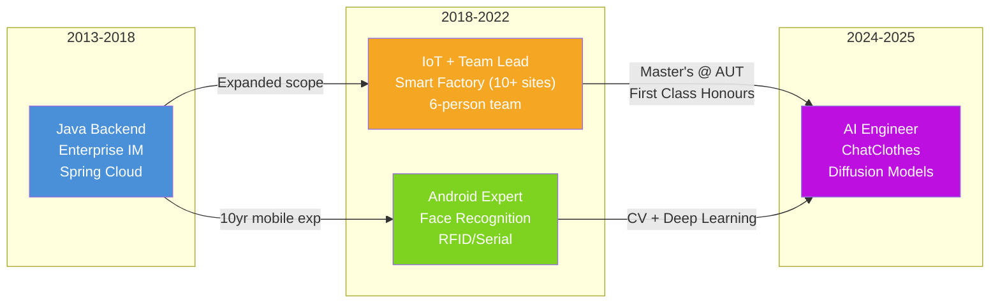
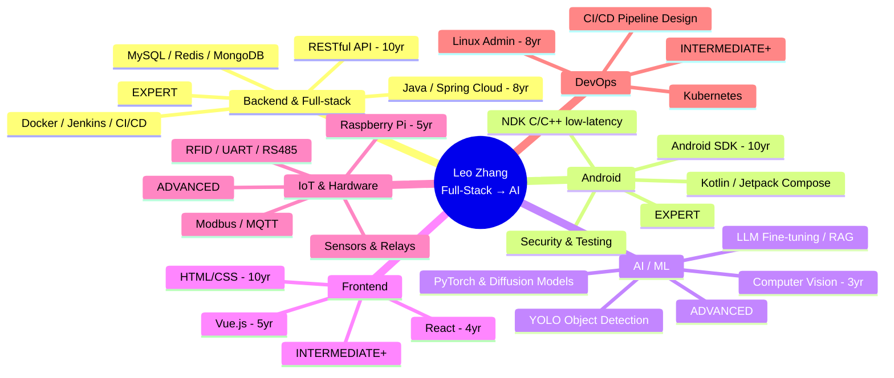
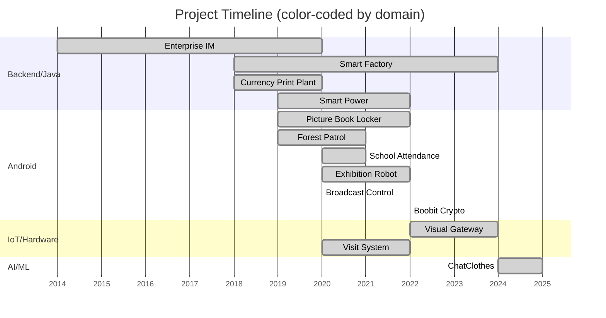

# Personal Facts Archive

> **Purpose:** Provide core facts about Leo Zhang for CV generation, interview preparation, job matching, and related scenarios.
> **Data sources:** `leozhang2056/leozhang2056` KB repo (profile.yaml, skills.yaml, achievements.yaml, project_relations.yaml, projects/*/facts.yaml)
> **Last updated:** 2026-06-09

---

## 1. Basic Info

| Item | Detail |
|------|--------|
| Chinese Name | 张玉超 |
| English Name | Yuchao Zhang (Leo Zhang) |
| Email | leozhang2056@gmail.com |
| Phone | +64 27 385 0794 |
| LinkedIn | https://www.linkedin.com/in/leo-zhang-305626280/ |
| GitHub | https://github.com/leozhang2056 |
| Location | Hillcrest, North Shore, Auckland, New Zealand (near Takapuna) |
| Visa Status | Post-Study Work Visa, eligible for full-time work |
| Working Languages | Chinese (native), English (professional working proficiency) |

### IDENTITY CARD

```
┌─────────────────────────────────────────────────────┐
│  ╔═══════════════════════════════════════════════╗   │
│  ║           LEO ZHANG · 张玉超                   ║   │
│  ║   Senior Software Engineer → AI Engineer      ║   │
│  ╚═══════════════════════════════════════════════╝   │
│                                                     │
│  📍  Auckland, NZ (Hillcrest)                       │
│  🎂  10+ yrs experience                             │
│  🎓  AUT Master (First Class Honours)               │
│  💼  Java → IoT/Tech Lead → AI/ML                   │
│                                                     │
│  CORE: Java · Android · Python · PyTorch · IoT      │
│  EDGE: Diffusion Models · Computer Vision · NDK     │
│                                                     │
│  ✉  leozhang2056@gmail.com                          │
│  📱 +64 27 385 0794                                 │
│  🔗  linkedin.com/in/leo-zhang-305626280            │
└─────────────────────────────────────────────────────┘
```

---

## 2. Education

### Auckland University of Technology (AUT) — Master of Computer and Information Sciences
- Period: 2024.07 – 2026.02 (completed)
- Honours: **First Class Honours**
- Research areas: Computer Vision, Diffusion Models, Large Language Models, Multimodal AI, AWS Infrastructure
- Thesis: Submitted and passed 6 months ahead of schedule
- Thesis link: http://hdl.handle.net/10292/20210

### Hebei University of Science and Technology — Bachelor of Software Engineering
- Period: 2009.07 – 2013.06
- Coursework: Data Structures, Algorithms, Java Programming, Database Systems, Software Engineering

### EDUCATION TIMELINE

```
2009                    2013                    2024        2026
  │                       │                       │           │
  ▼                       ▼                       ▼           ▼
  ┌───────────────────────┐                       ┌───────────┐
  │   B.Eng Software Eng  │    11 years industry   │  M.CIS    │
  │   Hebei Univ Sci&Tech │ ◄───────────────────► │  AUT      │
  │   (Java, Algorithms)  │    experience gap      │  (AI/CV)  │
  └───────────────────────┘                       └───────────┘
       FOUNDATION                              TRANSFORMATION
       "How to build"                          "How to build with AI"
```

> **Interview talking point:** The 11-year industry gap between degrees is a feature, not a gap. The Bachelor's gave me deep Java/backend fundamentals; the Master's was a deliberate pivot into AI, powered by a decade of real-world engineering judgment.

---

## 3. Career Positioning

**Current role:** AI Engineer (Python / Computer Vision)

**Core labels:**
- Full-stack Software Engineer, 10+ years experience
- AI/ML Engineer
- Android Developer
- Java Backend Engineer

**Career story arc:**
Started in enterprise Java backend and Android development → expanded to IoT integration and team leadership through smart factory projects → completed a full transition to AI engineering through master's research (ChatClothes virtual try-on system). Represents a complete career transformation from traditional software engineering to AI engineering.

**Target roles:** Full-stack Developer / AI Engineer / Android Developer / Intern / Graduate roles
**Preferred location:** Auckland, New Zealand
**Work preference:** Full-time, Onsite (North Shore area)
**Open to:** Willing to start as a delivery-focused full-stack engineer (including Junior title), as long as the team, mentorship, and AI/platform growth path are strong. Also open to **intern / graduate roles** as a pathway into the NZ market.

### CAREER ARC DIAGRAM



**Career arc narrated in one sentence:**
> "I spent 5 years building enterprise Java backends, then 4 years leading IoT/factory projects with a 6-person team across 10+ sites, and finally completed a full transition to AI engineering through an AUT Master's (First Class Honours) where I independently built a virtual try-on system published at IVCNZ 2025."

---

## 4. Core Skills Summary

### Backend & Full-stack (Expert)
- **Java / Spring Cloud** — 8+ years, microservice architecture, distributed systems
- **RESTful API** — 10 years, API design and implementation
- **MyBatis / Hibernate** — ORM data access
- **MySQL / Redis / MongoDB** — Multi-database experience
- **Docker / Jenkins / GitLab CI/CD** — Containerization and automated deployment
- **Nginx / Tomcat** — Load balancing and application deployment

### Android Development (Expert)
- **Android SDK** — 10 years, enterprise applications
- **Kotlin / Java** — Kotlin 5 years
- **Jetpack Compose / MVVM / Coroutines** — Modern Android architecture
- **NDK (C/C++)** — TCP/UDP protocols, low-latency communication
- **Android Security** — SSL/TLS, permission management, reverse analysis
- **Testing** — JUnit / MockK / Espresso

### AI / ML (Advanced)
- **PyTorch** — ChatClothes diffusion model implementation
- **OpenCV** — Image processing pipelines, 3 years
- **YOLO** — Object detection (clothing classification)
- **Diffusion Models** — Virtual try-on, ComfyUI integration
- **LLM Fine-tuning / RAG** — Large language model applications
- **Computer Vision** — 3 years, from traditional CV to deep learning

### Frontend
- **Vue.js** — 5 years, industrial dashboards
- **React** — 4 years
- **HTML/CSS** — 10 years

### DevOps & Systems
- **Linux System Administration** — 8 years (CentOS/Ubuntu)
- **Windows Server** — 10 years
- **Kubernetes** — Container orchestration
- **CI/CD Pipeline Design** — 5 years

### IoT & Hardware
- **RFID / Barcode / Serial Communication (UART/RS485/RS232)** — 6-7 years
- **Raspberry Pi** — 5 years, AI edge deployment
- **Sensors / Relays / Device Control** — Industrial automation
- **Modbus / MQTT** — Industrial protocols

### AI-Assisted Coding Tools
- **Cursor** — Expert-level, daily use
- **GitHub Copilot / Claude Code** — Advanced
- **OpenCode** — Intermediate

### SKILL DOMAIN MAP



**Depth at a glance:**
```
Expert ████████████████████  Backend (Java/Spring), Android (SDK/NDK)
Advan. ███████████████       AI/ML (PyTorch/CV), IoT (RFID/UART)
Inter. ██████████            Frontend (Vue/React), DevOps (K8s/Linux)
Tools  ████████████          AI Coding (Cursor/Copilot/Claude Code)
```

---

## 5. Project Experience Overview

### 🏭 Smart Factory System — 2018-2024
- **Role:** System designer, developer, maintainer
- **Scale:** Deployed to 10+ factories, 6-person cross-functional team
- **Tech stack:** Spring Cloud, Java, Vue.js, Docker, Jenkins, RFID, serial communication
- **Highlights:** 30%+ production efficiency improvement, long-term high-availability operation, scaled from single-site to multi-factory
- **Key capabilities:** Microservice architecture, IoT integration, team management, CI/CD, on-site delivery

### 💬 Enterprise Instant Messaging Platform — 2014-2020
- **Role:** Android developer, backend developer
- **Scale:** 5,000 DAU, 500K+ messages/day, <200ms latency
- **Tech stack:** Java, Spring Cloud, Android SDK, NDK, TCP/UDP
- **Key capabilities:** Real-time communication, high performance, enterprise-grade delivery

### 👗 ChatClothes Virtual Try-On System — 2024-2025
- **Role:** Independent developer (Master's thesis project)
- **Tech stack:** Python, PyTorch, Diffusion Models, LoRA, YOLO12n-LC, DeepSeek LLM, ComfyUI, Ollama, FastAPI, Raspberry Pi 5
- **Results:** 
  - FID 28.5 (19% improvement over baseline)
  - 75% reduction in hand artifacts
  - 94.2% classification accuracy
  - <10s latency on Raspberry Pi 5
  - 50-person user study, 87% success rate
- **Publication:** IVCNZ 2025 conference paper, DOI: 10.1109/IVCNZ67716.2025.11281834

### 🔌 Visual Gateway / Circuit Breaker Control — 2022-2024
- **Role:** Android gateway developer
- **Tech stack:** Kotlin/Java, RS232, Modbus RTU, MQTT, InfluxDB
- **Key capabilities:** Serial communication, edge computing, IoT architecture

### ⚡ Smart Power System — 2019-2022
- **Role:** Java backend & Android developer
- **Results:** 15% energy savings, <1s alert response, 99.9% data collection rate
- **Tech stack:** Spring Cloud, InfluxDB, Modbus, RS485, Vue.js

### 🎬 Broadcast Control Platform — 2020
- **Role:** Project manager, system designer, Android developer
- **Tech stack:** Java, Kotlin, MQTT, WebSocket

### 🔐 Visit System — 2020-2022
- **Tech stack:** Face recognition, WebRTC, Spring Cloud, Android
- **Results:** 99.5% face recognition accuracy, 30% management efficiency improvement

### 📚 Picture Book Locker — 2019-2022
- **Tech stack:** Android, face recognition, RFID, UART/RS485, GPIO
- **Results:** <3s borrow/return, zero book loss

### 🏫 School Facial Attendance System — 2020-2021
- **Tech stack:** OpenCV, face recognition, Android, Spring Cloud
- **Results:** 99%+ recognition accuracy, deployed to 3+ schools

### 🌲 Forest Patrol System — 2019-2021
- **Tech stack:** GIS, GPS, Android, offline maps

### 🤖 Exhibition Guide Robot — 2020-2022
- **Tech stack:** Android, SLAM, sensor integration

### 💰 Boobit Cryptocurrency Trading App — 2022
- **Tech stack:** Kotlin, WebSocket, Jetpack Compose, MVVM

### 🏭 Currency Printing Plant On-Site Integration — 2018-2020
- **Key capabilities:** High-security environment delivery, offline deployment, offline development & verification

### PROJECT TIMELINE MAP

```
Year:  2014  2015  2016  2017  2018  2019  2020  2021  2022  2023  2024  2025
       |-----|-----|-----|-----|-----|-----|-----|-----|-----|-----|-----|

ENTP   ████████████████████████████████████████░░░░░░░░░░░░░░░░░░░░░░░░░░░░
       Enterprise IM (Java/Android/NDK)

FACT   ░░░░░░░░░░░░░░░░░░░░████████████████████████████████████████████░░░░
       Smart Factory (Spring Cloud/IoT)

PRTY   ░░░░░░░░░░░░░░░░░░░░████████████████░░░░░░░░░░░░░░░░░░░░░░░░░░░░░░░
       Currency Print Plant (on-site)

POWER  ░░░░░░░░░░░░░░░░░░░░░░░░░░████████████████████░░░░░░░░░░░░░░░░░░░░░
       Smart Power (Java/Modbus)

BCAST  ░░░░░░░░░░░░░░░░░░░░░░░░░░░░░░░░░░████░░░░░░░░░░░░░░░░░░░░░░░░░░░░
       Broadcast Control (Kotlin)

VISIT  ░░░░░░░░░░░░░░░░░░░░░░░░░░░░░░░░░░████████████████░░░░░░░░░░░░░░░░
       Visit System (face recog/WebRTC)

PBOOK  ░░░░░░░░░░░░░░░░░░░░░░░░░░░░░░████████████████░░░░░░░░░░░░░░░░░░░░░
       Picture Book Locker (RFID/face)

SCHOOL ░░░░░░░░░░░░░░░░░░░░░░░░░░░░░░░░░░████████████░░░░░░░░░░░░░░░░░░░░
       School Attendance (OpenCV)

FOREST ░░░░░░░░░░░░░░░░░░░░░░░░░░░░░░████████████░░░░░░░░░░░░░░░░░░░░░░░░
       Forest Patrol (GIS/GPS)

ROBOT  ░░░░░░░░░░░░░░░░░░░░░░░░░░░░░░░░░░████████████░░░░░░░░░░░░░░░░░░░░
       Exhibition Robot (SLAM)

BOOBIT ░░░░░░░░░░░░░░░░░░░░░░░░░░░░░░░░░░░░░░░░░░░░░░████░░░░░░░░░░░░░░░░
       Boobit Crypto (Compose)

GW     ░░░░░░░░░░░░░░░░░░░░░░░░░░░░░░░░░░░░░░░░░░░░████████████████░░░░░░
       Visual Gateway (Kotlin/Modbus)

CLOTH  ░░░░░░░░░░░░░░░░░░░░░░░░░░░░░░░░░░░░░░░░░░░░░░░░░░░░██████████████
       ChatClothes (Python/PyTorch) ← AI TRANSITION
```



---

## 6. Quantified Results Summary

| Metric | Value | Project |
|--------|-------|---------|
| Daily active users | 5,000 | Enterprise IM |
| Daily messages | 500K+ | Enterprise IM |
| Message latency | <200ms | Enterprise IM |
| Factory deployments | 10+ | Smart Factory |
| Production efficiency gain | 30%+ | Smart Factory |
| Team size | 6 people | Smart Factory |
| Energy reduction | 15% | Smart Power |
| Alert response | <1s | Smart Power |
| Data collection rate | 99.9% | Smart Power |
| Face recognition accuracy | 99.5% | Visit System |
| Borrow/return speed | <3s | Picture Book Locker |
| Thesis early submission | 6 months | ChatClothes |
| FID improvement | 19% | ChatClothes |
| Hand artifact reduction | 75% | ChatClothes |
| Classification accuracy | 94.2% | ChatClothes |

### TOP 5 NUMBERS TO REMEMBER

```
╔══════════════════════════════════════════════════════════════════╗
║  #1  10+ years       — Full-stack engineering experience       ║
║  #2  10+ factories   — Smart Factory deployments at scale      ║
║  #3  500K msgs/day   — Enterprise IM throughput (<200ms)       ║
║  #4  99.5%           — Face recognition accuracy               ║
║  #5  FID 28.5        — ChatClothes (19% better than SOTA)      ║
╠══════════════════════════════════════════════════════════════════╣
║  BONUS: 75% hand artifact reduction | 87% user study success   ║
╚══════════════════════════════════════════════════════════════════╝
```

---

## 7. Academic Achievements

### Conference Paper
- **ChatClothes: Conversational Virtual Try-On with Diffusion Models**
  - Conference: Image and Vision Computing New Zealand, IVCNZ 2025
  - DOI: 10.1109/IVCNZ67716.2025.11281834
  - Collaborators: Kien Tran, Minh Nguyen, Wei Qi Yan

### Book Chapter (Under Review)
- **Clothes Recognition Based on Lightweight Deep Learning Models**
  - Publisher: IGI Global — Aesthetics in Creative Technology
  - Status: Under Review (Chapter submission ID: 211225-092240)

### Master's Thesis
- ChatClothes Virtual Try-On System
- Submitted and passed 6 months early, awarded First Class Honours
- Independently completed full-stack AI solution including Raspberry Pi 5 edge deployment

---

## 8. Certifications & Honours

| Name | Organization | Year | Level |
|------|-------------|------|-------|
| First Class Honours | AUT | 2025 | University |
| Science & Technology Achievement Award | Hebei Province | 2020 | Provincial |
| National Scholarship | Hebei University of Science and Technology | 2013 | National |
| Software Design Engineer Certificate | China Qualification | 2019 | — |
| IoT Fundamentals | Xi'an Jiaotong University | 2020 | — |

---

## 9. Interests & Hobbies

- Hiking
- Artificial Intelligence
- Self-hosted infrastructure
- Mobile technology trends

---

## 10. Work Style & Soft Skills

- **On-site driven:** Go deep into shop floors and client sites to understand requirements, rapid prototyping and iteration
- **Technical leadership:** Led a 6-person team with 30/60/90 milestones, weekly integration demos, coaching-style code reviews
- **Communication:** Bilingual bridging capability (Auckland R&D ↔ Shanghai delivery)
- **Delivery:** Emphasis on shippable, maintainable, iterable — not just prototypes
- **Continuous learning:** .NET 6+/8+, Kubernetes, Azure, Octopus Deploy — all self-taught upgrades

---

*This file was auto-generated by Hermes Agent from leozhang2056 KB repo data.*
