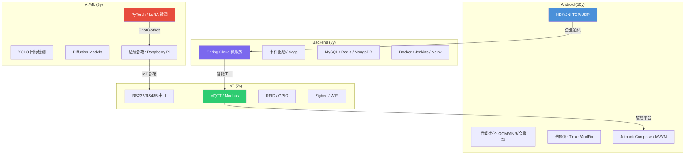

# Self-Introduction Scripts — Leo Zhang
> **用法**：根据面试场景选择对应时长的版本。先看 Key Points 记住骨架，再练习完整口稿。
> **核心原则**：不要背诵，要内化。每次根据具体岗位微调用词。
> **事实约束**：所有数据来自 `kb/*.yaml` 和 `projects/*/facts.yaml`，不可编造。

---

## 叙事结构 (三段式)

每个版本都遵循统一的三段式结构：

| 段落 | 内容 | 作用 |
|------|------|------|
| **Part 1 — Name** | 名字 + 身份定位 | 让面试官记住你是谁 |
| **Part 2 — Experience & Brand** | 经历 + 人设标签 | 建立专业信任，展示你是哪种工程师 |
| **Part 3 — Value + Company** | 你能带来什么 + 公司的技术方向 | 把你的能力和他们的需求连起来 |

---

## 目录

1. [2-Minute Version — 主版本 (技术面试 / Hiring Manager)](#2-minute)
2. [1-Minute Version — 标准面试开场](#1-minute)
3. [30-Second Version — HR 电话筛选 / 快速开场](#30-second)
4. [Role-Specific Variants — 按岗位微调](#role-specific)
5. [Company-Customized Template — 填空式定制](#company-customized)
6. [Delivery Tips — 表达技巧](#delivery-tips)

---

<a id="2-minute"></a>
## 2-Minute Version — 主版本
**场景**：技术面试、hiring manager 面试、panel interview、"tell me about yourself" 充裕时间版

### Part 1 — Name
Hello, I'm Leo Zhang.

I have over ten years of experience in software development, with most of my career focused on Android applications. Earlier this year, I completed my Master's degree in Computer and Information Science at Auckland University of Technology, where I also expanded my experience into AI and computer vision.

If I had to describe myself in one sentence, I would say that I enjoy turning complex ideas into reliable products.

### Part 2 — Experience & Brand
Throughout my career, I've worked across several industries. I built instant messaging applications, IoT platforms,  enterprise manufacturing software, and most recently, an AI-powered virtual try-on system.

One thing these projects have in common is that they all required solving different kinds of engineering problems.

For example, in an instant messaging project, I focused on application stability and performance. I optimized memory usage, reduced UI lag, improved startup performance, and implemented Hot Fix solutions so critical production issues could be resolved quickly.

Later, I led a team of nine engineers to build a digital signage platform. We delivered the project in just two months. My responsibilities included project planning, Android development, technical decisions, and coordinating with backend engineers, testers, and customers to make sure everything was delivered on schedule.

I also spent six years building a smart manufacturing platform that eventually scaled to over ten factory sites. That's where I developed most of my skills in team leadership, system integration, and long-term production maintenance.

I also worked on a manufacturing integration project in a highly secure environment where all development and deployment had to be completed offline. That experience taught me how to work closely with customers, deploy enterprise software, and solve problems under strict operational constraints.

During my master's research, I wanted to challenge myself with something completely different. I designed and built an AI virtual try-on system by integrating large language models, computer vision, and diffusion models. That project broadened my understanding of AI systems and reinforced the importance of software architecture and system integration.

Looking back, I've realised that the technologies have changed over the years — from Java to Kotlin, from Android development to AI — but the core of my work has remained the same: understanding problems, designing practical solutions, and delivering reliable software.

### Part 3 — Value + Company
That's exactly what I'm looking for in my next role. I hope to bring my experience in Android, enterprise systems, and AI to a collaborative team, while continuing to learn and grow as a software engineer here in New Zealand.

Thank you.

---

<a id="1-minute"></a>
## 1-Minute Version
**场景**：phone screen、行为面试开场、时间紧凑的 interview

### Part 1 — Name
Hello, I'm Leo Zhang. I'm a software engineer with over ten years of experience, mostly in Android development. I also recently completed my Master's at AUT here in Auckland, where I expanded into AI and computer vision.

### Part 2 — Experience & Brand
I enjoy turning complex ideas into reliable products. Throughout my career I've worked across instant messaging, IoT, manufacturing systems, and digital signage — each requiring different engineering solutions.

For example, I optimized an enterprise messaging app for stability and performance, implementing Hot Fix solutions for rapid production fixes. I led a team to deliver a digital signage platform in two months. I also spent six years on a smart manufacturing platform that scaled to over ten factory sites, where I built my skills in team leadership and system integration.

Most recently, my Master's research involved building an AI virtual try-on system combining LLMs, computer vision, and diffusion models.

### Part 3 — Value + Company
The technologies have changed over the years, but my core work stays the same — understanding problems, designing solutions, and delivering reliable software. That's what I'm looking to bring to my next role in New Zealand.

---

<a id="30-second"></a>
## 30-Second Version
**场景**：HR 电话筛选、career fair、LinkedIn 冷启动、快速 networking

### Part 1 — Name
Hi, I'm Leo Zhang — software engineer with over ten years of experience, mostly in Android development.

### Part 2 — Experience & Brand
I've worked across instant messaging, IoT, manufacturing, and digital signage. I recently completed a Master's at AUT in Auckland, expanding into AI and computer vision.

### Part 3 — Value + Company
I'm looking for a [backend / Android / software engineering] role in Auckland where I can put that combined experience to work.

### 变体：强调后端
> **P1** Hi, I'm Leo Zhang — backend and full-stack engineer, ten years in production systems.
>
> **P2** Enterprise messaging, smart factory platforms, IoT backends — I've built systems that run reliably at scale. I also completed a Master's at AUT, which broadened my AI and system design skills.
>
> **P3** I'm looking for a backend role where reliability and scale matter.

### 变体：强调 AI
> **P1** Hi, I'm Leo Zhang — AI and full-stack engineer.
>
> **P2** Ten years of Android and backend experience, plus a Master's at AUT specializing in computer vision and diffusion models. My thesis deployed a multimodal AI system on edge hardware.
>
> **P3** I'm looking for an applied ML role where production engineering discipline meets real AI challenges.

---

<a id="role-specific"></a>
## Role-Specific Variants
> 以下是针对不同岗位类型的一句话定位 + 强调重点。使用时替换 30s 版本中的 [role]，或作为 Part 2 的补充素材。

### Android Developer
**定位句**：
> I'm an Android engineer with over ten years of experience — from low-level NDK communication to modern Jetpack Compose and MVVM architecture.

**强调**：
- NDK/JNI TCP/UDP 实时通信 (Enterprise Messaging)
- 性能优化框架：冷启动、OOM、ANR、APK 体积
- 热修复框架：dex patching, native hot-swap (Tinker/AndFix)
- 离线优先架构 (Forest Patrol, IoT)
- OEM 兼容性 (Xiaomi/Huawei/OPPO ROM differences)

### Backend Engineer
**定位句**：
> I'm a backend engineer with deep experience in Java, Spring Cloud, and building reliable production systems at scale.

**强调**：
- Spring Cloud 微服务架构 (Smart Factory, 10+ factories)
- 事件驱动 + Saga 模式替代分布式事务
- 高并发消息系统 (500K+ messages/day, <200ms latency)
- MySQL/Redis/MongoDB 数据层优化
- Docker/Jenkins/Nginx CI/CD 全流程

### AI/ML Engineer
**定位句**：
> I'm an AI engineer with a rare combination of ten years of production engineering experience and recent research in computer vision and diffusion models.

**强调**：
- ChatClothes: LoRA 微调, OOTDiffusion, YOLO 轻量化, 边缘部署
- 端到端 ML pipeline: 标注 → 训练 → 评估 → 部署
- 模型优化: FID ↑19%, 手部伪影 ↓75%, <10s on Raspberry Pi 5
- 实际 AI 应用: 中草药识别 (YOLOv4), 设备维护预测 (时序)
- IVCNZ 2025 发表

### Fullstack Developer
**定位句**：
> I'm a full-stack engineer who's comfortable across the entire stack — from Android native code to Spring Cloud backends to Python ML pipelines.

**强调**：
- 前端: Kotlin/Android, Vue.js, React, Jetpack Compose
- 后端: Java/Spring Cloud, Node.js, FastAPI
- AI: Python, PyTorch, OpenCV
- 端到端交付: Smart Factory (全栈 + IoT + CI/CD)
- 系统思维: 从需求分析到生产部署的完整 ownership

---

<a id="company-customized"></a>
## Company-Customized Template
> **使用方法**：面试前填写 Part 3 的空白处。Part 1 和 Part 2 保持稳定。

### Part 1 — Name (固定)
Hello, I'm Leo Zhang. I'm a [backend / full-stack / Android / AI] engineer with over ten years of experience.

### Part 2 — Experience & Brand (固定，按岗位选变体)
> [从上面的 Role-Specific Variants 中选一个，或从 2-Minute Version 的 Part 2 中选 2-3 个项目]

### Part 3 — Value + Company (面试前填写)
I'm particularly interested in [Company] because [specific reason — product, tech, mission, scale].

[Connect 1-2 specific experiences to their needs]. For example, [pick one project as direct evidence].

What I can contribute immediately is [concrete skill matching their JD]. And long term, I'd like to [growth goal that benefits them].

### 定制清单 (面试前必填)
- [ ] 公司名 + 核心产品/服务
- [ ] JD 中的 2-3 个关键技术需求
- [ ] 你的经历中哪个项目最 match
- [ ] 你能立刻贡献什么
- [ ] 你对这家公司的了解 (tech blog / news / product体验)

### 示例：Air New Zealand
> **P1** Hello, I'm Leo Zhang. I'm a backend and full-stack engineer with over ten years of experience.
>
> **P2** I've built and maintained production systems at scale — a Smart Factory platform across 10+ sites, an enterprise messaging system with 5,000 daily users. I'm someone who stays with systems long-term and cares about reliability. I also completed a Master's at AUT, which broadened my AI skills.
>
> **P3** I'm interested in Air New Zealand because the digital platforms — app, booking systems, operational tools — need to work at a level where downtime directly impacts passengers and crew. That's exactly the kind of environment where my production engineering background fits. I can contribute in backend or full-stack, and I'm also interested in how applied AI could improve operational efficiency.

### 示例：Xero
> **P1** Hello, I'm Leo Zhang. I'm a full-stack engineer with ten years of experience.
>
> **P2** I've spent my career building software that people depend on every day — Smart Factory with 10+ factory sites, enterprise messaging with 5,000 daily users. I care about systems running reliably over years, not just demos.
>
> **P3** I'm interested in Xero because the platform is central to how small businesses operate — the reliability and usability expectations are very high. I'd bring full-stack capability with strong backend foundations in Java and Spring Cloud, plus the system thinking that comes from maintaining software over a decade.

---

<a id="delivery-tips"></a>
## Delivery Tips — 表达技巧

### 黄金法则
1. **内化，不要背诵** — 记住骨架 (Key Points)，不要逐字背 script
2. **对话感** — 像在跟同事聊天，不是在做 presentation
3. **眼神接触** — 尤其是开头和收尾时
4. **语速** — 30s 版可以稍快，2min 版要留呼吸空间

### 结构节奏
| 时长 | Part 1 — Name | Part 2 — Experience & Brand | Part 3 — Value + Company |
|------|------|------|------|
| 30s | 名字 + 身份 | 1 句经历亮点 | 目标岗位 |
| 1min | 名字 + 身份 + 年限 | 2-3 个项目要点 + 人设 | 价值 + 目标 |
| 2min | 名字 + 价值主张 | 4-5 个项目展开 → 人设收束 | 公司技术匹配 |

### 常见追问准备
自我介绍中提到的每个项目/数据，面试官都可能追问：
- **Enterprise Messaging** → Hot Fix 方案细节 (Tinker/AndFix)、性能优化指标
- **Digital Signage** → 9 人团队管理细节、MQTT 广播机制、2 个月交付时间线
- **Smart Factory** → 10+ 工厂扩展过程、团队领导、IoT 集成、长期维护
- **Air-gapped** → 涉密环境约束、客户沟通、ETL/BI 具体工作
- **ChatClothes** → LLM + vision + diffusion 集成细节、架构设计

### 不要做的
- ❌ 从出生讲起 ( nobody cares about childhood )
- ❌ 列举所有技术栈 ( 不是简历朗读 )
- ❌ 说 "I'm a hard worker / fast learner" ( show, don't tell )
- ❌ 负面评价前雇主或解释离开原因 ( 留给追问环节 )
- ❌ 超时 — 如果面试官说 "tell me about yourself" 并没有说 "take 5 minutes"

### 练习方法
1. **录音回听** — 手机录音，回放检查语速、停顿、口头禅
2. **计时练习** — 30s / 1min / 2min 各练 3 遍
3. **对着镜子** — 练习眼神和表情
4. **找人练** — 找朋友或同事模拟，获取反馈
5. **每次微调** — 根据目标岗位调整关键词和证据选择

---

## Quick Reference Card

```
Part 1 — Name    = 名字 + 身份定位 (让面试官记住你)
Part 2 — Brand   = 经历 + 人设标签 (建立专业信任)
Part 3 — Value   = 你能带来什么 + 公司的技术方向 (连起来)
```

**人设句** (你自己的版本):
> "I enjoy turning complex ideas into reliable products."

**收尾句** (你自己的版本):
> "The technologies have changed over the years, but the core of my work has remained the same: understanding problems, designing practical solutions, and delivering reliable software."

**万能过渡句** (从自我介绍切入技术讨论):
> "The technical challenge I found most interesting was..." → [准备好的项目故事]

---

## Career Timeline

```
2013        2015        2017        2019        2021        2023     2024-2026
 │           │           │           │           │           │           │
 ▼           ▼           ▼           ▼           ▼           ▼           ▼
┌─────────────────────────────────────────────────────────────────┐  ┌──────────────┐
│              Chunxiao Technology (春晓科技)                      │  │  AUT Master's │
│              Android Dev → Full-stack → Team Lead               │  │  AI / CV      │
├───────┬──────┬──────┬──────┬──────┬──────┬──────┬──────┬───────┤  ├──────────────┤
│Patent │Entpr.│Smart │ IoT  │Live  │Smart │Bcst. │Forest│More   │  │ChatClothes   │
│Search │ Mess.│Fact. │Solut.│Strm. │Power │Ctrl. │Patrol│...    │  │IVCNZ 2025    │
│  .NET │NDK   │RFID  │MQTT  │WebRTC│Modbus│MQTT  │GIS   │       │  │LoRA+Diffusion│
│       │10yr  │6yr   │7yr   │3yr   │3yr   │6mo   │1yr   │       │  │Edge Deploy   │
└───────┴──────┴──────┴──────┴──────┴──────┴──────┴──────┴───────┘  └──────────────┘
  ▲         ▲              ▲                        ▲                   ▲
  初级      成长期          领导期                   IoT 深耕             AI 转型
```

### 四个阶段，一句话版本

| 阶段 | 时间 | 标签 | 核心故事 |
|------|------|------|----------|
| **起步** | 2013-2015 | .NET + Android 入门 | 专利检索系统 (Lucene.NET)，企业通讯开始 |
| **成长** | 2015-2018 | NDK 通信 + 性能优化 | 企业通讯 5K DAU，直播 1000+ 并发 |
| **领导** | 2018-2023 | 团队管理 + IoT + 全栈 | 智能工厂 10+ 工厂，播控 9 人团队 |
| **转型** | 2024-2026 | AI + 边缘部署 | ChatClothes, IVCNZ 发表, First Class Honours |

---

## Skill Landscape



### 项目 × 技能矩阵 (面试时快速查哪个项目证明哪个能力)

| 能力维度 | Enterprise Mess. | Smart Factory | Broadcast | IoT | ChatClothes | Air-gapped |
|---------|:---:|:---:|:---:|:---:|:---:|:---:|
| **Android 优化** | ⭐ | ⭐ | ⭐ | ⭐ | | |
| **团队领导** | | ⭐ | ⭐ | | | |
| **后端架构** | ⭐ | ⭐ | | ⭐ | | ⭐ |
| **IoT 集成** | | ⭐ | ⭐ | ⭐ | | |
| **性能优化** | ⭐ | ⭐ | | | ⭐ | |
| **离线/安全** | | | | ⭐ | ⭐ | ⭐ |
| **AI/CV** | | | | | ⭐ | |
| **客户交付** | | ⭐ | ⭐ | ⭐ | | ⭐ |

---

## Story Bank — 5 个核心故事

> 面试时不需要背所有项目，记住这 5 个故事，每个准备 **张力 → 动作 → 结果 → 教训** 四句话。

### Story 1: Enterprise Messaging (企业通讯)
```
张力：IM 应用需要实时推送，但 Android 系统会杀后台进程
动作：NDK TCP/UDP 直连 + Tinker 热修复 + 性能优化 (内存/CPU/启动速度)
结果：5,000 DAU, <200ms 延迟, 500K+ 消息/天, 运行 10 年
教训：实时通讯需要多层保障，不能只依赖系统推送
```
**可用于回答**：技术挑战 / 性能优化 / Android 深度 / 长期维护

### Story 2: Smart Factory (智能工厂)
```
张力：工厂没有现成产品可参考，需求模糊，要在产线现场澄清
动作：带 6 人团队，从 1 个试点扩展到 10+ 工厂，发明串口转 WebSocket 桥接
结果：30%+ 效率提升，6 年持续运行，河北省科技进步奖
教训：先现场观察再设计，用快速原型验证，不要猜需求
```
**可用于回答**：团队领导 / IoT 集成 / 规模扩展 / 需求模糊

### Story 3: Digital Signage (数字标牌)
```
张力：客户要 2 个月内交付完整播控平台，时间极紧
动作：带 9 人团队，MQTT 广播分发，项目规划 + 跨团队协调
结果：按时交付，支持电梯/门店/公共屏多场景
教训：紧时间线下，沟通和协调比技术更重要
```
**可用于回答**：项目管理 / 按时交付 / 跨团队协作 / 压力

### Story 4: Air-gapped Deployment (涉密部署)
```
张力：所有开发和部署必须离线完成，进出厂区需要审批
动作：用离线笔记本做格式分析，带安装包进厂手工部署
结果：成功交付 BI/ETL 集成
教训：在极端约束下，客户沟通和耐心比技术能力更关键
```
**可用于回答**：客户沟通 / 严格约束 / 企业交付 / 耐心

### Story 5: ChatClothes (虚拟试衣)
```
张力：论文方案在纸面上可行，但真机部署后延迟和硬件限制成为硬约束
动作：LoRA 微调 OOTDiffusion, 本地 LLM (Ollama), YOLO 轻量化, 边缘部署
结果：FID ↑19%, 手部伪影 ↓75%, <10s on Raspberry Pi 5, 提前 6 个月提交
教训：先 profile 再优化，不要猜瓶颈
```
**可用于回答**：AI 经历 / 学习能力 / 从零构建 / 约束下交付

---

## Narration Flow — 讲述节奏指南

> 这是帮你练习时把握节奏的流程图。每个节点标注了「大概几秒」和「过渡句」。

### 2-Minute Version 流程

```
┌─ Part 1: Name (15-20s) ─────────────────────────────┐
│ "Hello, I'm Leo Zhang."                              │
│ "10+ years... Android... Master's at AUT..."          │
│ "I enjoy turning complex ideas into reliable products"│
└──────────────────┬───────────────────────────────────┘
                   │ 过渡句: "Throughout my career, I've
                   │ worked across several industries..."
                   ▼
┌─ Part 2: Experience (60-70s) ────────────────────────┐
│ ① Enterprise Messaging (10-15s)                      │
│   "instant messaging... stability... Hot Fix..."     │
│                 ↓ 过渡: "Later, I led a team..."     │
│ ② Digital Signage (10-15s)                           │
│   "nine engineers... two months..."                  │
│                 ↓ 过渡: "I also spent six years..."  │
│ ③ Smart Factory (10-15s)                             │
│   "ten factory sites... team leadership..."          │
│                 ↓ 过渡: "I also worked on..."        │
│ ④ Air-gapped (8-10s)                                 │
│   "highly secure... offline..."                      │
│                 ↓ 过渡: "During my master's..."      │
│ ⑤ ChatClothes (10-15s)                               │
│   "AI virtual try-on... LLMs, vision, diffusion..." │
│                 ↓                                     │
│ ⑥ 反思收束 (5-8s)                                    │
│   "technologies changed... but the core same..."     │
└──────────────────┬───────────────────────────────────┘
                   │ 过渡句: "That's exactly what I'm
                   │ looking for in my next role..."
                   ▼
┌─ Part 3: Value (10-15s) ─────────────────────────────┐
│ "bring my experience in Android, enterprise systems,  │
│  and AI to a collaborative team..."                   │
│ "Thank you."                                         │
└──────────────────────────────────────────────────────┘
```

### 练习口诀

```
名字 → 一句话人设
IM → 稳定性
标牌 → 带队交付
工厂 → 规模领导
涉密 → 约束下工作
AI → 全新领域
反思 → 核心不变
价值 → 下一步
```

---

## One-Page Cheat Sheet

> 面试前 5 分钟扫一眼。手机截图或打印。

```
╔═══════════════════════════════════════════════════════════════╗
║                    LEO ZHANG — SELF-INTRO CHEAT              ║
╠═══════════════════════════════════════════════════════════════╣
║                                                               ║
║  人设句: "I enjoy turning complex ideas into reliable products" ║
║                                                               ║
║  ─── PART 1: NAME ─────────────────────────────────────────── ║
║  Leo Zhang | 10+ years | Android → AI | Master's AUT         ║
║                                                               ║
║  ─── PART 2: 5 PROJECTS ───────────────────────────────────── ║
║                                                               ║
║  ① Enterprise Mess.  │ NDK, Hot Fix, 性能优化                  ║
║     5K DAU, <200ms, 10年                                      ║
║                                                               ║
║  ② Digital Signage   │ 9人团队, 2个月交付, MQTT                 ║
║     项目管理 + 跨团队协调                                       ║
║                                                               ║
║  ③ Smart Factory     │ 10+工厂, 6年, 30%效率↑                  ║
║     团队领导 + IoT 集成 + 规模扩展                               ║
║                                                               ║
║  ④ Air-gapped        │ 涉密环境, 离线部署, 客户沟通              ║
║     严格约束下交付                                               ║
║                                                               ║
║  ⑤ ChatClothes       │ LLM + Vision + Diffusion               ║
║     FID ↑19%, <10s on RPi5, 提前6个月                          ║
║                                                               ║
║  反思: "Technologies changed, but the core remained the same"  ║
║                                                               ║
║  ─── PART 3: VALUE ────────────────────────────────────────── ║
║  Android + Enterprise + AI → collaborative team in NZ          ║
║                                                               ║
║  ─── KEY NUMBERS ──────────────────────────────────────────── ║
║  10+ years │ 5K DAU │ <200ms │ 500K msg/day                   ║
║  9 engineers │ 2 months │ 10+ factories │ 30%+ efficiency      ║
║  FID 28.5 │ 75% less artifacts │ <10s RPi5 │ 6 months early   ║
║                                                               ║
╚═══════════════════════════════════════════════════════════════╝
```

---

*Last updated: 2026-06*
