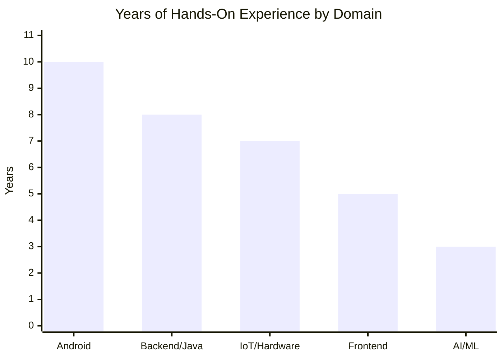

# Leo Zhang

**Senior Android Developer · Java Backend · Full-stack Engineer**   
📧 leozhang2056@gmail.com | 📍 portfolio https://portfolio.leoz.fun
🔗 LinkedIn: [linkedin.com/in/leo-zhang-305626280](https://www.linkedin.com/in/leo-zhang-305626280/)

---

## GitHub activity

<p align="center">
  <a href="https://github.com/leozhang2056">
    
  </a>
</p>

---

## Experience by Domain



---

## 👋 Professional Summary

Senior Software Engineer with **10+ years of experience** and Master's in Computer and Information Sciences from AUT, graduating **February 2026**. Delivering enterprise solutions across **Android development**, **Java backend systems**, **IoT platforms**, and **AI/ML integration**.

Proven track record evolving a standalone IM client into a multi-subsystem enterprise platform over 10 years, leading cross-functional teams up to 20 people, deploying IoT solutions managing 1000+ devices, and architecting digital signage platforms for large-scale retail networks.

**Key Strengths:**
- **Android Expertise**: 10+ years building enterprise Android apps — from IM clients (NDK TCP/UDP) to IoT gateways (serial protocol, MQTT) to digital signage players, with hardware integration (RFID, scales, cameras, serial devices)
- **Platform Architecture**: Evolved a messaging tool into a full enterprise platform (user center, file service, permissions) serving 5,000 DAU over 10 years — from sole developer to leading 20-person team
- **IoT & Edge Computing**: Designed Android-based gateways bridging non-networked industrial equipment (circuit breakers, smart meters) to cloud platforms via MQTT, managing 1000+ devices with offline resilience
- **Backend Development**: Spring Cloud microservices, time-series databases (InfluxDB), stream processing (Apache Flink), distributed file storage (FastDFS)
- **AI-Assisted Development**: Daily use of **Claude Code**, Cursor, and GitHub Copilot for code generation, refactoring, and review — comfortable integrating AI tools into the full development workflow
- **Additional Skills**: ML model training (PyTorch, LoRA, YOLO), BI platforms (PowerBI, FineBI, Kettle ETL), hardware protocol integration (Modbus, RS485, UART), .NET desktop development

---

## 🛠️ Technical Skills

| Category | Technologies |
|----------|-------------|
| **Android** | Kotlin, Java, Jetpack Compose, MVVM, NDK/JNI, Room, Coroutines, Camera API |
| **Backend** | Spring Cloud, Spring Boot, REST APIs, MySQL, Redis, RabbitMQ, FastDFS |
| **Frontend** | Vue.js, Element Plus, ECharts, JavaScript, HTML/CSS |
| **IoT** | MQTT, Modbus RTU/TCP, RS485, UART, SerialPort API, Zigbee, WiFi |
| **Data** | InfluxDB, Apache Flink, Pentaho Kettle (ETL), Time-series Databases |
| **AI/ML** | PyTorch, YOLO, LoRA, Diffusion Models, LLM Integration, OpenCV, ArcSoft Face SDK |
| **DevOps** | Docker, Jenkins, Git, Nginx, Linux |
| **BI** | Power BI, FineBI, Tableau, Kettle ETL, Data Visualization |
| **Other** | .NET Framework, C#, Lucene.NET, WebRTC, WebSockets, ESP8266 |

---

## 💼 Professional Experience

### Auckland University of Technology (AUT) — *New Zealand*
**Master's Student & AI Researcher** | Jul 2024 – Feb 2026

- **[ChatClothes](projects/chatclothes/)** — Developed diffusion-based multimodal virtual try-on system with YOLO classification and LLM-driven interaction
  - Optimized for edge deployment on Raspberry Pi 5 with full offline capability
  - Integrated ComfyUI + Dify for workflow orchestration
  - Thesis passed with First Class Honours; completed ahead of schedule

### Chunxiao Technology Co., Ltd. — *China*
**Technical Lead / Senior Software Engineer** | Jan 2013 – Jun 2024

Started as sole developer, grew to lead 20-person cross-functional team. Owned Android development, architecture design, and platform evolution across IoT, manufacturing, and enterprise communication projects.

**Key Projects:**

- **[Enterprise Messaging Platform](projects/enterprise-messaging/)** — Sole developer → team lead over 10 years (2014–2024)
  - Started as the only developer, built first Android IM client and pushed to production
  - Designed custom TCP protocol (WebSocket was unstable), NDK transport for sub-200ms latency
  - Evolved standalone IM into multi-subsystem enterprise platform (user center, file service, attendance, approvals) serving 5,000 DAU
  - Migrated from unstable C++ messaging to Easemob cloud, eliminating 90%+ defects
  - Still in use and actively growing

- **[Smart Factory Backend](projects/smart-factory/)** — Full-stack tech lead (2018–2024)
  - Led 6-person team delivering Spring Cloud microservices across 5+ factory sites
  - Built hardware communication (electronic scales via serial-to-WebSocket bridge, conveyors, RFID)
  - Deployed Android shop-floor terminals and Vue.js dashboards for hundreds of daily workers
  - Improved production efficiency by 30%+; awarded Hebei Provincial Science & Technology Award

- **[Smart Broadcast Control Platform](projects/broadcast-control/)** — PM & Android Team Lead (2020)
  - Led 9-person team, delivered 1000+ device Digital Signage platform in 2 months ahead of schedule
  - MQTT broadcast for large-scale ad delivery to retail displays (bookstores, clothing stores)
  - Managed high-concurrency MQTT connections — primary technical challenge at scale

- **[IoT Solutions](projects/iot-solutions/)** — Sole Android developer for 7-year product line (2016–2023)
  - Smart switches and gateways: Android app + embedded gateway firmware + Spring Cloud backend
  - Participated in architecture design with time-series database and message queue

- **[Smart Power Management](projects/smart-power/)** — Java backend & Android developer (2019–2022)
  - 20-person company-wide project: 3+ parks, ~15% energy reduction, sub-second alarms
  - Integrated Modbus/RS485 gateways and smart meters with InfluxDB + Apache Flink

---

## 🚀 Portfolio

### ⭐ Flagship Projects

#### [Enterprise Messaging Platform](projects/enterprise-messaging/) — 10-Year Platform Evolution
Started as sole developer, grew to 20-person team. Custom TCP protocol (WebSocket was unstable), NDK transport for sub-200ms latency. Evolved from standalone IM to multi-subsystem enterprise platform.

**Key Features:**
- Custom TCP/UDP protocol with NDK transport achieving <200ms latency
- Migrated from unstable C++ messaging to Easemob cloud (90%+ defect elimination)
- Platform evolution: IM → user center → file service → attendance, approvals, asset management
- 5,000 DAU, 500K+ daily messages, <2% downtime over 10 years

**Tech Stack:** Kotlin, Java, NDK, Custom TCP/UDP, Spring Cloud, Easemob, FastDFS, MySQL, Redis  
**Impact:** Still in use and actively growing after 10 years

---

#### [Smart Factory System](projects/smart-factory/) — End-to-End Manufacturing Platform
Microservice-based platform deployed across 5+ factory sites, connecting brands, factories, and workers. Won Hebei Provincial Science & Technology Award.

**Tech Stack:** Spring Cloud, Vue.js, Docker, Jenkins, MySQL, Redis, RFID, Electronic Scales  
**Impact:** 30%+ efficiency improvement, 99.9% uptime, hundreds of workers supported daily

---

#### [Smart Broadcast Control Platform](projects/broadcast-control/) — 1000+ Device Digital Signage
Digital Signage platform for retail stores — led 9-person team, delivered in 2 months ahead of schedule. MQTT broadcast for large-scale ad delivery.

**Key Features:**
- 1000+ Android display devices across bookstores, clothing stores, design shops
- MQTT broadcast for high-concurrency ad campaign distribution
- Three-component architecture: Vue.js Admin Console, Customer Portal, Android Device Client
- Device fleet management with heartbeat monitoring and offline cache/recovery

**Tech Stack:** Android, MQTT, Spring Boot, Vue.js, ExoPlayer, SQLite  
**Impact:** Replaced manual on-site content updates, delivered ahead of schedule

---

#### [IoT Device Management Platform](projects/iot-solutions/) — 7-Year Smart Switches & Gateways
7-year product line: smart switches and gateways sold to customers. Sole Android developer for all mobile apps. Participated in architecture design with time-series DB and message queue.

**Tech Stack:** Android, Embedded Linux, Zigbee, WiFi, MQTT, Spring Cloud, InfluxDB, Message Queue  
**Impact:** End-to-end IoT product from gateway firmware to cloud platform to mobile app

---

#### [Smart Power Management](projects/smart-power/) — Energy Monitoring & Optimization
20-person company-wide project: enterprise power monitoring for factories, buildings, and campuses with real-time data collection and energy analysis.

**Tech Stack:** Spring Cloud, InfluxDB, Modbus, RS485, MQTT, Apache Flink, Vue.js, ECharts  
**Impact:** ~15% energy reduction, <1s alerts, 99.9% data collection rate, 3+ parks deployed

---

### 🤖 AI & Machine Learning

#### [ChatClothes](projects/chatclothes/) — Multimodal Virtual Try-On
Master's thesis project at AUT. Developed diffusion-based multimodal virtual try-on system with YOLO classification and LLM-driven interaction. Published at IVCNZ 2025.

**Tech Stack:** PyTorch, Diffusion Models, YOLO12n-LC, DeepSeek LLM, ComfyUI, Dify, Raspberry Pi 5  
**Impact:** Published at IVCNZ 2025, 19% FID improvement over baseline, deployed on edge devices

---

#### [Chinese Herbal Recognition](projects/chinese-herbal-recognition/) — General-Purpose AI Platform
General-purpose AI data annotation and model training platform, validated with 20-class herbal recognition demo. Users upload data, publish annotation tasks, train models, and deploy inference.

**Tech Stack:** Python, FastAPI, YOLO, ResNet, MobileNetV3, Docker, GPU Training  
**Impact:** End-to-end platform workflow; launched but not maintained post-launch

---

#### [Device Maintenance Prediction](projects/device-maintenance-prediction/) — Predictive Maintenance with ML
Predictive maintenance platform analyzing historical equipment records to predict maintenance windows using Random Forest and time-series analysis.

**Tech Stack:** Python, SparkNet, Random Forest, Time-series Forecasting  
**Impact:** Shifted maintenance strategy from fixed-cycle/reactive to predictive

---

### 🏗️ Android Infrastructure & Architecture

#### [Android Performance Optimization](projects/android-performance-optimization/) — 8-Year Optimization Framework
Led performance optimization across 8+ enterprise Android apps over 8 years. Systematic optimization across 6 domains: memory, CPU, UI fluency, cold-start, APK size, stability.

**Key Achievements:**
- APK 200MB+ → 80-90MB (55% reduction) via R8/ProGuard and SO stripping
- Cold-start ~1.5s → ~800ms (47% improvement)
- Systematic OOM/ANR governance across 8+ apps

**Tech Stack:** Kotlin, Java, C++, LeakCanary, Android Profiler, R8, ProGuard, Heap Dump  
**Impact:** Measurable performance improvements across entire app portfolio

---

#### [Android Hotfix Framework](projects/android-hotfix-framework/) — Build, Evaluate, Retire
In-house hotfix framework (AndFix → Tinker) for emergency patch deployment. After years of practice, led the decision to retire it in favor of staged rollout + feature flags.

**Key Decision:**
- Identified unsustainable maintenance cost (patch-per-version model, expanding QA matrix)
- Retired after proving staged rollout provided better ROI
- Evolution: AndFix → Tinker → Full Upgrade + Staged Rollout

**Tech Stack:** Kotlin, Java, Method Replacement, Dex Merge, Canary Deployment, Feature Flags  
**Impact:** Technical evaluation and retirement decision saved long-term maintenance overhead

---

### 📱 Mobile & Field Deployment

#### [Visual Gateway](projects/visual-gateway/) — 1:70 Breaker Control Gateway
Smart gateway controlling non-networked circuit breakers via RS232 serial bus. Each gateway manages up to 70 breakers. Connects to Smart Power Management Platform.

**Tech Stack:** Android, RS232, Modbus RTU, MQTT, Edge Alerting, InfluxDB  
**Impact:** 1:70 gateway-to-breaker ratio, 24/7 operation, multi-site deployment

---

#### [School Attendance](projects/school-attendance/) — Face Recognition with Local Comparison
School face recognition attendance using ArcSoft SDK for on-device comparison. 3-person team — I built the Android terminal. 1-2 seconds per student, 99%+ accuracy.

**Tech Stack:** Android, ArcSoft Face SDK, Liveness Detection, Gate Control, JPush  
**Impact:** Deployed across multiple schools, real-time parent notifications

---

#### [Picture Book Locker](projects/picture-book-locker/) — Smart Library Cabinet
24/7 self-service borrow/return system for schools with face recognition, QR auth, electromagnetic locks, and UV disinfection. 10+ hardware peripherals via UART/RS485/GPIO.

**Tech Stack:** Android, Face SDK, ARM Controller, UART/RS485, GPIO, Spring Cloud  
**Impact:** <3s average borrow time, deployed in multiple schools, zero book loss

---

#### [Forest Patrol Inspection](projects/forest-patrol-inspection/) — Offline-First GIS App
Mobile patrol system for forest rangers in no-signal areas. Custom offline maps, GPS tracking, GIS risk-point annotation, and deferred sync on network recovery.

**Tech Stack:** Android, GDAL, Geos, Shapely, GPS, Offline Maps, SQLite  
**Impact:** Enabled reliable patrol data collection in zero-connectivity forest areas

---

#### [Exhibition Service Robot](projects/exhibition-robot/) — SDK-Based Intelligent Robot
Service robot for exhibitions — bought robot with SDK, built features on top: navigation, face recognition, voice interaction, knowledge base. 4-person team.

**Tech Stack:** Android, ArcSoft Face SDK, iFlytek ASR/TTS, Spring Cloud, SLAM  
**Impact:** Deployed at client exhibition hall, still in use

---

### 🔧 Specialized Projects

#### [Banknote Paper Mill Integration](projects/banknote-paper-mill/) — High-Security Manufacturing IT
Hardware data acquisition (serial ports), ETL (Kettle), and BI (FineBI) for a banknote paper production facility. Fully air-gapped environment.

**Tech Stack:** SQL, Pentaho Kettle, FineBI, Serial Port, UHF Scanning, Linux  
**Impact:** Data pipeline from scattered databases and hardware devices to unified BI layer

---

#### [Live Streaming Commerce System](projects/live-streaming-system/) — Multi-Language Platform
Early career multi-language live streaming platform (C#, C++, Node.js, Python, Lua) with RTMP/HLS/WebRTC.

**Tech Stack:** .NET, C++, Node.js, Python, Lua, RTMP, WebRTC, FFmpeg  
**Impact:** 1,000+ peak concurrent viewers, 99.5% streaming uptime

---

#### [Patent Search System](projects/patent-search-system/) — Solo .NET Desktop App
Early-career solo project: enterprise patent document management with Lucene.NET full-text search, SQL Server, and Excel batch processing.

**Tech Stack:** C#, .NET Framework 2.0, Lucene.NET, SQL Server, Windows Forms  
**Impact:** 10,000+ patents managed, <2s search response, 50+ daily users

---

#### [Boobit Crypto Trading App](projects/boobit/) — Fintech Mobile App
Android cryptocurrency trading app with real-time market data via WebSocket, secure wallet storage, and exchange/recharge flows.

**Tech Stack:** Kotlin, Jetpack Compose, Room, Retrofit, WebSocket, MVVM  
**Impact:** Real-time market data, 3-layer security architecture

---

#### [Field Weighing System](projects/field-weighing-access-control/) — Highway Toll Station
C# application for highway toll station vehicle weighing, overload alarms, and invoicing system integration.

**Tech Stack:** C#, Electronic Scale Integration, Alarm System  
**Impact:** Deployed at highway toll station

---

#### [Visit System](projects/visit-system/) — Access Management with Face Recognition
Multi-terminal visit booking and access management for high-security scenarios (prison, hospital). WebRTC video visitation with server-side time enforcement.

**Tech Stack:** Spring Cloud, WebRTC, Face Recognition, WeChat Mini Program  
**Impact:** Deployed across multiple departments, supported pandemic contactless visits

---

## 🔭 Project Constellation

Shared technologies and domain relationships across all projects:

```mermaid
graph LR
  subgraph Enterprise
    IM["Enterprise Messaging<br/>(10-yr platform)"]
    SF["Smart Factory<br/>(5+ sites)"]
    SP["Smart Power<br/>(3+ parks)"]
    BC["Broadcast Control<br/>(1000+ devices)"]
  end

  subgraph IoT
    VG["Visual Gateway<br/>(1:70 ratio)"]
    IoT["IoT Solutions<br/>(7-yr product)"]
    PBL["Picture Book Locker<br/>(10+ peripherals)"]
  end

  subgraph AI
    CC["ChatClothes<br/>(Diffusion + LLM)"]
    CH["Herbal Recognition<br/>(YOLO/ResNet)"]
    DM["Maintenance Prediction<br/>(Random Forest)"]
  end

  subgraph Mobile
    Boobit["Boobit<br/>(Compose)"]
    SA["School Attendance<br/>(Face SDK)"]
    FP["Forest Patrol<br/>(Offline GIS)"]
    ER["Exhibition Robot<br/>(SLAM)"]
  end

  subgraph Govt
    BP["Banknote Paper Mill<br/>(Air-gapped ETL)"]
    VS["Visit System<br/>(WebRTC)"]
  end

  %% Shared technology links
  IM -- "Spring Cloud<br/>Kotlin/Java" --> SF
  SF -- "MQTT<br/>Vue.js" --> BC
  SP -- "MQTT<br/>InfluxDB" --> IoT
  IoT -- "RS485<br/>Modbus" --> VG
  VG -- "MQTT<br/>Edge alerts" --> SP
  CC -- "YOLO" --> CH
  CH -- "Python" --> DM
  SA -- "Face SDK" --> ER
  PBL -- "Face SDK<br/>UART" --> SA
  FP -- "Android<br/>Offline-first" --> IoT
  BP -- "C#/.NET" --> VS
  BC -- "Android<br/>Fleet mgmt" --> IoT
```

---

## 📊 Key Numbers

```
┌─────────────────────────────────────────────────────────┐
│                     CAREER BY NUMBERS                   │
├──────────────┬──────────────┬───────────────────────────┤
│  10+ yrs     │   5,000 DAU  │   1,000+ IoT devices      │
│  Experience  │  Messaging   │   managed concurrently     │
├──────────────┼──────────────┼───────────────────────────┤
│  20-person   │   5+ factory │   ~15% energy reduction    │
│  team led    │   sites      │   across 3+ parks          │
├──────────────┼──────────────┼───────────────────────────┤
│  <200ms      │   99%+ face  │   10,000+ patents          │
│  latency     │   recognition│   indexed                  │
│  (TCP/NDK)   │   accuracy   │                            │
├──────────────┼──────────────┼───────────────────────────┤
│  55% smaller │  47% faster  │  99.5% streaming uptime    │
│  APKs        │  cold start  │  (Live Commerce)           │
└──────────────┴──────────────┴───────────────────────────┘
```

---

## 🎓 Education

**Master of Computer and Information Sciences**  
Auckland University of Technology (AUT), New Zealand | 2024 – Feb 2026
- First Class Honours · GPA 7.41/9.0
- Research Focus: AI, Computer Vision, Edge Computing
- Thesis: ChatClothes Virtual Try-On System — passed ahead of schedule

**Bachelor of Software Engineering**  
Hebei University of Science and Technology, China | 2009 – 2013
- National Scholarship recipient

---

## 📄 Publications

- Zhang, Y. et al. **ChatClothes: Conversational Virtual Try-On with Diffusion Models** — IVCNZ 2025 · [DOI 10.1109/IVCNZ67716.2025.11281834](https://doi.org/10.1109/IVCNZ67716.2025.11281834)
- Zhang, Y. **Clothes Recognition Based on Lightweight Deep Learning Models** — *Aesthetics in Creative Technology*, IGI Global · 2026
- Zhang, Y. **ChatClothes: A Virtual Try-On System Using Conversational AI and Diffusion Models** — AUT Master's Thesis, 2025 · [AUT Repository](http://hdl.handle.net/10292/20210)

---


*Last updated: June 2026*
