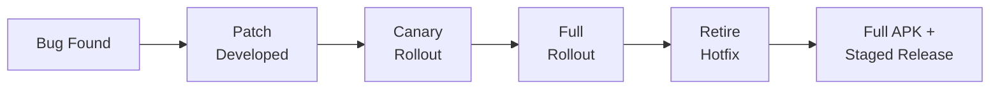

# Android Hotfix Framework

> Evaluated and participated in an Android hotfix framework using method replacement and Dex merge — then drove the decision to retire it after identifying unsustainable maintenance costs.

### Hotfix Decision Lifecycle



## Overview

Participated in the development and maintenance of an Android hotfix framework that used method replacement (AndFix-style) and Dex merge (Tinker-style) to deploy bug fixes without full app store releases.

The framework had significant limitations:
- Patches could only replace methods — could not add new code or swap native .so libraries
- Vendor ROM compatibility issues across MIUI, EMUI, ColorOS
- Version-per-patch management became unsustainable as version count grew
- Some bugs involved server-side APIs, making client-only fixes insufficient

After years of practice, participated in the technical evaluation that led to retiring the hotfix system in favor of full APK upgrades combined with staged rollout and feature flags — a decision that reduced maintenance overhead and improved overall stability.

## Technical Mechanisms

| Approach | What It Does | Limitation |
|----------|-------------|------------|
| **Method Replacement (AndFix)** | Replaces individual methods in existing classes | Cannot add new code, only swap implementations |
| **Dex Merge (Tinker)** | Generates dex diff patches and merges into existing dex | Complex merge process, version coupling |

### What Hot Fix Cannot Do

- Cannot modify AndroidManifest
- Cannot add new Activities, Services, Receivers, or ContentProviders
- Cannot replace Application class
- Cannot swap native .so libraries
- Only suitable for local code fixes (method replacement)

## Why We Retired It

### Technical Limitations

- **Method-only replacement**: Patches could only swap method implementations, not add new functionality
- **No native .so patching**: Native library bugs still required full APK update
- **ROM compatibility**: AndFix relies on ART/Dalvik Runtime internals; vendor ROMs (MIUI, EMUI, ColorOS) introduced compatibility gaps requiring re-validation on every major Android release
- **Crash Loop risk**: Dex merge failures or ClassLoader exceptions could cause app crashes, requiring additional rollback mechanisms

### Engineering Cost

- **Version coupling**: Patches must exactly match the Base APK — different versions cannot share patches
- **Sustainable management**: Each release required maintaining an independent patch, with backend managing patch lifecycle, version dependencies, canary rollout, and rollback strategies
- **Expanded test matrix**: Base APK × Patch × multiple Android versions × vendor device combinations
- **Ongoing framework maintenance**: Required continuous adaptation to new Android SDKs, Gradle Plugins, R8, and ART Runtime changes

### Business Reality

- IM products iterate rapidly (weekly releases); most production issues resolve through fast re-release
- Some bugs involve server-side APIs or protocol versions — client-only fixes cannot fully resolve
- Google Play and app store review efficiency improved; staged rollout can reach users quickly
- Feature Flags and Remote Config handle feature control without hotfix complexity

## Final Decision

After comprehensive evaluation of stability, maintenance cost, testing burden, and business value, the team decided to retire the Hot Fix system and migrate to:

- **Full APK upgrade** — simpler architecture, lower risk
- **Staged Rollout** — gradual user coverage (1% → 5% → 20% → 100%)
- **Feature Flags** — runtime feature control
- **Remote Config** — server-driven configuration
- **CI/CD auto-release** — fast iteration cycles

## Evolution Path

```
AndFix (method replacement) → Tinker (dex merge) → Retire Hot Fix → Full Upgrade + Staged Rollout
```

## Before / After Comparison

| Aspect | Before (Hotfix Framework) | After (Retired) |
|--------|--------------------------|------------------|
| Patch delivery | Method replacement / Dex merge | Full APK upgrade |
| Rollout control | Manual patch lifecycle | Staged rollout (1%->5%->20%->100%) |
| Feature control | Not possible via hotfix | Feature Flags + Remote Config |
| ROM compatibility | Per-vendor re-validation | Standard Android update path |
| Maintenance cost | High (version coupling, test matrix) | Low (CI/CD auto-release) |
| Crash risk | Dex merge failure / rollback needed | Standard install reliability |

## Tech Stack

- **Languages:** Kotlin, Java
- **Hotfix Approaches:** Method Replacement (AndFix), Dex Merge (Tinker)
- **Replacement Strategy:** Staged Rollout, Feature Flags, Remote Config

## Key Takeaways

Deep understanding of Android hotfix mechanisms (method replacement, Dex merge) and their practical limitations. More importantly, learned that **technology decisions must evaluate long-term maintenance cost, engineering complexity, and business value — not just technical feasibility**.

The team followed the typical evolution: AndFix → Tinker → retire Hot Fix → full upgrade + staged rollout. **Driving a "stop doing something" decision often creates more value than building new features** — this project demonstrated the importance of knowing when to stop investing in a technology that no longer serves the business.

## Timeline

2017 – 2023 | Chunxiao Technology Co., Ltd.
