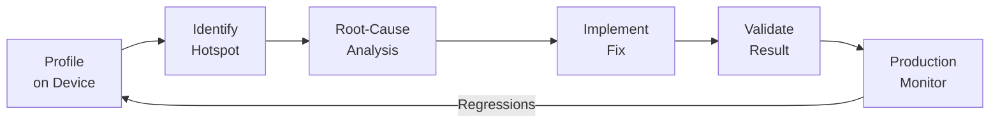

# Android Performance Optimization

> Systematic Android performance engineering across 8+ production apps — 200MB+ down to 80-90MB, spanning 6 optimization domains over 8 years

## Overview

Led Android performance optimization for enterprise IM client and Smart Gateway applications. Applied systematic profiling and tuning across six domains: memory, CPU, UI fluency, cold-start, APK size, and stability — transforming performance from chronic issues to governed metrics.

> **Key Numbers**
> | Metric | Before | After |
> |--------|--------|-------|
> | APK size | 200MB+ | 80-90MB |
> | Cold-start time | ~1.5s | ~800ms |
> | Apps covered | — | 8+ production apps |
> | Size reduction | — | 55%+ |
> | Startup improvement | — | ~47% |

## Optimization Domains

### 1. Memory Optimization

- Activity / Fragment / Handler / Thread lifecycle management
- Heap Dump reference chain analysis for leak root-cause
- LeakCanary integration for automated leak detection
- Bitmap memory optimization and LruCache strategy
- Context reference leak prevention
- Listener / BroadcastReceiver / Callback registration lifecycle
- Socket / long-connection / message queue resource release
- Most leaks traced to: thread holding/concurrency issues and Handler retaining Activity/Fragment Context
- OOM prevention through reduced GC pressure

### 2. CPU Optimization

- Android Studio CPU Profiler hotspot method analysis
- Main thread heavy computation offloading
- Background thread scheduling optimization and task deduplication
- Third-party IM/SDK heartbeat tuning (Huanxin/JPush push channels)
- Invalid polling reduction

### 3. UI Fluency

- CPU trace frame-drop analysis: distinguish data-loading jank from refresh-triggered jank
- Minimize unnecessary refresh frequency
- RecyclerView scrolling performance optimization
- Layout hierarchy flattening
- Database and network operations moved to background threads

### 4. Startup Optimization

- Non-core module lazy initialization
- SDK async initialization
- Application.onCreate startup path restructuring
- Resource load order optimization

**Result: Cold-start reduced from ~1.5s to ~800ms (~47% improvement)**

### 5. APK Size Optimization

Most effective tactic: **unused SO library removal**. Map/location and audio/video SDKs ship multiple ABI builds (arm, armv7, arm64, x86, x86_64), but x86/x86_64 variants are only needed on emulators — all real devices are ARM. Removing these unused ABIs saved the most space.

Second: **image compression**. Multi-MB assets compressed to tens of KBs with negligible visual difference.

Other measures:
- APK Analyzer composition breakdown
- Unused third-party SDK cleanup
- Legacy code and resource removal
- Duplicate dependency resolution
- Resource shrinking
- R8 / ProGuard code shrinking

**Result: 200MB+ → 80-90MB (55%+ reduction)**

### 6. Stability Governance

- Ongoing OOM / ANR / Crash root-cause analysis
- GC behavior monitoring
- Main thread blocking detection
- Background thread resource release discipline
- Long-connection stability tuning

## Profiling Approach

On-device profiling using Android Studio tools — no separate monitoring infrastructure:

- **Memory snapshots**: Capture heap state before/after key operations, identify growing allocations
- **CPU traces**: Record per-frame method timing to pinpoint what happens during jank frames
- **LeakCanary**: Automated leak detection with log analysis to identify which methods hold references
- **Cross-team alignment**: Negotiate optimization boundaries with product team — image quality vs. APK size, refresh frequency vs. real-time feel

### Profiling-to-Fix Workflow

## Profiling Toolkit

| Tool | Purpose |
|------|---------|
| Android Studio Memory Profiler | Memory allocation and leak tracking |
| Android Studio CPU Profiler | Hotspot method and thread analysis |
| Heap Dump | Object reference chain analysis |
| APK Analyzer | APK composition breakdown |
| LeakCanary | Automated memory leak detection |
| System Trace | UI jank and frame-drop analysis |
| Logcat / ADB | Runtime diagnostics |
| ProGuard / R8 | Code shrinking and obfuscation |

## Results

- Reduced APK from **200MB+** to **80-90MB** across IM and gateway apps (55%+ reduction)
- Applied optimizations across **8+ production Android applications**
- Established data-driven performance profiling and optimization workflow
- Continuously reduced OOM, ANR, and Crash rates in production
- Improved RecyclerView scrolling fluency for high-frequency message and device list pages

## Key Takeaways

Performance optimization is a continuous iterative engineering practice — not a one-time fix. Deep understanding of Android Runtime, memory management, thread model, UI rendering pipeline, and APK build mechanism are prerequisites. Systematic governance across all domains, combined with data-driven tool diagnostics and business context awareness, yields cumulative stability gains over time.

## Timeline

2016 – 2024 | Chunxiao Technology Co., Ltd.
