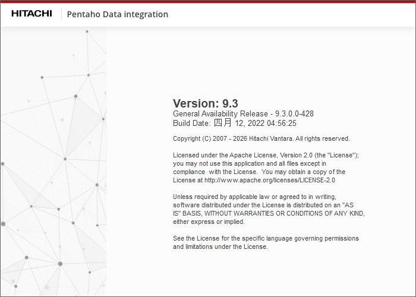
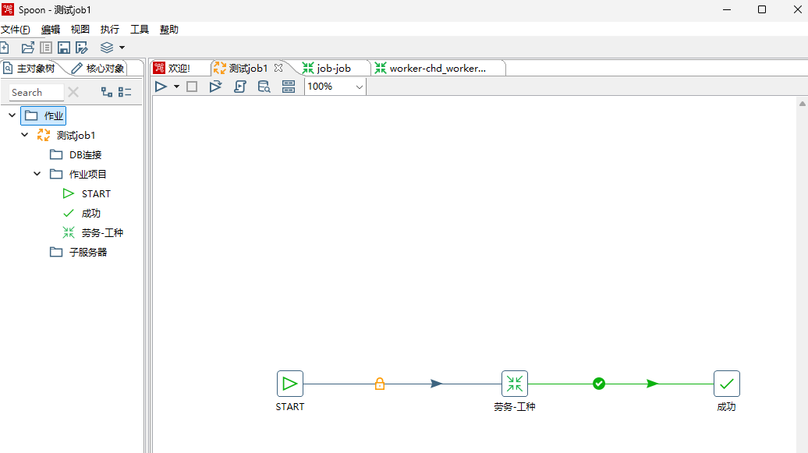

# Banknote Paper Mill Customer Integration

> On-site data integration and delivery for a high-secrecy banknote paper manufacturing facility with strict air-gapped network constraints.

---

## Overview

This project involved IT system integration and data format analysis at a **banknote paper mill** — a high-security manufacturing environment where internet access was completely prohibited on-site.

Working under strict secrecy and access controls, the development cycle required:
- Using **air-gapped laptops** to analyze and export data formats
- Testing solutions inside the plant's internal network
- Returning to external development environment for further work
- Re-entering the facility for validation and deployment

Each site entry required customer approval with **~1 week lead time**, making on-floor debugging time extremely scarce and demanding thorough off-site preparation.

**Project Type:** Enterprise System / Manufacturing IT  
**Timeline:** 2018 - 2020  
**Role:** Developer & Integrator  
**Company:** Chunxiao Technology Co., Ltd.

---

## Key Challenges

- **Air-gapped environment:** No internet access on-site; all tools, libraries, and dependencies had to be transferred via controlled offline media
- **Strict access controls:** Each entry/exit required formal approval, typically 1 week advance notice
- **Limited debugging windows:** On-floor time was precious; scripts, data packages, and rollback plans had to be prepared off-site
- **Controlled deployment:** Software installation and upgrades required offline artifacts with manual verification and rollback procedures

---

## Technical Solution

### ETL Data Integration

Used **Hitachi Pentaho Data Integration (Kettle) v9.3** for data format analysis and ETL workflow development:

- Designed and tested ETL jobs on offline laptops
- Validated data transformation logic within the plant's internal network
- Packaged and verified all artifacts for air-gapped deployment

### Deployment Workflow

```
Off-site Preparation → Offline Media Transfer → On-site Installation → Internal Network Testing → Validation
        ↑                                                                          │
        └──────────────────── Iteration Loop ──────────────────────────────────────┘
```

---

## Evidence

### ETL Development Environment

<table>
  <tr>
    <td align="center">
      <br/>
      <sub>Hitachi Pentaho Data Integration (Kettle) v9.3</sub>
    </td>
    <td align="center">
      <br/>
      <sub>ETL job workflow in Spoon designer</sub>
    </td>
  </tr>
</table>

---

## Skills Demonstrated

- Secure customer-site integration under high-secrecy constraints
- Offline analysis and validation workflows
- Air-gapped deployment and controlled release artifacts
- Cross-environment testing (offline ↔ online)
- Stakeholder communication under schedule pressure

---

**Tags:** #Manufacturing #ETL #AirGapped #HighSecurity #OnSiteIntegration #PentahoKettle
