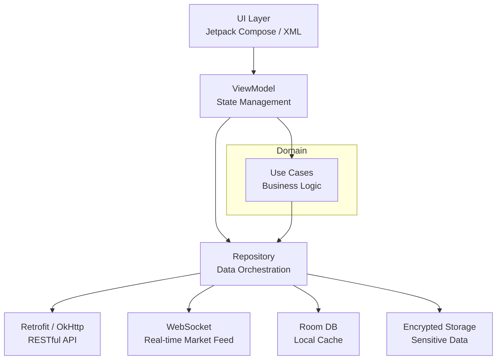
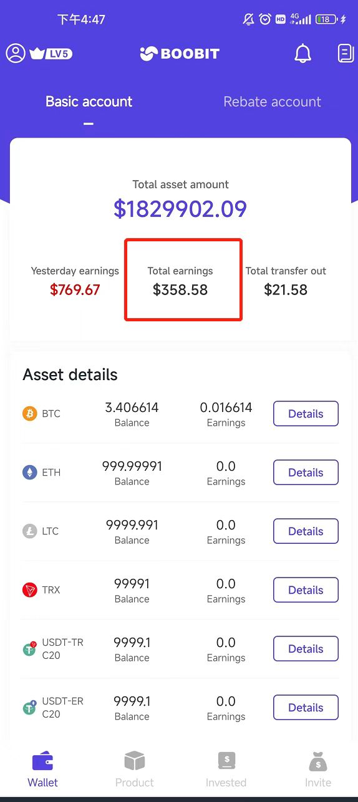
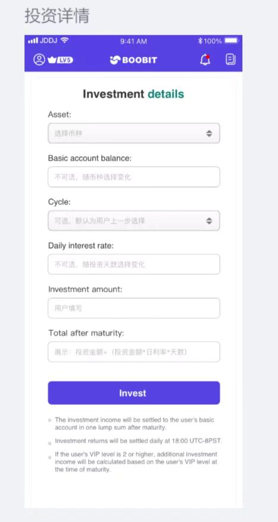
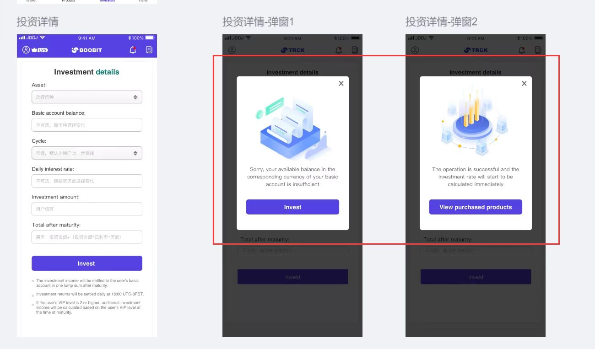
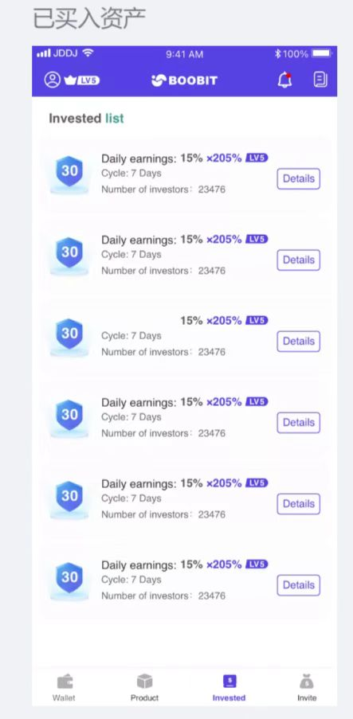
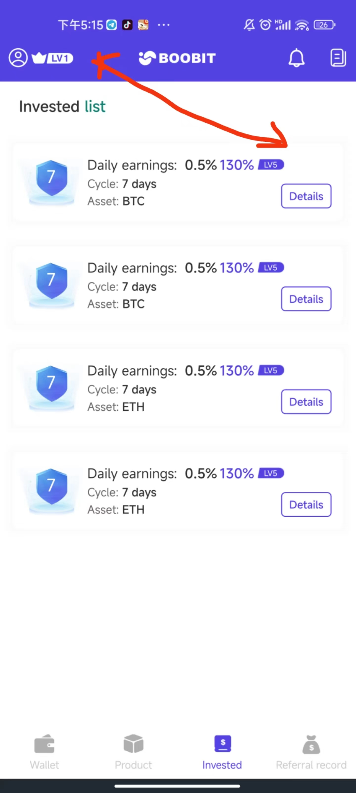
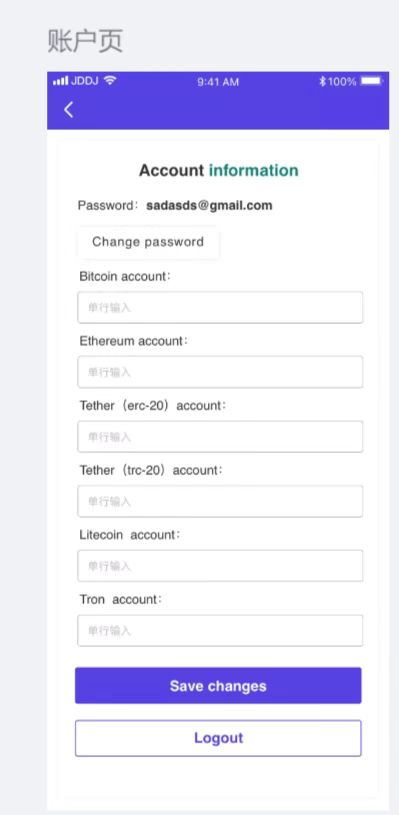
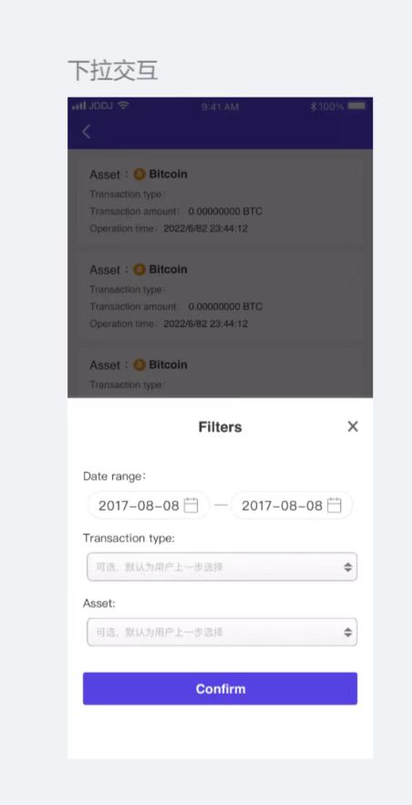
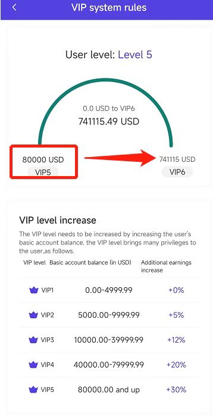

# Boobit

## Overview

Boobit is a cryptocurrency trading platform mobile application that enables users to query market data, search for coins, and perform exchange and recharge operations.

## Architecture

## Features

- **Market Query**: Real-time cryptocurrency price tracking and market data visualization
- **Search**: Advanced search functionality for discovering and filtering cryptocurrencies
- **Exchange**: Currency conversion and trading capabilities
- **Recharge**: Deposit and wallet funding operations
- **Wallet Management**: Secure digital asset storage and transaction history

## Tech Stack

- **Platform**: Android
- **Language**: Kotlin / Java
- **Architecture**: MVVM with Clean Architecture
- **Networking**: Retrofit, OkHttp, WebSocket
- **UI**: Jetpack Compose / XML Layouts
- **Data**: Room, SharedPreferences
- **Security**: Encryption for sensitive data, secure storage

## Architecture

The app follows MVVM pattern with Clean Architecture principles:
- **Presentation Layer**: UI components, ViewModels
- **Domain Layer**: Use cases, business logic
- **Data Layer**: Repositories, API services, local database

## Key Numbers

| Metric | Detail |
|--------|--------|
| Core Features | 5+ (market, search, exchange, recharge, wallet) |
| Real-time Feed | WebSocket push for live price updates |
| Security | HTTPS + HMAC-SHA256 request signing + AES parameter encryption |
| Local Storage | Room DB + encrypted SharedPreferences |
| Role | Sole Android developer, ~1-month delivery |

## Key Achievements

- Implemented real-time market data updates via WebSocket
- Built secure wallet system with encryption
- Designed intuitive UI for complex trading operations
- Integrated multiple payment gateways for recharge functionality
- Normalized high-precision decimal handling across tokens (18 decimals for BTC, 8 for others)

## Timeline

- **Started**: 2022
- **Status**: Completed

## Screenshots

### App Interface

  

### Wallet & Assets

<table>
  <tr>
    <td align="center"> Wallet dashboard with total assets</td>
    <td align="center"> Wallet with earnings breakdown</td>
    <td align="center"> Product dashboard with asset details</td>
  </tr>
</table>

### Investment System

<table>
  <tr>
    <td align="center"> Investment details form</td>
    <td align="center"> Investment flow with error/success states</td>
    <td align="center"> Investment detail screen (BTC, 7-day cycle)</td>
  </tr>
  <tr>
    <td align="center"> Invested list with daily earnings</td>
    <td align="center"> Investment cards for BTC/ETH</td>
  </tr>
</table>

### Account & Transactions

<table>
  <tr>
    <td align="center"> Account info with crypto wallet addresses</td>
    <td align="center"> BTC withdrawal form</td>
    <td align="center"> Transaction filter overlay</td>
  </tr>
</table>

### VIP System

<table>
  <tr>
    <td align="center"> VIP level progress and bonus tiers</td>
  </tr>
</table>
