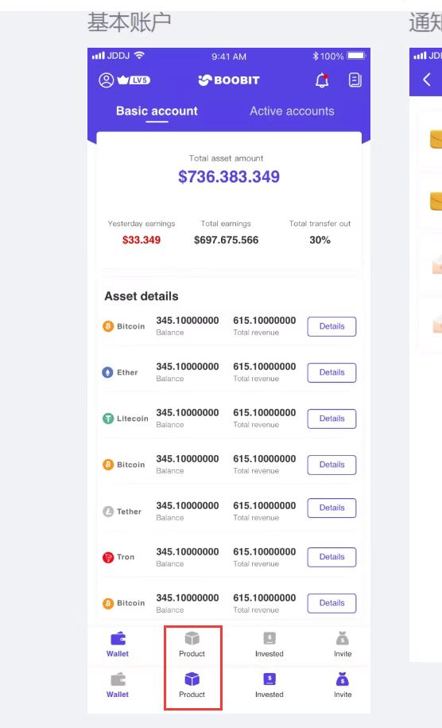
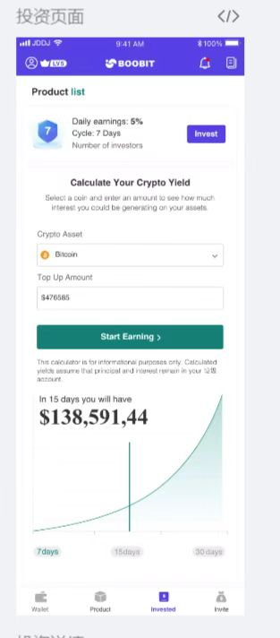
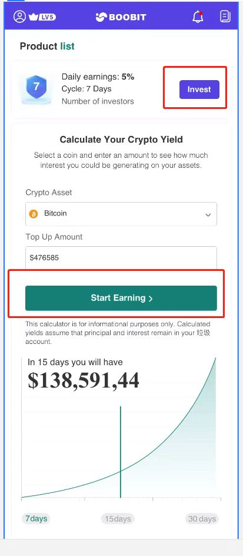
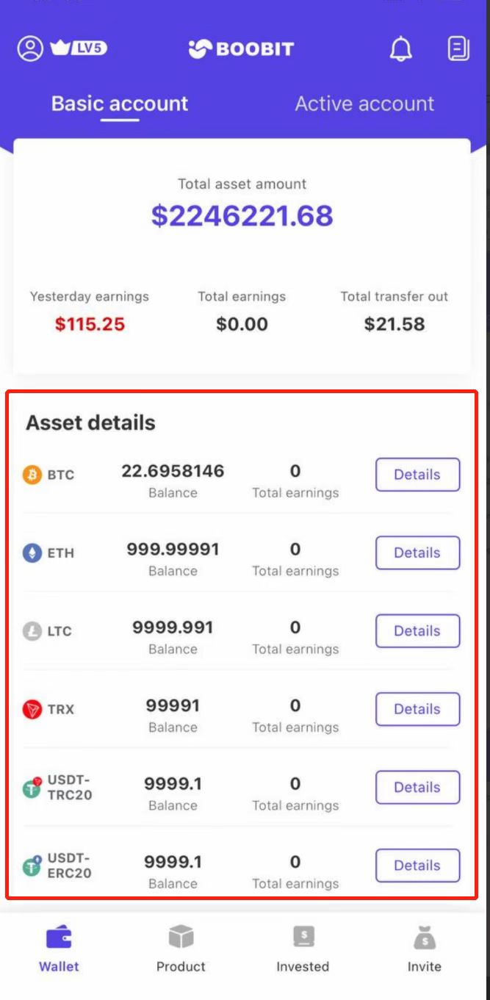
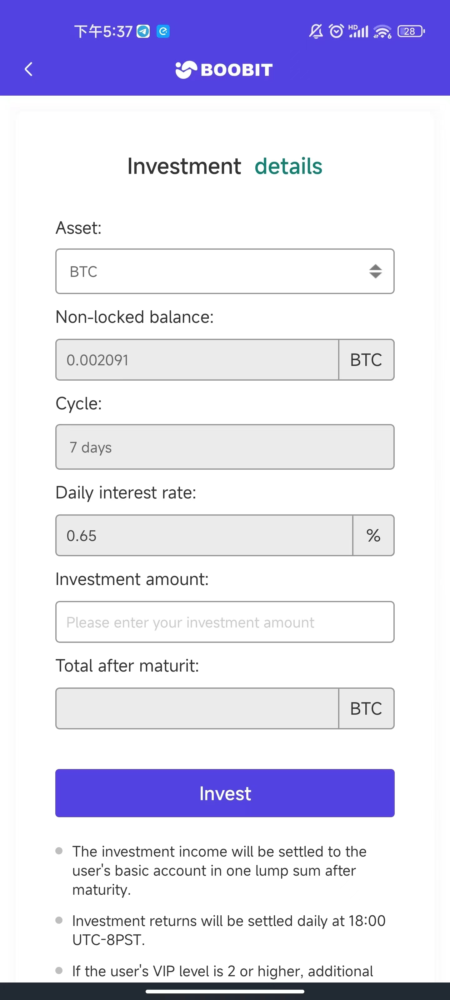
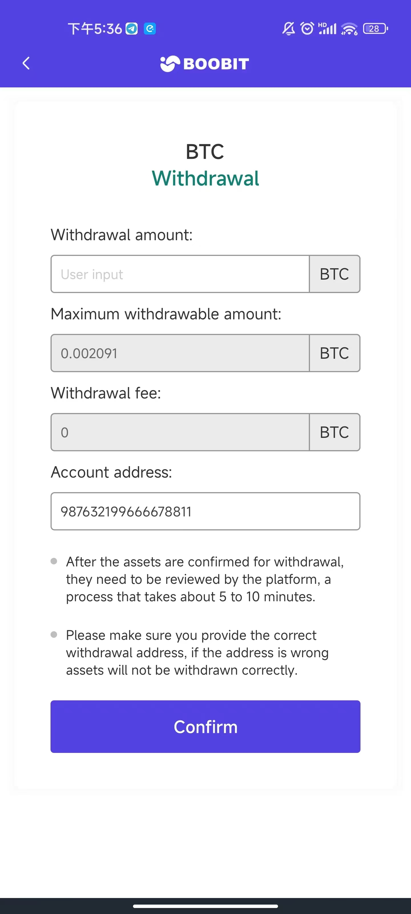
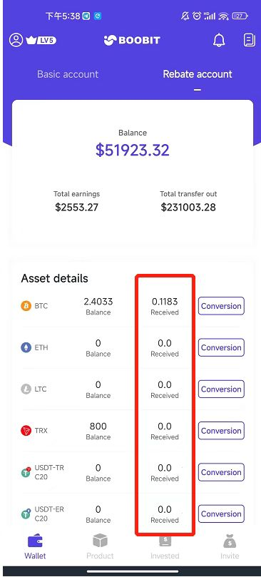

# Boobit

## Overview

Boobit is a cryptocurrency trading platform mobile application that enables users to query market data, search for coins, and perform exchange and recharge operations.

## Features

- **Market Query**: Real-time cryptocurrency price tracking and market data visualization
- **Search**: Advanced search functionality for discovering and filtering cryptocurrencies
- **Exchange**: Currency conversion and trading capabilities
- **Recharge**: Deposit and wallet funding operations
- **Wallet Management**: Secure digital asset storage and transaction history

## Tech Stack

- **Platform**: Android
- **Language**: Kotlin / Java
- **Architecture**: MVVM with Clean Architecture
- **Networking**: Retrofit, OkHttp, WebSocket
- **UI**: Jetpack Compose / XML Layouts
- **Data**: Room, SharedPreferences
- **Security**: Encryption for sensitive data, secure storage

## Architecture

The app follows MVVM pattern with Clean Architecture principles:
- **Presentation Layer**: UI components, ViewModels
- **Domain Layer**: Use cases, business logic
- **Data Layer**: Repositories, API services, local database

## Key Achievements

- Implemented real-time market data updates via WebSocket
- Built secure wallet system with encryption
- Designed intuitive UI for complex trading operations
- Integrated multiple payment gateways for recharge functionality

## Timeline

- **Started**: 2022
- **Status**: Completed

## Screenshots

### App Interface

| Home | Market | Search |
|:---:|:---:|:---:|
|  |  |  |

| Coin Detail | Wallet | Exchange |
|:---:|:---:|:---:|
|  |  |  |

| Recharge | Transaction History | Settings |
|:---:|:---:|:---:|
|  |  |  |

### More Screenshots

