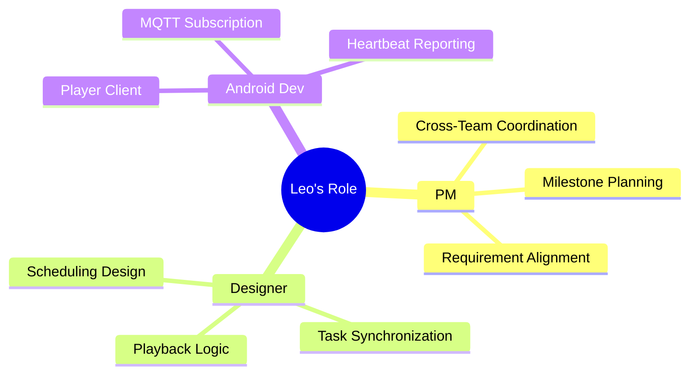
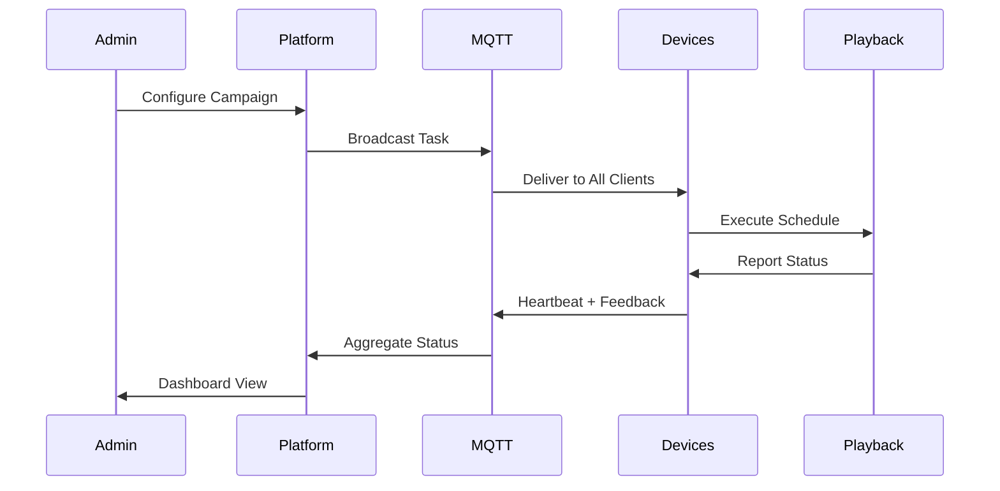
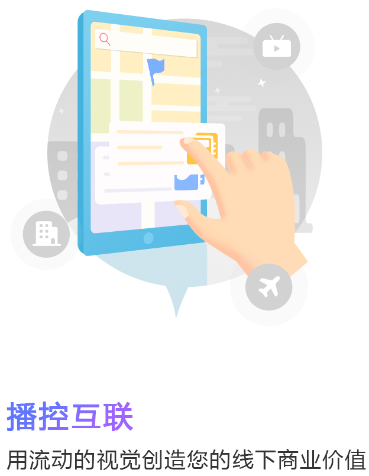

# Broadcast Control Platform (Digital Signage Ad Delivery)

> A 2020 digital signage platform project for centralized ad delivery across elevator, in-store, and public screens, with MQTT broadcast-based control.

---

## Overview

The Broadcast Control Platform provides a unified control model for distributed public screens.  
Operators can manage campaigns and remotely deliver **video/image advertisements** to:

- Elevator screens
- In-store screens
- Public digital signage screens

The core design goal is to improve delivery efficiency and operational consistency for large-scale multi-screen publishing.

**Project Type:** Digital Signage / AdTech Platform  
**Timeline:** 2020  
**Role:** Project Manager + Android Screen Client Lead Developer  
**Company:** Chunxiao Technology Co., Ltd.

> ### Key Numbers
> | Metric | Value |
> | :--- | :--- |
> | Team Size | **9** cross-functional |
> | Delivery Time | **2 months** |
> | Control Protocol | **MQTT broadcast** |
> | Screen Scenarios | **3** (Elevator, Store, Public) |

---

## My Responsibilities

### Responsibility Breakdown



### Project Management
- Coordinated product, backend, operations, and screen deployment teams.
- Drove requirement alignment for campaign management, scheduling, and device control.
- Defined delivery milestones and rollout priorities for multi-scenario screen usage.

### Android Screen Client Development
- Led and implemented Android player clients for elevator/store/public screens.
- Designed task synchronization and playback execution logic on device side.
- Implemented MQTT broadcast subscription and command handling for campaign delivery.
- Built runtime status reporting (heartbeat, playback state, task feedback) for central monitoring.

---

## Key Capabilities

- **Campaign-driven delivery:** Configure materials, target groups, and schedule windows.
- **MQTT broadcast control:** Broadcast delivery tasks to large online device groups.
- **Multi-format playback:** Support both image and video advertisement materials.
- **Group-based management:** Organize devices by building, store, region, or custom tags.
- **Policy-based scheduling:** Apply time, location, and priority rules for playback.
- **Operational visibility:** Monitor device online status and active playback tasks.
- **Auditability:** Keep publish and policy-change operation logs.

---

## End-to-End Workflow

1. Upload ad assets and configure campaign policies.
2. Select target screen groups and publishing windows.
3. Dispatch campaign tasks through MQTT broadcast channels.
4. Android screen clients receive tasks and execute scheduled playback.
5. Devices report runtime heartbeat, task status, and playback feedback.
6. Operators optimize campaign policies based on delivery and runtime status.

### Control Sequence



---

## Architecture (Conceptual)

```
┌────────────────────────────────────────────────────┐
│                Operation Console                    │
│ Campaign Mgmt | Device Mgmt | Schedule | Reports    │
└─────────────────────────────┬───────────────────────┘
                              │
┌─────────────────────────────▼───────────────────────┐
│                 Control Platform                     │
│  Asset Service | Campaign Engine | Policy Engine     │
│  Device Registry | Task Dispatcher | Audit Logging   │
└─────────────────────────────┬───────────────────────┘
                              │
                  MQTT Broadcast / HTTP / WebSocket
                              │
┌─────────────────────────────▼───────────────────────┐
│              Android Screen Clients                  │
│ Elevator | Store | Public Displays                   │
│ Player Runtime | Task Sync | Heartbeat Reporting     │
└──────────────────────────────────────────────────────┘
```

---

## Project Impact

- Established a unified platform for heterogeneous public screens.
- Reduced manual on-site content updates through remote campaign dispatching.
- Improved large-scale publishing efficiency using MQTT broadcast delivery.
- Enabled reusable operation workflows for recurring advertisement schedules.

---

## Evidence

### Platform Interface

<table>
  <tr>
    <td align="center">
      <br/>
      <sub>Broadcast Control Interconnection promotional illustration with tablet interface</sub>
    </td>
  </tr>
</table>

---

## Skills Demonstrated

- Project management and cross-team delivery coordination
- Android screen-side application development
- MQTT broadcast messaging and task distribution
- Digital signage campaign scheduling design
- Multi-device remote operation and monitoring

---

**Tags:** #DigitalSignage #AdTech #BroadcastControl #MQTT #Android #CampaignManagement
