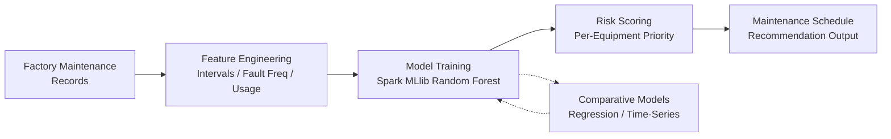

# Device Maintenance Prediction

> 2023 experimental project: Spark MLlib Random Forest on textile equipment maintenance data — limited dataset, focused on learning Spark MLlib ecosystem

## Prediction Pipeline

## Overview

Experimental predictive maintenance exploration using factory-provided textile equipment records. Core goal was gaining hands-on experience with **Spark MLlib** — building Random Forest models, feature engineering pipelines, and understanding industrial data challenges. Limited dataset constrained predictive accuracy; the project did not progress to production deployment but provided solid exposure to the Spark MLlib ecosystem.

## Context

- **Timeline**: 2023
- **Role**: AI Algorithm Developer
- **Data Source**: Factory maintenance records (textile equipment)
- **Framework**: Spark MLlib
- **Status**: Experimental, not production deployed

## Algorithm

- **Core**: Spark MLlib Random Forest
- **Features**: Maintenance intervals, fault frequency, usage intensity, aging indicators
- **Output**: Next maintenance window prediction + risk score per equipment unit

## Key Numbers

| Metric | Detail |
|--------|--------|
| Models Compared | Random Forest + regression and time-series baselines |
| Feature Categories | Intervals, fault frequency, usage intensity, aging indicators |
| Output | Per-equipment next maintenance window + risk score |
| Approach | SparkNet + Random Forest with comparative validation |

## What I Learned

- **Data is the bottleneck in industrial AI** — predictive accuracy was heavily constrained by limited historical records; production deployment would need 6-12 months of continuous labeled data
- **Spark MLlib pipeline design matters** — same pipeline code runs locally for development and on a Spark cluster if data scales, future-proofing the approach
- **Interpretability beats black-box** — Random Forest was chosen over deep learning because feature contributions can explain risk scores to factory managers; black-box predictions do not build trust in industrial settings
- **Feature engineering on real data is hard** — industrial maintenance records are messy, incomplete, and far from clean research datasets

**Tags:** #AI #PredictiveMaintenance #Spark #SparkMLlib #RandomForest #IndustrialAI #Experimental
