# Enterprise Messaging Platform

> Real-time internal messaging system serving 5,000 daily active users

---

## Overview

Developed and maintained a comprehensive enterprise instant messaging platform for internal company communications.  
The platform is organized as multiple core subsystems, including **User Center**, **Message Center**, and **File System**, and supports real-time messaging across Android, Web, and PC clients with high reliability and low latency.

**Project Type:** Enterprise Communication Platform  
**Timeline:** 2014 - 2023  
**Role:** Core Android & Backend Developer  
**Company:** Chunxiao Technology Co., Ltd., China  
**Scale:** 5,000 daily active users

---

## Key Features

- **Real-time Messaging:** Sub-200ms message delivery latency
- **Cross-Platform:** Android, Web, and PC clients
- **High Throughput:** 500,000+ messages processed daily
- **Native Performance:** NDK-based TCP/UDP implementation
- **Cross-Terminal Login:** Seamless device switching
- **Stable Connection:** Robust protocol handling
- **Enterprise Security:** Internal network deployment
- **Modular Subsystems:** User Center, Message Center, File System, and supporting services

---

## Architecture

```
┌─────────────────────────────────────────┐
│           Client Layer                  │
│  ┌──────────┐ ┌──────────┐ ┌─────────┐ │
│  │ Android  │ │   Web    │ │   PC    │ │
│  │  (NDK)   │ │ (WebSocket)│ │ (C++)  │ │
│  └────┬─────┘ └────┬─────┘ └────┬────┘ │
└───────┼────────────┼────────────┼──────┘
        │            │            │
        └────────────┼────────────┘
                     │
┌────────────────────▼────────────────────┐
│         Load Balancer (Nginx)           │
└────────────────────┬────────────────────┘
                     │
┌────────────────────▼────────────────────┐
│      Message Gateway (Spring Cloud)     │
│     ┌───────────────────────────┐      │
│     │   Connection Management   │      │
│     │   Message Routing         │      │
│     │   Session Handling        │      │
│     └───────────────────────────┘      │
└────────────────────┬────────────────────┘
                     │
┌────────────────────▼────────────────────┐
│      Core Services                      │
│  ┌──────────┐ ┌──────────┐ ┌─────────┐ │
│  │ Message  │ │  User    │ │ Presence│ │
│  │ Service  │ │ Service  │ │ Service │ │
│  └────┬─────┘ └────┬─────┘ └────┬────┘ │
└───────┼────────────┼────────────┼──────┘
        │            │            │
┌───────▼────────────▼────────────▼──────┐
│      Data Layer                         │
│    MySQL          Redis          C++    │
│  (Messages)    (Sessions)    (Protocol) │
└─────────────────────────────────────────┘
```

---

## Technologies

### Mobile Development
- **Java/Kotlin** - Android development
- **NDK** - Native C code for protocol implementation
- **TCP/UDP** - Custom protocol over native sockets
- **Android SDK** - UI and system integration

### Backend
- **Java** - Service development
- **Spring Cloud** - Microservices framework
- **Node.js** - Auxiliary services
- **C++** - Core protocol implementation
- **WebSocket** - Web client communication

### Data & Caching
- **MySQL** - Message and user data storage
- **Redis** - Session management and caching
- **Distributed Database** - Scalable data storage across nodes
- **FastDFS** - Distributed file management for media/file attachments
- **Message Queue** - Async processing

### Infrastructure
- **Nginx** - Load balancing
- **Linux** - Server deployment
- **Git** - Version control

---

## Key Achievements

- ✅ **5,000 daily active users** - Company-wide adoption
- ✅ **<200ms latency** - Sub-200ms message delivery
- ✅ **500K+ messages/day** - High throughput handling
- ✅ **Cross-platform support** - Android, Web, PC clients
- ✅ **99.9% uptime** - Reliable enterprise service
- ✅ **Protocol optimization** - Custom NDK implementation

---

## Responsibilities

### Android Development
- Designed and implemented real-time messaging UI
- Built native communication layer using NDK
- Implemented cross-terminal login functionality
- Optimized connection stability and performance
- Handled Android OS compatibility across versions

### Backend Development
- Developed messaging backend services using Spring Cloud
- Designed and implemented core subsystem collaboration: User Center, Message Center, and File System
- Implemented message routing and delivery logic
- Built session management and presence system
- Integrated distributed database architecture and FastDFS file storage
- Created REST APIs for client integration
- Node.js auxiliary services development

### Protocol Design
- Designed custom TCP/UDP communication protocol
- Implemented protocol in C++ for performance
- Optimized for low latency and high throughput
- Handled connection management and reconnection

### Release Management
- Facilitated version releases across platforms
- Coordinated updates with QA team
- Managed client rollout and monitoring
- Handled backward compatibility

---

## Technical Challenges

### Challenge 1: Low Latency Requirements
**Problem:** Enterprise users expect instant message delivery  
**Solution:** Custom NDK protocol implementation, connection pooling, optimized message routing

### Challenge 2: Connection Stability
**Problem:** Mobile networks are unstable, causing frequent disconnections  
**Solution:** Intelligent reconnection logic, message queueing, session persistence

### Challenge 3: Cross-Platform Consistency
**Problem:** Ensuring consistent experience across Android, Web, and PC  
**Solution:** Unified protocol design, shared backend services, synchronized state management

### Challenge 4: Scale & Performance
**Problem:** Handling 500K+ messages daily with low latency  
**Solution:** Horizontal scaling, Redis caching, async processing, database optimization

---

## Results & Impact

- **User Adoption:** 5,000 daily active users across the company
- **Performance:** Consistent sub-200ms message delivery
- **Reliability:** Maintained high availability over 9 years
- **Efficiency:** Significantly improved internal communication
- **Scale:** Successfully handled peak loads and growth

---

## Evidence

### Client UI Screenshots

<table>
  <tr>
    <td align="center">
      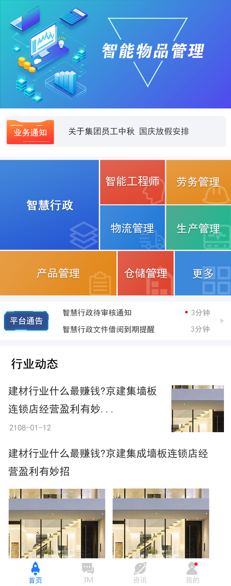<br/>
      <sub>Home page - Main message list and navigation</sub>
    </td>
    <td align="center">
      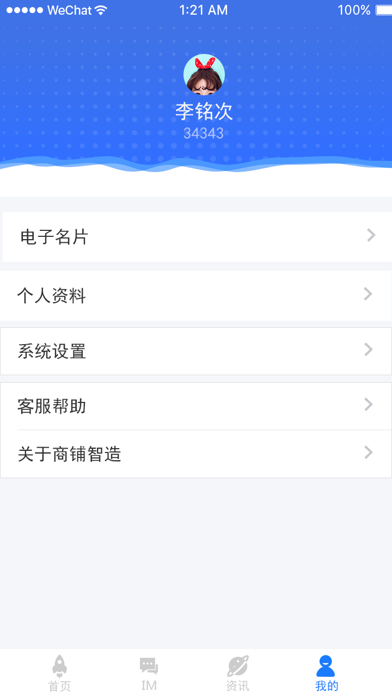<br/>
      <sub>Profile page after login - User info and settings</sub>
    </td>
  </tr>
  <tr>
    <td align="center">
      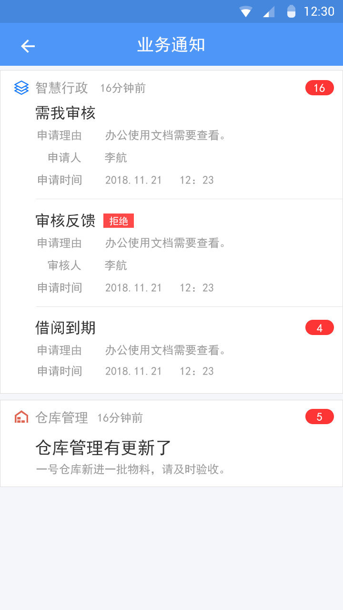<br/>
      <sub>Message detail view - Conversation thread</sub>
    </td>
    <td align="center">
      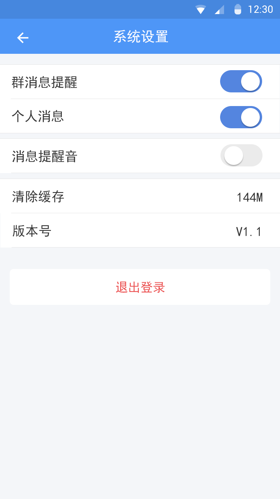<br/>
      <sub>System settings - Configuration options</sub>
    </td>
  </tr>
</table>

### Additional Screens

<table>
  <tr>
    <td align="center">
      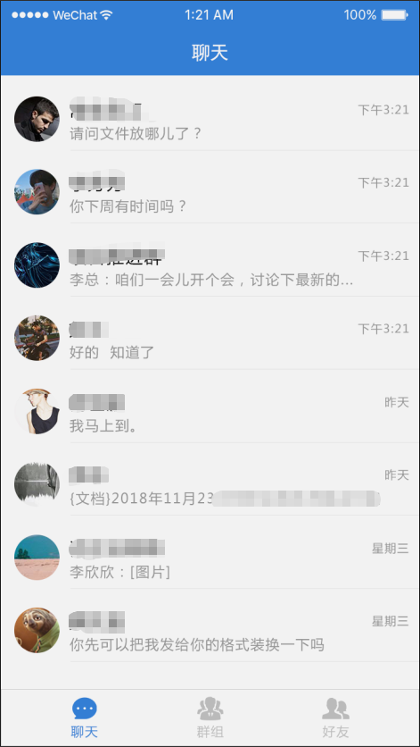<br/>
      <sub>Recent client interface</sub>
    </td>
  </tr>
</table>

### Enterprise App Launcher & Management

<table>
  <tr>
    <td align="center">
      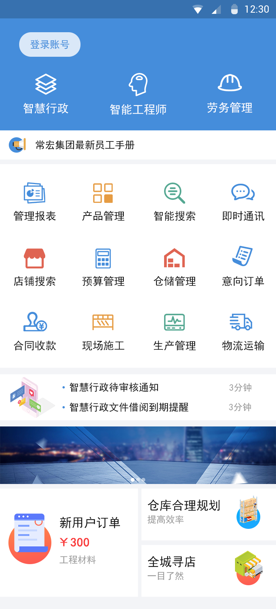<br/>
      <sub>Enterprise app homepage with service categories and function grid</sub>
    </td>
  </tr>
</table>

### Desktop PC Client

<table>
  <tr>
    <td align="center">
      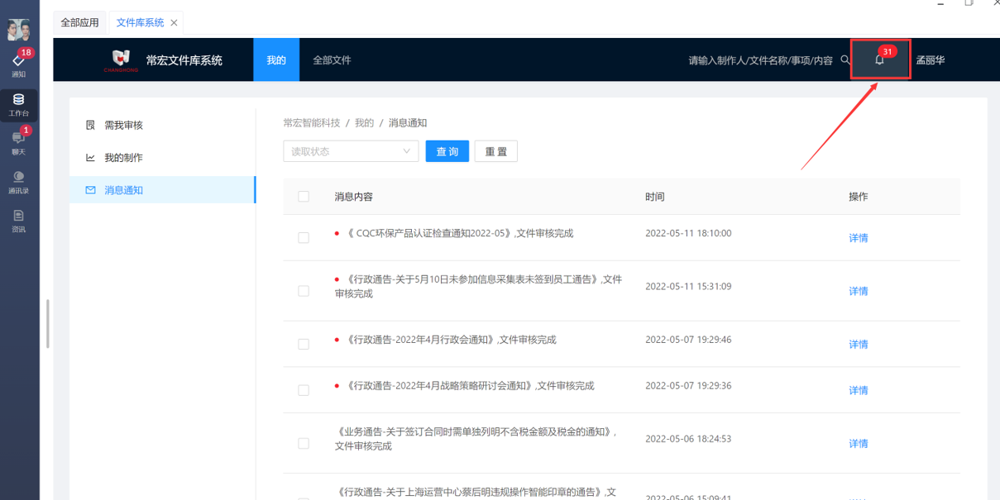<br/>
      <sub>Desktop client: document review notifications</sub>
    </td>
    <td align="center">
      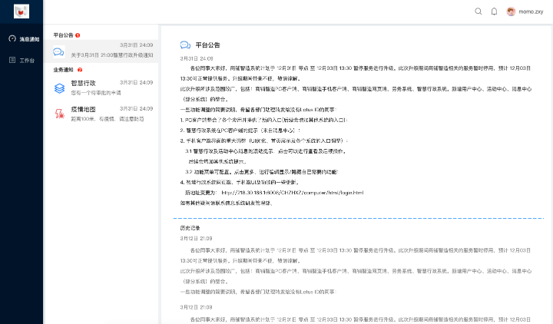<br/>
      <sub>Content management dashboard with articles</sub>
    </td>
  </tr>
  <tr>
    <td align="center">
      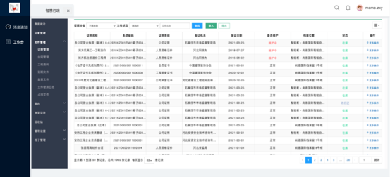<br/>
      <sub>Admin backend: account management table</sub>
    </td>
    <td align="center">
      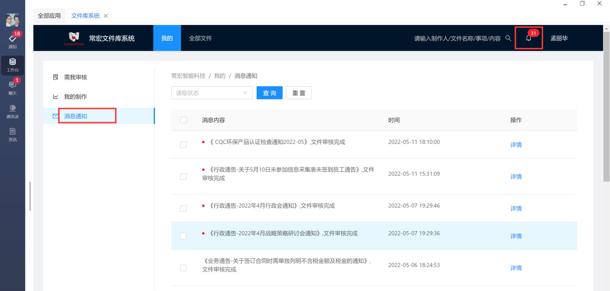<br/>
      <sub>File library notifications with unread count</sub>
    </td>
  </tr>
  <tr>
    <td align="center" colspan="2">
      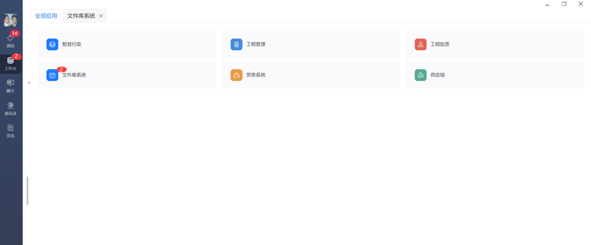<br/>
      <sub>Enterprise subsystem tiles: Admin, Engineering, Files, Labor, Supply Chain</sub>
    </td>
  </tr>
</table>

---

## Skills Demonstrated

- **Android Development:** NDK, custom protocols, UI design
- **Backend Engineering:** Spring Cloud, microservices, REST APIs
- **Network Programming:** TCP/UDP, socket programming, protocol design
- **Performance Optimization:** Low-latency systems, caching strategies
- **Cross-Platform Development:** Multi-client synchronization
- **DevOps:** Deployment, monitoring, release management

---

**Tags:** #Android #Java #NDK #SpringCloud #Messaging #TCP #UDP #LowLatency #HighThroughput #CrossPlatform
