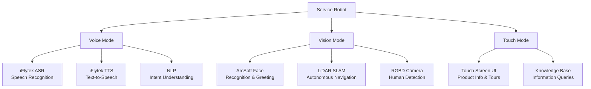

# Exhibition Service Robot

> 2019 project: Android SDK integration for a purchased service robot — ArcSoft face recognition, iFlytek voice, knowledge base for exhibition hall deployment

## Multi-Modal Interaction

## Overview

Purchased a complete service robot with built-in Android SDK (navigation, LiDAR SLAM, face recognition, voice interaction all exposed as API calls). 4-person team built upper-layer application features: product introduction, face recognition visitor check-in, voice-guided tours, and a knowledge base for information queries. My role was Android development — building the interaction interface and integrating robot vendor SDK features.

## Context

- **Timeline**: 2019
- **Role**: Full-stack Engineer / System Integration
- **Team**: 4 (Android + Robot Integration + Frontend + Backend)
- **Approach**: Buy-vs-build — purchased robot hardware with SDK, focused team effort on application layer

## My Responsibilities

- Developed Android interaction interface and voice dialogue system using robot vendor SDK
- Integrated vendor SDK APIs for navigation, LiDAR map scanning, face recognition (ArcSoft), and voice interaction (iFlytek ASR/TTS)
- Built multi-modal interaction combining voice, touch, and vision in exhibition environments
- Implemented ArcSoft face recognition for VIP greeting, visitor check-in, and attendance tracking

## Tech Stack

- **Android**: Java, Kotlin, Android SDK
- **Robot Vendor SDK**: Navigation, SLAM, LiDAR APIs (built-in, not developed by us)
- **Face Recognition**: ArcSoft
- **Voice**: iFlytek ASR/TTS
- **Backend**: Spring Cloud, WebSocket, MQTT, MySQL, Redis

## Key Numbers

| Metric | Detail |
|--------|--------|
| Navigation Precision | Centimeter-level (LiDAR SLAM) |
| Voice Understanding | >90% intent accuracy |
| Face Recognition | >98% accuracy |
| Operation | 7x24 continuous service |
| Interaction Modes | Voice, Vision, Touch (3 modalities) |

## Deployment

Deployed at a building materials and decoration client's exhibition hall — their business provides store fit-outs for major brands including Apple and Huawei.

**Tags:** #Android #SDKIntegration #ArcSoft #iFlytek #Exhibition #Robot
