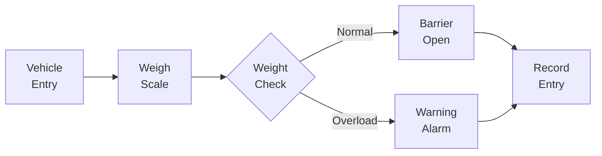

# Entrance Road Weighing & Access Interlock Integration

> Vehicle weigh-in system at entrance scale with overload warnings and barrier/signal interlocks.

---

## Overview

Customer-site delivery for vehicle weigh-in at an entrance scale: read stable weight from the scale, raise overload warnings, and interlock with barrier/signal hardware. This project involved strong dependency on deep on-site experience and required balancing technical stack preferences with team maintainability concerns.

**Project Type:** Industrial IoT / Field Integration  
**Timeline:** 2015 - 2017 (estimated)  
**Role:** Developer (Field Software Integration)  
**Company:** Chunxiao Technology Co., Ltd., China

> **Key Numbers**
> | Metric | Detail |
> |--------|--------|
> | Scale interface | RS232/RS485 serial |
> | Barrier control | GPIO interlock |
> | Primary stack | Delphi (team decision) |
> | Timeline | 2015-2017 |
> | Delivery | Customer-site deployed |

---

## Key Features

- **Vehicle Weighing:** Automated weight reading as vehicles roll onto weigh scales
- **Overload Detection:** Real-time overload warnings based on configured thresholds
- **Barrier Interlock:** Coordinate with barrier gates and signal hardware
- **Device Integration:** Serial communication with weigh scales and access control hardware
- **Field Workflow:** High coupling between device semantics and on-site operational constraints

---

## Technical Context

This project involved a notable technical disagreement regarding technology stack selection:

- **Senior colleague preference:** Delphi for rapid development using familiar toolchain
- **Your recommendation:** .NET-oriented approach for better team alignment, code review coverage, and maintainability
- **Decision:** Engineering/customer owner chose Delphi
- **Your response:** Executed professionally despite non-preferred stack, documented interfaces and risks thoroughly to reduce bus factor

---

## Architecture (Conceptual)

```
┌─────────────────────────────────────────┐
│         Field Hardware Layer            │
│  ┌──────────┐ ┌──────────┐ ┌────────┐  │
│  │Weigh     │ │ Barrier  │ │Signal  │  │
│  │Scale     │ │ Gate     │ │Lights  │  │
│  └────┬─────┘ └────┬─────┘ └───┬────┘  │
│       │ RS232/485  │ GPIO      │ GPIO   │
└───────┼────────────┼───────────┼────────┘
        │            │           │
┌───────▼────────────▼───────────▼────────┐
│      Desktop Application (Delphi)       │
│  ┌─────────────────────────────────┐   │
│  │  - Weight data acquisition      │   │
│  │  - Overload detection logic     │   │
│  │  - Barrier/signal control       │   │
│  │  - Local logging                │   │
│  └─────────────────────────────────┘   │
└─────────────────────────────────────────┘
```

### Weigh-In Flow



---

## Technologies

### Languages & Frameworks
- **Delphi** - Primary application development (team decision)
- **.NET** - Alternative stack proposed for team alignment

### Domain Expertise
- Weigh-scale integration and calibration
- Barrier/access control interlocks
- Overload detection workflows
- Serial/device communication protocols

### Skills Demonstrated
- Field integration and device-driven workflows
- Stack trade-off analysis (maintainability vs individual familiarity)
- Technical writing for handover under non-preferred stack decisions
- Conflict handling with senior specialists
- Stakeholder-visible risk articulation
- Professional execution after leadership decisions

---

## Challenges & Solutions

### Challenge 1: Technology Stack Disagreement
**Problem:** Senior colleague preferred Delphi; you advocated for .NET for better team support  
**Solution:** Documented trade-offs clearly (maintainability, review coverage, bus factor), accepted final decision, executed professionally with thorough documentation

### Challenge 2: Field Hardware Integration
**Problem:** High coupling between serial/device semantics and on-site constraints  
**Solution:** Deep collaboration with experienced colleague, thorough testing in actual field conditions

### Challenge 3: Knowledge Transfer Risk
**Problem:** Few teammates could debug/maintain Delphi code  
**Solution:** Comprehensive interface documentation, operational risk notes, clear boundary definitions for future maintainers

---

## Results & Impact

- **Successful Delivery:** System deployed and operational at customer site
- **Professional Execution:** Maintained quality despite non-preferred technology stack
- **Documentation:** Interfaces and risks well-documented to reduce tribal knowledge
- **Learning:** Balanced respect for on-site experience with explicit risk communication

---

## Evidence

> No screenshots currently available in this repository.
> Suggested files to add under `images/`:
> - `weigh-scale-hardware.jpg` - Photo of weigh scale installation
> - `barrier-interlock.jpg` - Barrier gate and signal hardware
> - `software-interface.png` - Desktop application UI showing weight readings
> - `field-deployment.jpg` - On-site deployment photo

---

## Related Projects

This project shares similarities with other industrial IoT and field integration work:

- **[Smart Factory](../smart-factory/)** - Also involves electronic scale integration via serial communication
- **[IoT Solutions](../iot-solutions/)** - Device management and field deployment experience
- **[Picture Book Locker](../picture-book-locker/)** - Hardware integration and access control

---

**Tags:** #IndustrialIoT #Weighbridge #VehicleWeighing #OverloadAlarm #BarrierInterlock #Delphi #FieldDelivery #StackDisagreement #Maintainability
