# Forest Patrol Inspection System

> Mobile patrol system for forest rangers to work in no-signal areas, record GPS tracks, report fire/pest risks, and upload data when network becomes available.

---

## Overview

This project is designed for **forest patrol operations in weak or no-network environments**.  
Patrol users carry mobile devices into forest areas to complete inspections, record trajectories, and report risk events such as:

- Fire hazards
- Pest and disease incidents
- Other field abnormalities

The system supports offline-first data collection and delayed synchronization, ensuring data is not lost during patrol.

**Project Type:** Mobile GIS / Forest Patrol  
**Timeline:** TBD  
**Role:** Android Mobile Client Developer  
**Company:** TBD

---

## My Responsibilities

- Focused on Android mobile client development for offline field patrol operations.
- Implemented GPS-based patrol track recording and trajectory playback support.
- Implemented risk reporting forms for fire, pest, and other patrol events.
- Integrated offline map loading and GIS-based field annotations.
- Built local data storage and deferred upload mechanism after reconnecting to network.
- Coordinated with backend/GIS teams for API schema and map layer integration.

---

## Key Capabilities

- **Offline patrol mode:** Continue patrol tasks in areas without mobile signal.
- **GPS trajectory recording:** Record and persist patrol routes with timestamps.
- **Offline map support:** Load map tiles/packages locally for field navigation.
- **GIS annotation:** Mark risk points, routes, and observation notes on map layers.
- **Event reporting:** Structured reporting for fire risk, pest hazards, and other incidents.
- **Deferred synchronization:** Automatically upload local records after network recovery.
- **Field evidence collection:** Support text/photos/position metadata for incident records.

---

## Typical Workflow

1. Ranger downloads offline map packages before entering patrol region.
2. Android client starts patrol session and records GPS trajectories continuously.
3. Ranger marks risk points and submits local event records in no-signal areas.
4. All patrol data is stored locally with status tracking.
5. When network is available, the client uploads tracks/events and syncs to platform.
6. Management side reviews patrol coverage and risk distribution on GIS layers.

---

## Architecture (Conceptual)

```
┌────────────────────────────────────────────────────┐
│                 Android Patrol Client               │
│ Offline Map | GPS Track | Event Report | Local DB   │
└─────────────────────────────┬───────────────────────┘
                              │
                    Sync When Network Available
                              │
┌─────────────────────────────▼───────────────────────┐
│                 Patrol Platform APIs                 │
│ Track Ingestion | Event Management | User/Task Mgmt  │
└─────────────────────────────┬───────────────────────┘
                              │
┌─────────────────────────────▼───────────────────────┐
│                   GIS Visualization                  │
│ Patrol Routes | Risk Points | Thematic Layers        │
└──────────────────────────────────────────────────────┘
```

---

## Project Impact

- Enabled reliable patrol data collection in no-signal forest areas.
- Improved risk reporting timeliness for fire and pest events.
- Built GIS-based visibility for patrol coverage and hazard distribution.
- Reduced manual transcription and delayed reporting from field teams.

---

## Evidence

### Android App Screens

<table>
  <tr>
    <td align="center">
      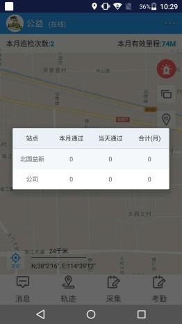<br/>
      <sub>Photo capture and evidence upload</sub>
    </td>
    <td align="center">
      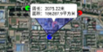<br/>
      <sub>Patrol map and operation workflow</sub>
    </td>
  </tr>
  <tr>
    <td align="center">
      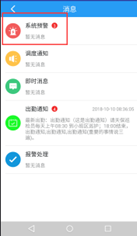<br/>
      <sub>Patrol task and field reporting page</sub>
    </td>
    <td align="center">
      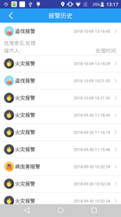<br/>
      <sub>Risk record and evidence entry page</sub>
    </td>
  </tr>
</table>

### Field Patrol Scenes

<table>
  <tr>
    <td align="center">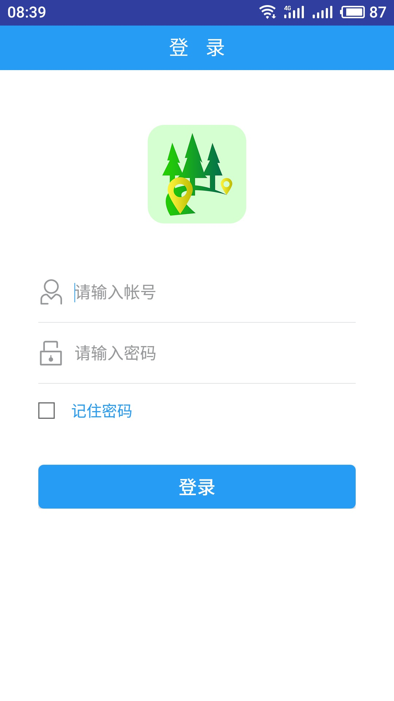<br/><sub>Field patrol scene 01</sub></td>
    <td align="center">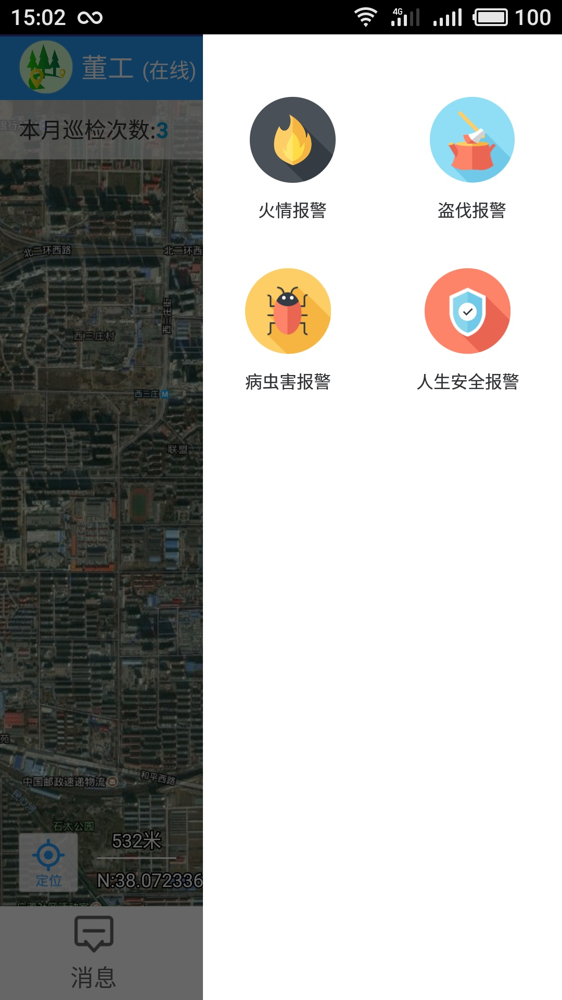<br/><sub>Field patrol scene 02</sub></td>
    <td align="center">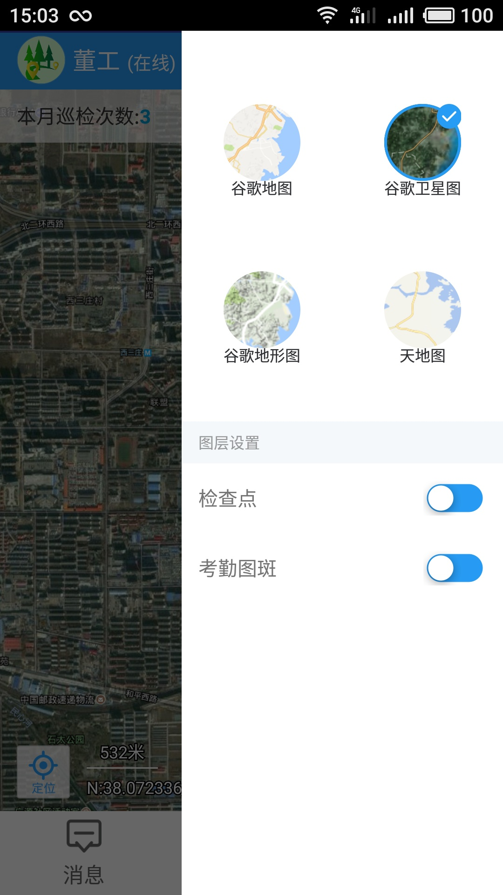<br/><sub>Field patrol scene 03</sub></td>
    <td align="center">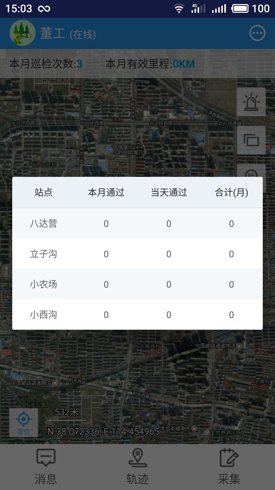<br/><sub>Field patrol scene 04</sub></td>
  </tr>
  <tr>
    <td align="center">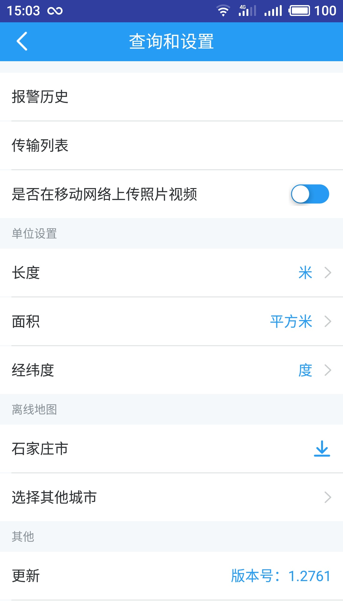<br/><sub>Field patrol scene 05</sub></td>
    <td align="center">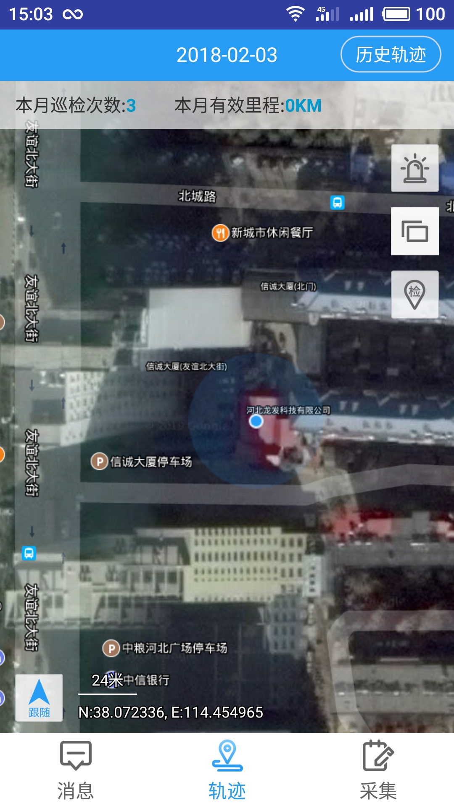<br/><sub>Field patrol scene 06</sub></td>
    <td align="center">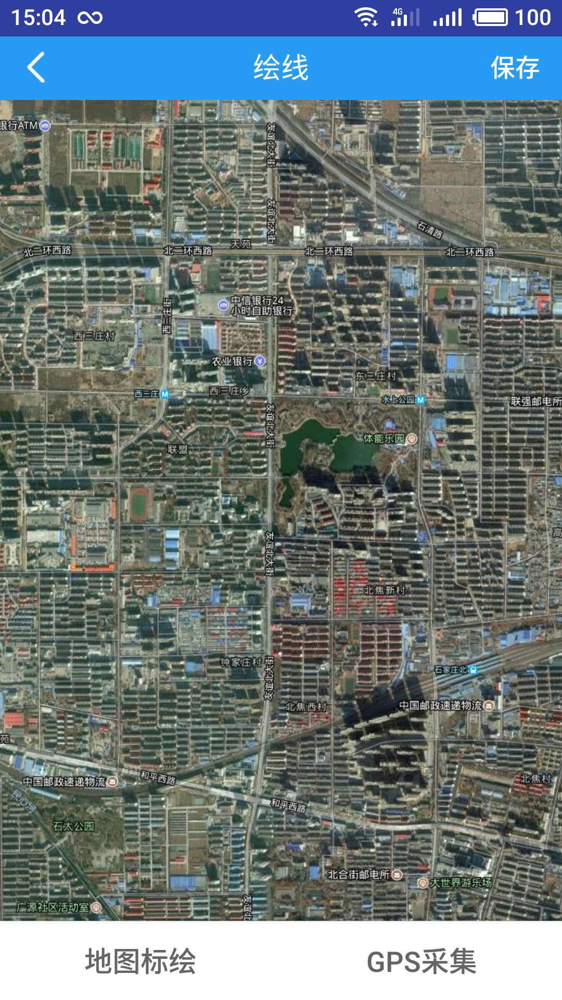<br/><sub>Field patrol scene 07</sub></td>
    <td align="center">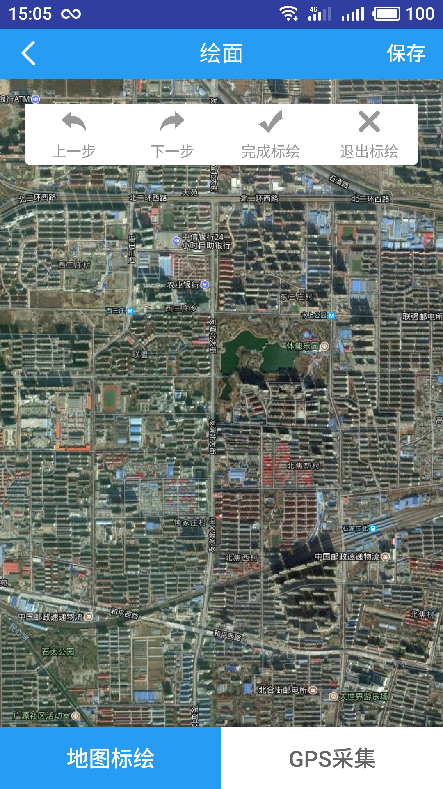<br/><sub>Field patrol scene 08</sub></td>
  </tr>
</table>

---

## Skills Demonstrated

- Android offline-first development
- GPS trajectory recording
- Offline map integration
- GIS data annotation and visualization
- Delayed sync and weak-network data reliability

---

**Tags:** #Android #GIS #OfflineMap #GPS #ForestPatrol #OfflineFirst #FieldInspection
