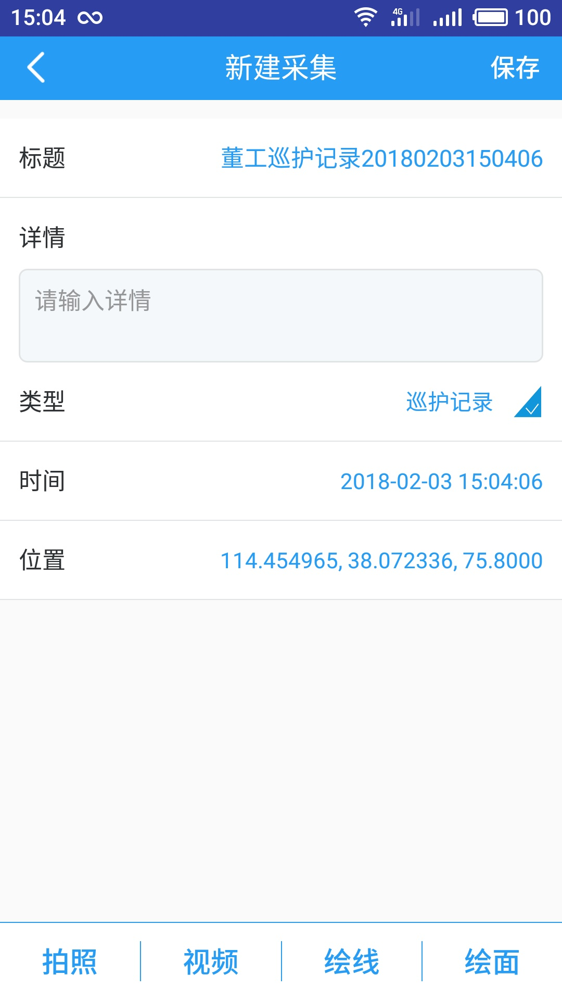
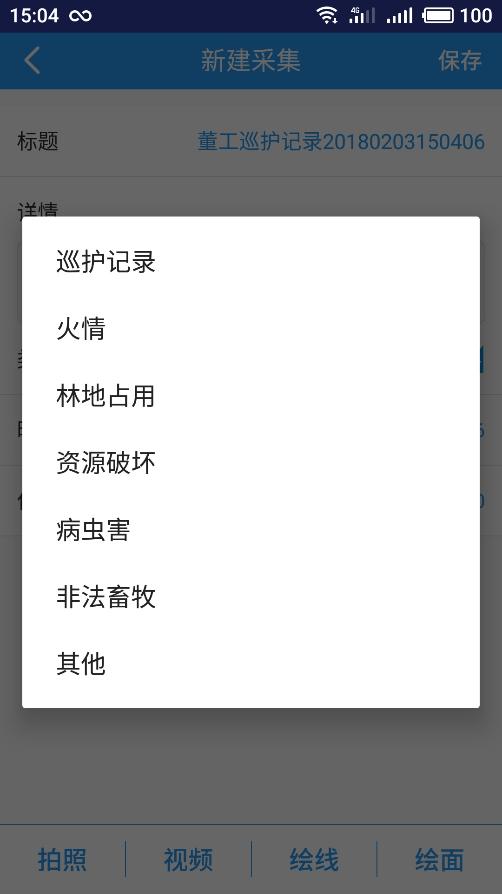
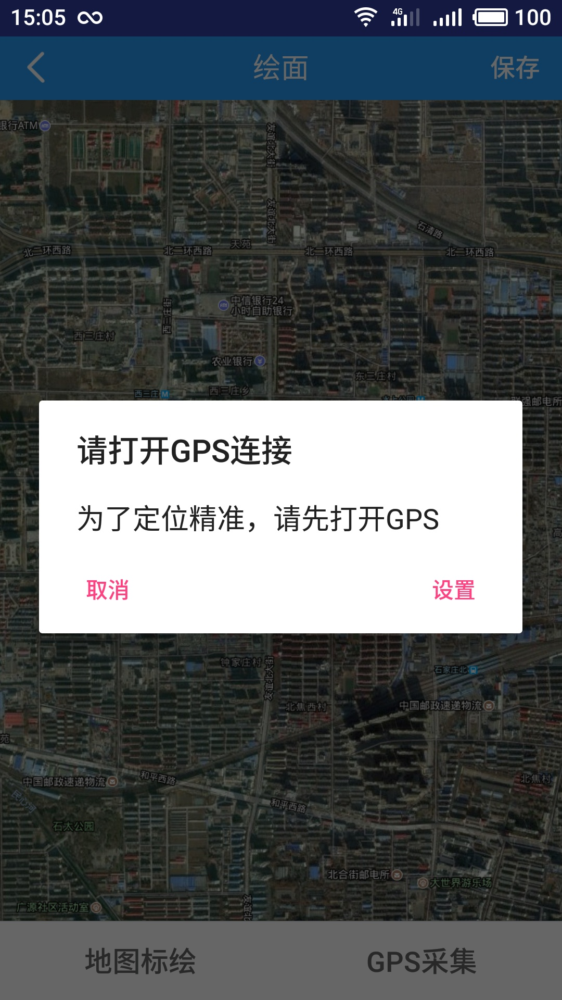
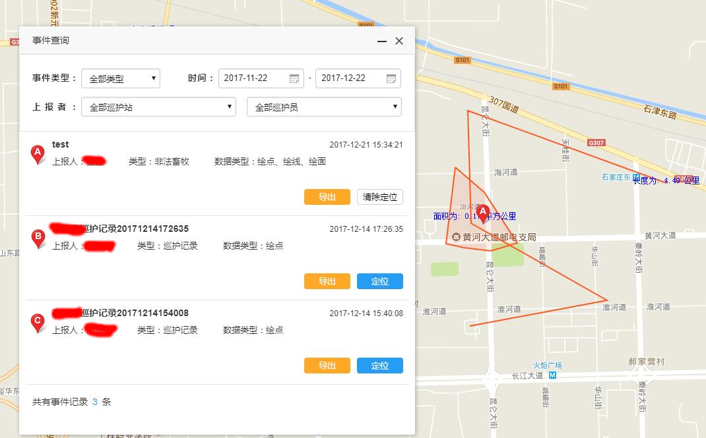
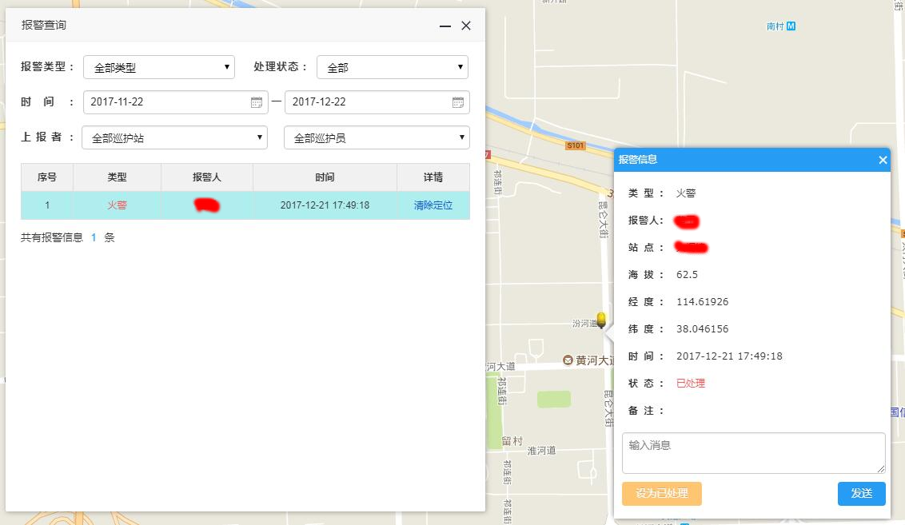
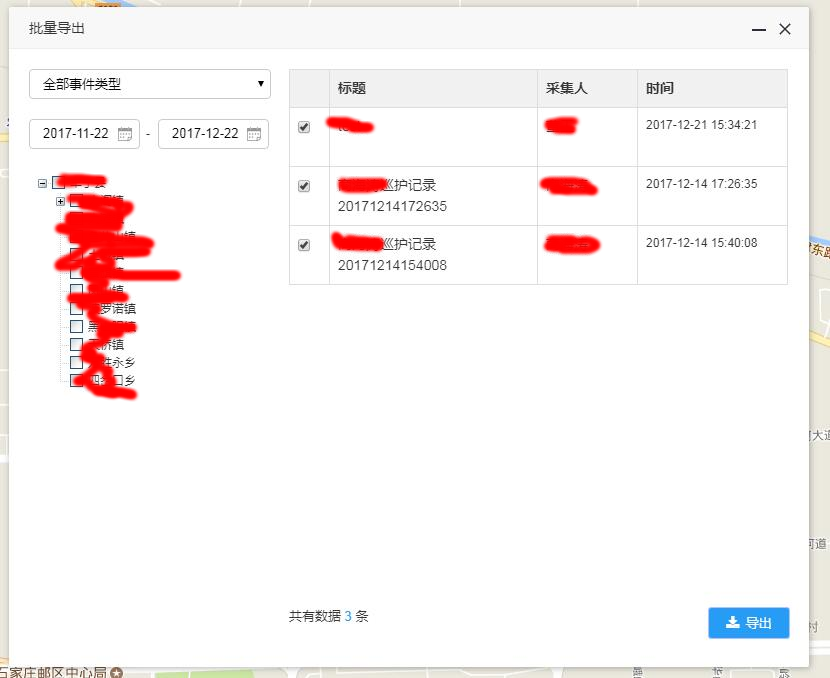
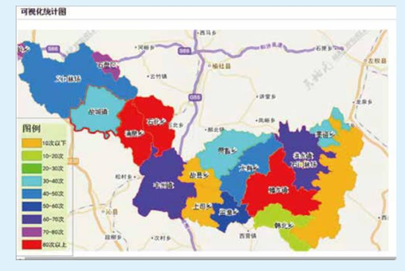

# ForestGuard Patrol

> Mobile patrol system for forest rangers to work in no-signal areas, record GPS tracks, report fire/pest risks, and upload data when network becomes available.

---

## Overview

This project is designed for **forest patrol operations in weak or no-network environments**. Originally built as **ForestGuard Patrol** for a forestry management organization in China.

Patrol users carry mobile devices into forest areas to complete inspections, record trajectories, and report risk events such as fire hazards, pest and disease incidents, land occupation, resource destruction, and illegal grazing.

The system supports offline-first data collection and delayed synchronization, ensuring data is not lost during patrol.

**Project Type:** Mobile GIS / Forest Patrol  
**Timeline:** 2021 - 2022  
**Role:** Android Mobile Client Developer  
**Company:** Chunxiao Technology Co., Ltd.

---

## Core Features

- **Offline patrol mode:** Continue patrol tasks in areas without mobile signal.
- **Map-based patrol:** ArcGIS Runtime SDK (v100.12.0) for real-time location tracking, route playback, and GIS layer overlays (patrol zones, attendance polygons).
- **GPS trajectory recording:** Record and persist patrol routes with timestamps using Baidu Location Service (GCJ-02 coordinates).
- **Offline map support:** Load map tiles/packages locally for field navigation.
- **GIS annotation:** Mark risk points, routes, and observation notes on map layers.
- **Event reporting:** Structured reporting for fire risk, pest hazards, land occupation, resource destruction, illegal grazing, and other incidents with geo-tagged photos/videos.
- **Alarm system:** One-tap fire/disaster alerts with location attached.
- **Attendance & leave management:** Check-in/check-out, attendance statistics, leave requests with approval workflow.
- **Push-to-talk:** Built-in walkie-talkie module (`tf.talkie`) for team voice communication.
- **Dispatcher messaging:** Backend sends tasks/dispatches to field rangers; rangers confirm receipt.
- **Deferred synchronization:** Automatically upload local records after network recovery.
- **Offline patching:** Tinker hot-patch framework for in-field app updates without full reinstalls.
- **Media compression:** `MediaCompressLibrary` compresses captured images/videos before uploading to AliCloud OSS.

---

## Architecture

### Conceptual Flow

```
+----------------------------------------------------+
|                Android Patrol Client                |
| Offline Map | GPS Track | Event Report | Local DB   |
+-----------------------------------------------------+
                              |
                    Sync When Network Available
                              |
+-----------------------------------------------------+
|                Patrol Platform APIs                  |
| Track Ingestion | Event Management | User/Task Mgmt  |
+-----------------------------------------------------+
                              |
+-----------------------------------------------------+
|                  GIS Visualization                   |
| Patrol Routes | Risk Points | Thematic Layers        |
+------------------------------------------------------+
```

### Module Structure

| Module | Purpose |
|--------|---------|
| `app` | Main application -- activities, services, UI |
| `LibMarsdaemon` | Background process keep-alive (dual-process guard) |
| `MediaCompressLibrary` | Image/video compression before upload |
| `OneSDK` | Alibaba Baichuan SDK -- social sharing & third-party login |

---

## Tech Stack

| Category | Technology |
|----------|-----------|
| Language | Java |
| Min SDK / Target SDK | 16 / 23 |
| Maps | Esri ArcGIS Runtime 100.12.0 |
| Location | Baidu LBS |
| Push | Firebase Cloud Messaging |
| Storage | AliCloud OSS |
| Networking | xUtils 3.9.0 |
| Event Bus | EventBus 3.2.0 |
| Image Selection | MultiImageSelector |
| Calendar | material-calendarview |
| Permissions | RxPermissions |
| Hot Patching | Tinker |

---

## Backend API

RESTful services with JWT token authentication. Key endpoints include `/login` for user authentication, `/v1/users/{id}` for user profile and patrol area, `/v1/location` for GPS track upload and query, `/v1/collectRecord` for incident reports (point/line/area with attachments), `/v1/alarmRecord` for fire and disaster alerts, `/v1/patrolPoints` for assigned patrol checkpoints, `/v1/notice` for messages and dispatches, and `/v1/zoneRange` for offline map download boundaries.

---

## Typical Workflow

1. Ranger downloads offline map packages before entering patrol region.
2. Android client starts patrol session and records GPS trajectories continuously.
3. Ranger marks risk points and submits local event records in no-signal areas.
4. All patrol data is stored locally with status tracking.
5. When network is available, the client uploads tracks/events and syncs to platform.
6. Management side reviews patrol coverage and risk distribution on GIS layers.

---

## Project Impact

- Enabled reliable patrol data collection in no-signal forest areas.
- Improved risk reporting timeliness for fire and pest events.
- Built GIS-based visibility for patrol coverage and hazard distribution.
- Reduced manual transcription and delayed reporting from field teams.

---

## Evidence

### Android App Screens

<table>
  <tr>
    <td align="center">
      <br/>
      <sub>Photo capture and evidence upload</sub>
    </td>
    <td align="center">
      <br/>
      <sub>New collection form with GPS coordinates</sub>
    </td>
    <td align="center">
      <br/>
      <sub>Event type selection (fire, pest, land occupation, etc.)</sub>
    </td>
  </tr>
  <tr>
    <td align="center">
      <br/>
      <sub>Patrol task and field reporting page</sub>
    </td>
    <td align="center">
      <br/>
      <sub>Risk record and evidence entry page</sub>
    </td>
    <td align="center">
      <br/>
      <sub>GPS positioning and offline map</sub>
    </td>
  </tr>
</table>

### Web Management Platform

<table>
  <tr>
    <td align="center">
      <br/>
      <sub>Event query with patrol tracks on map</sub>
    </td>
    <td align="center">
      <br/>
      <sub>Alarm query with fire alert details</sub>
    </td>
  </tr>
  <tr>
    <td align="center">
      <br/>
      <sub>Batch export patrol records</sub>
    </td>
    <td align="center">
      <br/>
      <sub>Regional patrol coverage heatmap</sub>
    </td>
  </tr>
</table>

### Field Patrol Scenes

<table>
  <tr>
    <td align="center"><br/><sub>Field patrol scene 01</sub></td>
    <td align="center"><br/><sub>Field patrol scene 02</sub></td>
    <td align="center"><br/><sub>Field patrol scene 03</sub></td>
    <td align="center"><br/><sub>Field patrol scene 04</sub></td>
  </tr>
  <tr>
    <td align="center"><br/><sub>Field patrol scene 05</sub></td>
    <td align="center"><br/><sub>Field patrol scene 06</sub></td>
    <td align="center"><br/><sub>Field patrol scene 07</sub></td>
    <td align="center"><br/><sub>Field patrol scene 08</sub></td>
  </tr>
</table>

---

## Skills Demonstrated

- Android offline-first development
- GPS trajectory recording
- Offline map integration (ArcGIS Runtime SDK)
- GIS data annotation and visualization
- Delayed sync and weak-network data reliability
- Hot-patch based in-field app updates

---

## Build

Requires Android Gradle Plugin >= 7.1.0, Gradle >= 7.2, and JDK 8+.

```bash
./gradlew assembleDebug
```

---

**Tags:** #Android #GIS #OfflineMap #GPS #ForestPatrol #OfflineFirst #FieldInspection
