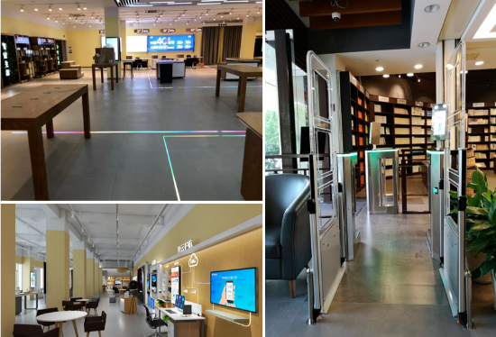
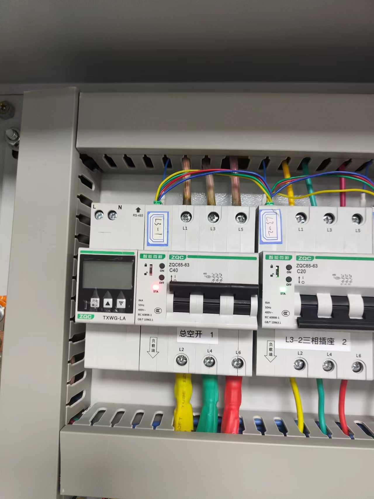
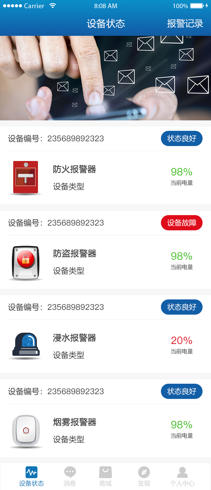
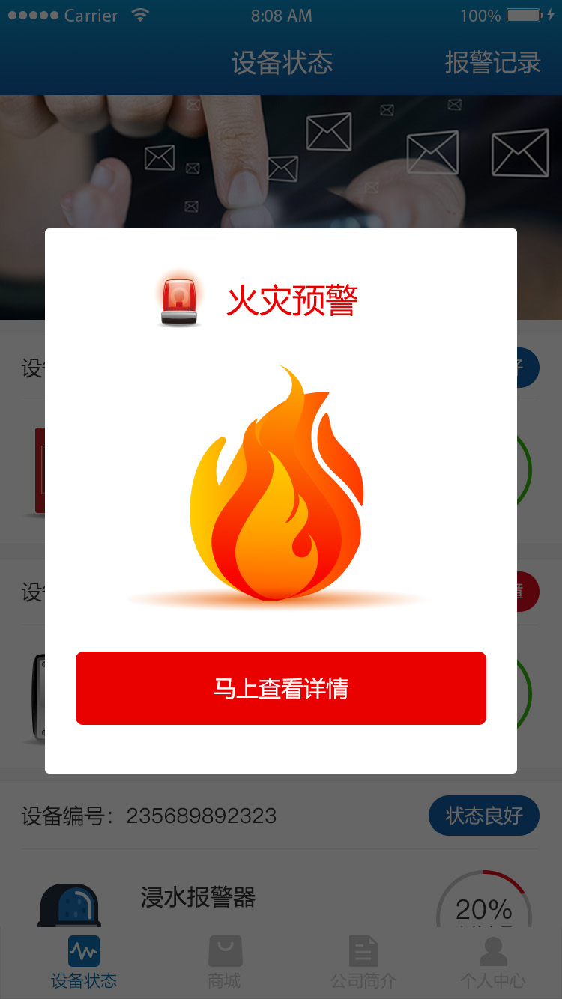
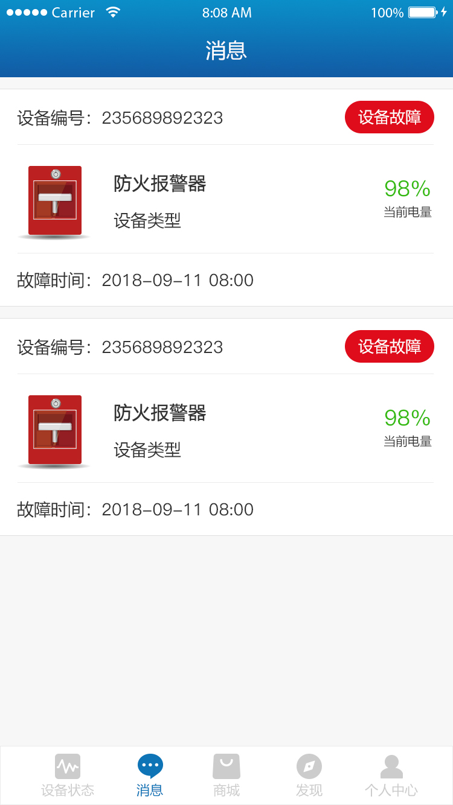
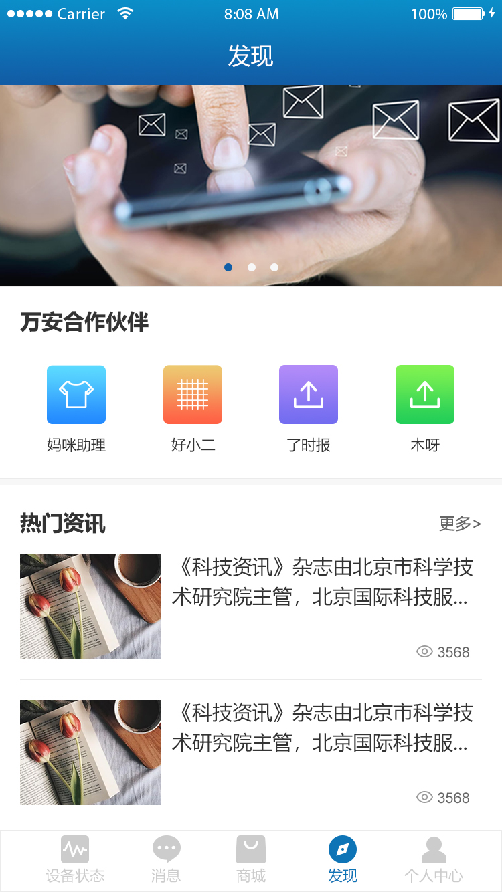
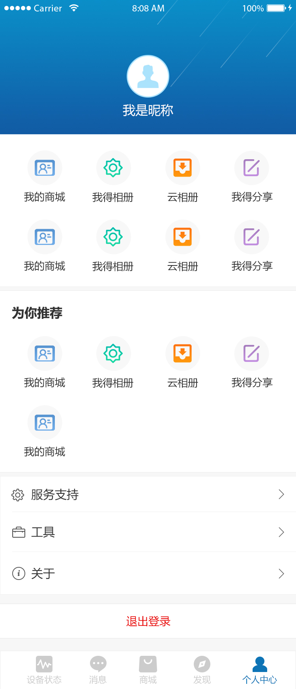

# IoT Device Management Platform

> IoT platform for smart switches and gateways. My main work focused on Android mobile client development, with participation in gateway and platform integration.

---

## Overview

An **IoT management platform** where users can register, configure, and manage purchased IoT devices.  
The company sells **smart switches** and **gateways**; the platform provides device binding, remote control, status monitoring, and related services.  
My **primary responsibility was Android mobile client development** for end-user device control and management, while also participating in gateway and platform integration work.

**Project Type:** IoT Platform / Device Management / Product Development  
**Timeline:** 2013 – 2023 (tenure at company)  
**Role:** Android Mobile Client Developer (primary), Gateway & Platform Integration (participated)  
**Company:** Chunxiao Technology Co., Ltd., China

---

## Platform & Products

### Platform
- Users manage **purchased IoT devices** in one place
- Device registration, binding, grouping
- Remote control, status monitoring, alerts
- Account and device lifecycle management

### Products Sold
- **Smart switches** – Sold to end users; managed via platform and app
- **Gateways** – Sold to end users; I developed the **gateway** software/firmware that connects devices to the platform and enables local/remote control

### Screenshots

#### Product & Device

| Platform Demo | Gateway & Smart Switches |
|---|---|
|  |  |
| IoT platform demo: exhibition area, mobile app UI, and smart access | Gateway (TXWG-LA) and smart micro-breakers |

#### Android App UI

| Device Home | Fire Alert | Messages |
|---|---|---|
|  |  |  |
| Current device status and quick controls | Fire warning and risk status view | Message center and device notifications |

| Discover | Profile Center |
|---|---|
|  |  |
| Discover/services entry for user workflows | Personal center and account settings |

---

## My Contributions

### Gateway Development
- Designed and implemented gateway software/firmware
- Device connectivity (e.g. smart switches and sensors via gateway)
- Protocol implementation and data forwarding to platform
- Local control and offline behavior
- OTA and remote configuration support where applicable

### Mobile App (Phone)
- Main owner of the **Android mobile application** for end users
- Device discovery, binding, and management
- Remote control of smart switches and gateway-connected devices
- Real-time status and notifications
- Integration with platform APIs

### Platform (Participated)
- Participated in **platform** (backend and/or web) development
- APIs for device management, user accounts, and control
- Possibly dashboards, rules, or admin tools (depending on actual scope)

---

## Architecture (Conceptual)

```
┌─────────────────────────────────────────────────────────┐
│                    End Users                             │
│  ┌─────────────────┐         ┌─────────────────┐        │
│  │  Mobile App     │         │  Web Portal     │        │
│  │  (I developed)  │         │  (platform)     │        │
│  └────────┬────────┘         └────────┬────────┘        │
└───────────┼────────────────────────────┼─────────────────┘
            │                            │
            └────────────┬───────────────┘
                         │
            ┌────────────▼────────────┐
            │   IoT Management       │
            │   Platform (backend)   │
            │   (I participated)      │
            └────────────┬────────────┘
                         │
            ┌────────────▼────────────┐
            │   Gateway               │
            │   (I developed)         │
            │   Smart switches, etc.  │
            └─────────────────────────┘
```

---

## Technologies

### Gateway
- Embedded / Linux-based gateway stack
- Protocol implementation (e.g. Zigbee, Z-Wave, WiFi, or proprietary)
- UART/Serial, GPIO, or network interfaces to devices
- Secure connection to cloud platform (e.g. MQTT, HTTPS)

### Mobile
- Android SDK, Java/Kotlin
- REST/WebSocket to platform
- Device discovery and control flows
- Push notifications

### Platform (backend / web)
- Spring Boot (or equivalent) backend
- RESTful APIs, WebSocket for real-time
- MySQL / Redis for data and session
- Vue.js or similar for admin/dashboard if applicable

---

## Key Achievements

- ✅ **Gateway** – Delivered gateway product used by customers on the platform
- ✅ **Mobile app** – Full-featured app for device management and control
- ✅ **Platform** – Contributed to backend/APIs and device lifecycle on the platform
- ✅ **End-to-end** – Users can purchase smart switches and gateways and manage them via app and platform

---

## Other Work (Same Tenure)

During the same period I also contributed to other internal and client projects, including forestry patrol apps, smart cabinet SDKs, IoT dashboards, ad display systems, and system administration. These demonstrate broader full-stack and IoT experience alongside the core platform and product work above.

---

## Skills Demonstrated

- **Gateway / Embedded:** Protocol design, device connectivity, firmware/software for gateways
- **Mobile:** Android app for IoT device control and management
- **Backend / Platform:** APIs, device management, user and device lifecycle
- **Full-stack:** End-to-end from gateway and app to platform
- **IoT:** Smart switches, gateways, cloud connectivity

---

**Tags:** #IoT #Gateway #Android #SmartSwitch #DeviceManagement #Platform #SpringBoot #Embedded
