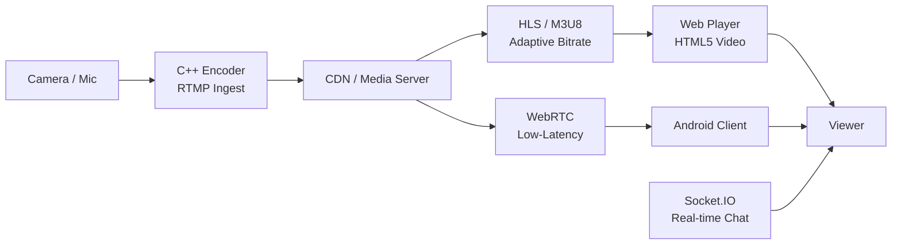

# Live Streaming Chat Room

> The company's earliest product (2013-2015) — a live streaming chat room platform built during the start-up phase, before pivoting to IoT

## Streaming Pipeline

## Overview

The company's first product after founding. An 8-person team built a live streaming chat room platform with real-time messaging, room management, and audio/video streaming. I built across the full stack: ASP.NET/DNN admin backend, Node.js + Socket.IO web chat room, and Android client. The C++ server core was rewritten multiple times as the team iterated on the architecture. Company exited this business line in 2015 to focus on IoT.

## Context

- **Timeline**: 2013 – 2015 (~2 years)
- **Role**: Full-stack Developer (Web + Android + Server)
- **Team**: 8 (2 server engineers + myself across web/android/server + others)
- **Architecture**: Monolithic ASP.NET/DNN admin, C++ server core, Node.js web client, Android client
- **Outcome**: Business line discontinued in 2015; company pivoted to IoT

## My Responsibilities

### ASP.NET/DNN Admin Backend
- Built monolithic management backend on ASP.NET/DNN (DotNetNuke)
- Server-side rendered — no front/back separation at the time

### Node.js Web Chat Room
- Developed web-based chat room with Socket.IO for real-time messaging
- HTML5 video player for HLS (M3U8) live stream playback

### Android Client
- Built native Android client for live streaming and chat

### C++ Server (Partial)
- Contributed to the C++ server core alongside 2-person server team
- Server was rewritten multiple times during rapid iteration phase

## Tech Stack

| Layer | Technology |
|-------|-----------|
| Admin Backend | ASP.NET Web Forms, DNN (DotNetNuke), WCF, IIS |
| Web Client | Node.js, Socket.IO, HTML5 Video |
| Mobile | Android SDK (Java/Kotlin) |
| Server Core | C++ (message center, audio/video center) |
| Streaming | RTMP (ingest), HLS/M3U8 (delivery), FFmpeg, WebRTC |
| Scripting | Python (analytics), Lua (config/dynamic rules) |
| Database | SQL Server, Redis, MongoDB |
| Real-time | Socket.IO, WebSocket, SignalR |

## Key Numbers

| Metric | Detail |
|--------|--------|
| Peak Concurrent | 1000+ viewers per live room |
| Uptime | 99.5% streaming availability |
| Active Period | 2 years of operation (2013-2015) |
| Team Size | 8 cross-functional engineers |
| Languages | 5+ (C#, C++, Java, Python, Lua) |
| Bitrate Support | 360p to 1080p adaptive |

## Key Takeaways

- Full-stack ownership across .NET, Node.js, Android, and C++ — broad technology exposure early in career
- Start-up velocity: server rewritten multiple times as the team iterated toward the right architecture
- Monolithic server-side rendering (DNN) was the standard before modern SPA + API separation

**Tags:** #LiveStreaming #ASP.NET #DNN #NodeJS #SocketIO #Android #C++ #HLS #RTMP #Startup
