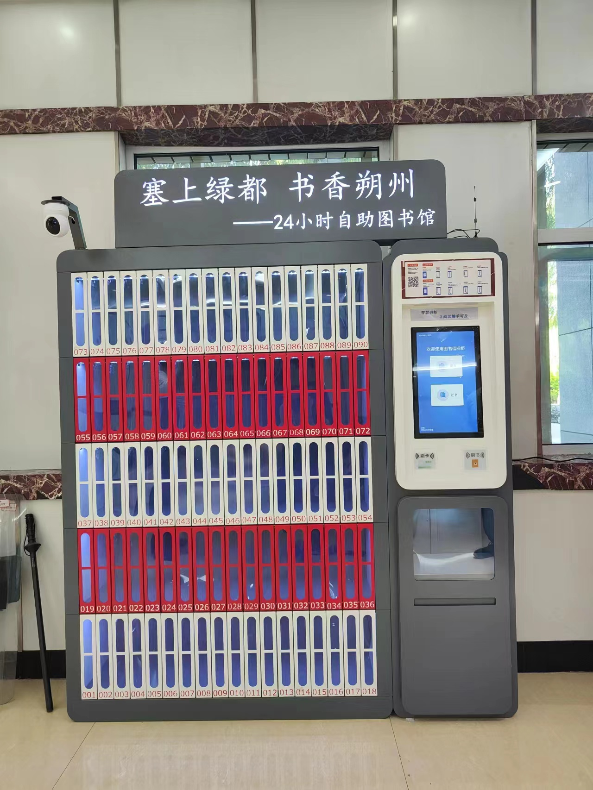
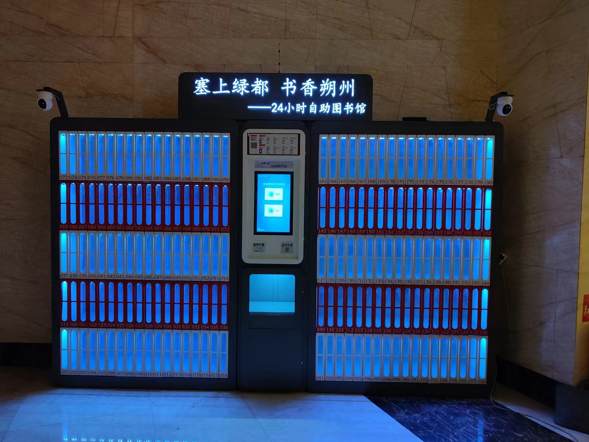
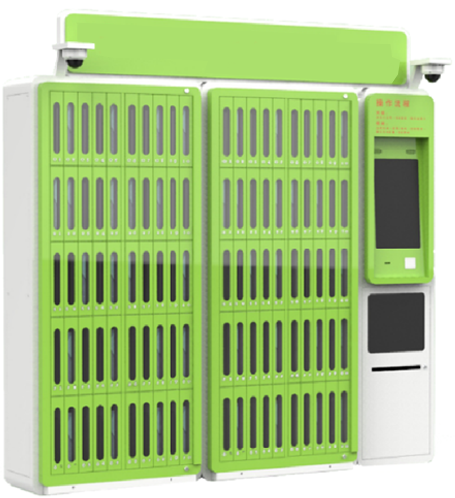
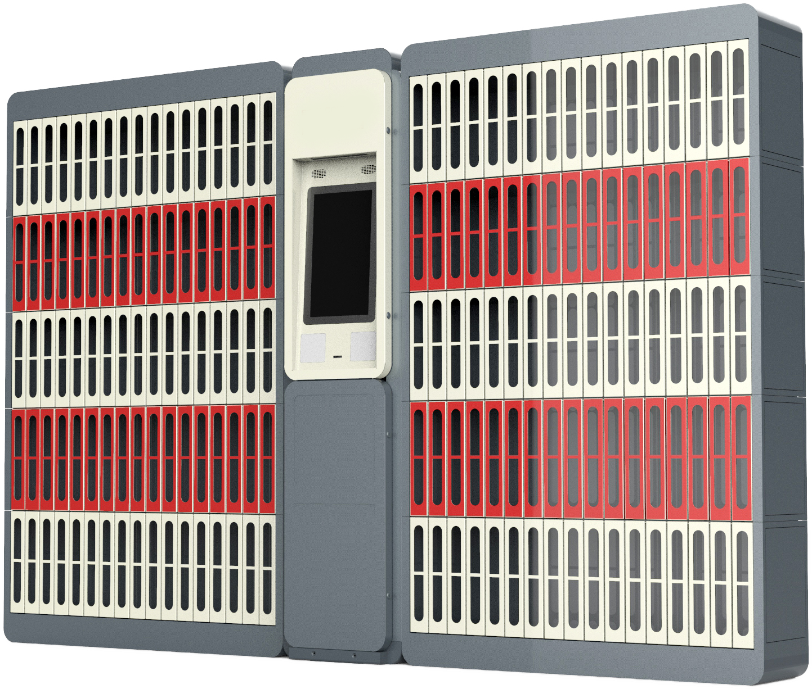
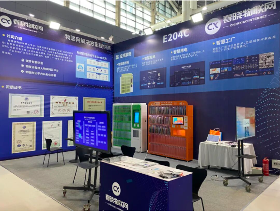
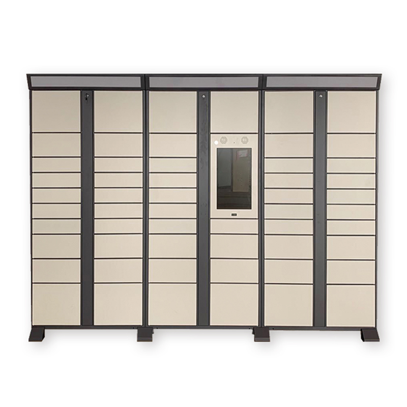
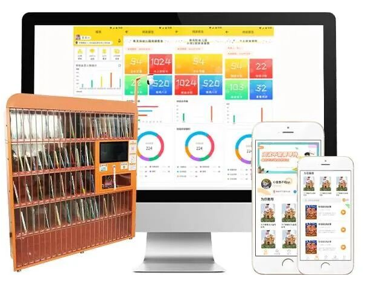
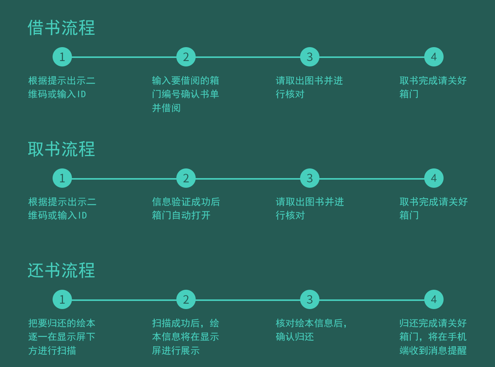
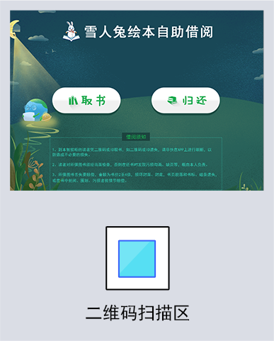

# Picture Book Locker / Smart Library Cabinet

> 24/7 self-service borrow/return for school and community libraries, with face recognition, QR code, and card support.

---

## Overview

A smart picture-book locker system for school and community libraries. It provides 24-hour self-service borrow and return with face recognition, QR code, and card options, plus smart lighting and UV disinfection for hygienic book handling.

**Project Type:** IoT / Smart Library / Self-Service  
**Timeline:** 2020 – 2023  
**Role:** Android Developer / Embedded Development  
**Company:** Chunxiao Technology Co., Ltd., China

---

## Key Features

- **Face recognition borrow:** Quick borrow/return by face
- **Multiple auth:** QR code, IC card, PIN
- **Smart doors:** Auto-open target compartment, LED guidance
- **UV disinfection:** Built-in UV module
- **Inventory:** Real-time stock and location
- **Borrow history:** Full history and overdue reminders
- **Admin:** Stock management, analytics, remote monitoring
- **Multi-cabinet:** Multiple units networked and managed together

---

## Architecture

```
┌─────────────────────────────────────────┐
│            Hardware Layer               │
│  ┌────────┐ ┌────────┐ ┌──────────┐    │
│  │ Main   │ │Solenoid│ │ UV       │    │
│  │ Board  │ │ Lock   │ │ Module   │    │
│  │ (ARM)  │ │Control │ │          │    │
│  └───┬────┘ └────┬───┘ └────┬─────┘    │
│  ┌────────┐ ┌────────┐ ┌──────────┐    │
│  │Face Rec│ │QR Code │ │ LED      │    │
│  │ Camera │ │Scanner │ │ Strip    │    │
│  └───┬────┘ └────┬───┘ └────┬─────┘    │
└──────┼───────────┼──────────┼──────────┘
       │           │          │
       └───────────┴──────────┘
                   │
┌──────────────────▼──────────────────────┐
│       Android Main Control                │
│  ┌─────────────────────────────────┐   │
│  │  - Face recognition SDK         │   │
│  │  - QR code scan                  │   │
│  │  - Serial (lock/sensors)         │   │
│  │  - Local DB                      │   │
│  │  - Network sync                  │   │
│  └─────────────────────────────────┘   │
└──────────────────┬──────────────────────┘
                   │
┌──────────────────▼──────────────────────┐
│       Backend (Spring Cloud)              │
│  ┌──────────┐ ┌──────────┐ ┌─────────┐ │
│  │ Borrow   │ │ Book     │ │ User    │ │
│  │ Inventory│ │ Notify   │ │ Stats   │ │
│  └──────────┘ └──────────┘ └─────────┘ │
└─────────────────────────────────────────┘
```

---

## Technologies

### Android
- **Android SDK** – Main control app
- **Java/Kotlin** – Language
- **Face SDK** – Face auth
- **ZXing** – QR scanning
- **SQLite** – Local cache

### Embedded
- **ARM main board** – Controller
- **Solenoid lock** – Door control
- **UART/RS485** – Hardware comms
- **GPIO** – LED, UV control
- **Sensors** – Door, temperature, etc.

### Backend
- **Spring Cloud** – Services
- **MySQL** – Business data
- **Redis** – Cache and session
- **MQTT** – Device communication

### Third-Party
- **WeChat/Alipay** – Scan auth (optional)
- **SMS** – Notifications
- **Push** – Mobile notifications

---

## Key Achievements

- ✅ **24/7 service** – Unmanned self-service
- ✅ **<3s borrow** – Average face-based borrow time
- ✅ **Multi-site** – Deployed in multiple schools and libraries
- ✅ **UV disinfection** – Automatic book disinfection
- ✅ **Zero loss** – Lock control for book security

---

## Responsibilities

### Android
- Locker main control app
- Face recognition and QR integration
- Serial communication and hardware
- Local DB and sync logic
- UI and flows

### Hardware
- Solenoid lock integration
- LED strip control
- UV module scheduling
- Sensor data
- Fault detection and alerts

### Backend
- Book management APIs
- Borrow record service
- User auth and permissions
- Notifications
- Reports and stats

### Deployment
- On-site installation and debugging
- Hardware integration testing
- User training and handover

---

## Challenges & Solutions

### Challenge 1: Face Recognition Accuracy
**Problem:** Children’s faces harder to recognize.  
**Solution:** Camera angle and lighting, child-optimized face algorithm.

### Challenge 2: Hardware Reliability
**Problem:** Solenoid locks overheating over time.  
**Solution:** Cooling, periodic checks, automatic failover.

### Challenge 3: Unstable Network
**Problem:** Poor library network, frequent disconnects.  
**Solution:** Offline mode, local cache, resume sync.

### Challenge 4: Book Size Variation
**Problem:** Different book sizes, compartment design.  
**Solution:** Multiple compartment sizes, allocation logic.

---

## Results & Impact

- **Convenience** – Students can borrow/return anytime
- **Extended hours** – 24/7 beyond library opening
- **Hygiene** – UV disinfection for children
- **Efficiency** – Auto stats and reports, less manual work
- **Multi-scenario** – Schools, communities, malls

---

## Evidence

### Hardware & Deployment

<table>
  <tr>
    <td align="center">
      <br/>
      <sub>Deployed locker with visible book slots and screen</sub>
    </td>
    <td align="center">
      <br/>
      <sub>Two lockers installed in a school canteen corridor</sub>
    </td>
  </tr>
  <tr>
    <td align="center">
      <br/>
      <sub>24/7 smart library room built around the locker system</sub>
    </td>
    <td align="center">
      <br/>
      <sub>Outdoor deployment in front of a public site</sub>
    </td>
  </tr>
  <tr>
    <td align="center">
      <br/>
      <sub>24-hour self-service library kiosk with illuminated book slots</sub>
    </td>
    <td align="center">
      <br/>
      <sub>Library kiosk in UV/night mode with glowing slots</sub>
    </td>
  </tr>
</table>

### Locker Variants

<table>
  <tr>
    <td align="center">
      <br/>
      <sub>Blue locker cabinet with integrated touch screen</sub>
    </td>
    <td align="center">
      <br/>
      <sub>Green picture-book locker with dense slots</sub>
    </td>
    <td align="center">
      <br/>
      <sub>Red/grey high-capacity variant</sub>
    </td>
  </tr>
  <tr>
    <td align="center">
      <br/>
      <sub>Locker with anti-theft gates</sub>
    </td>
  </tr>
  <tr>
    <td align="center">
      <br/>
      <sub>Green-and-white modular smart locker system</sub>
    </td>
    <td align="center">
      <br/>
      <sub>3D-rendered locker with gray cabinets and red accent bands</sub>
    </td>
  </tr>
</table>

### UV & Night Mode

<table>
  <tr>
    <td align="center">
      <br/>
      <sub>Locker running with illuminated UV / lighting effect</sub>
    </td>
    <td align="center">
      <br/>
      <sub>Borrow UI running on the actual locker device</sub>
    </td>
    <td align="center">
      <br/>
      <sub>Touch screen UI: borrow / return / exchange</sub>
    </td>
  </tr>
</table>

### Related Devices

<table>
  <tr>
    <td align="center">
      <br/>
      <sub>Related IoT cabinet form factor used in similar scenarios</sub>
    </td>
  </tr>
  <tr>
    <td align="center">
      <br/>
      <sub>Trade show booth displaying IoT solutions and smart cabinets</sub>
    </td>
    <td align="center">
      <br/>
      <sub>Modular parcel locker with four columns of compartments</sub>
    </td>
    <td align="center">
      <br/>
      <sub>Cross-platform analytics dashboard with physical cabinet</sub>
    </td>
  </tr>
</table>

### Process & Mobile

<table>
  <tr>
    <td align="center">
      <br/>
      <sub>Library process flowchart: borrow, retrieve, return workflows</sub>
    </td>
    <td align="center">
      <br/>
      <sub>Mobile app UI for book pickup and return</sub>
    </td>
  </tr>
  <tr>
    <td align="center">
      <br/>
      <sub>Mobile app UI for book pickup and return (Snowman Rabbit)</sub>
    </td>
  </tr>
</table>

---

## Skills Demonstrated

- **Android:** Main control app, face recognition, QR scan
- **Embedded:** Serial, GPIO, hardware integration
- **IoT:** Device networking, MQTT, remote management
- **Hardware:** Solenoid lock, LED, sensors
- **Backend:** Spring Cloud, book management logic

---

**Tags:** #IoT #Android #FaceRecognition #QRCode #SmartLocker #Library #Embedded #SpringBoot
