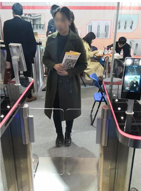
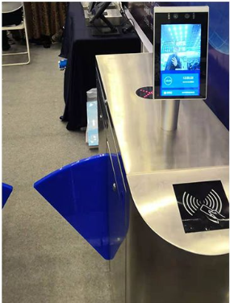
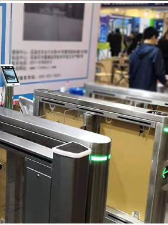

# School Face Recognition Attendance System > Smart face-based attendance for K–12 schools: touchless check-in, real-time stats, and parent notifications. --- ## Overview An intelligent face recognition attendance system for primary and secondary schools. It provides touchless student check-in, real-time statistics, and automatic parent notifications. Features include face-based punch, attendance reporting, and anomaly alerts; the system has been deployed in multiple schools. **Project Type:** IoT / Education IT **Timeline:** 2019 – 2022 **Role:** Full-stack Developer **Company:** Chunxiao Technology Co., Ltd., China --- ## Key Features - **Face recognition punch:** Camera-based face detection and recognition - **Touchless attendance:** Automatic recognition as students pass; no manual action - **Real-time sync:** Attendance data uploaded to the cloud in real time - **Parent notifications:** Automatic push to parents after successful check-in - **Data & reports:** Attendance rate, late arrivals, leave, and other reports - **Multi-terminal:** Gate terminals + admin backend + parent app - **Liveness detection:** Reduces photo/video spoofing --- ## Architecture ``` ┌─────────────────────────────────────┐ │ Terminal Devices │ │ ┌──────────┐ ┌──────────┐ │ │ │Face Rec │ │ Gate │ │ │ │ Camera │ │ Controller│ │ │ └────┬─────┘ └────┬─────┘ │ └───────┼────────────┼────────────────┘ │ │ ┌───────▼────────────▼────────────────┐ │ Android Terminal App │ │ - Face recognition SDK │ │ - Local cache │ │ - Network sync │ └───────┬─────────────────────────────┘ │ ┌───────▼─────────────────────────────┐ │ Backend (Spring Cloud) │ │ - Attendance record service │ │ - Face recognition service │ │ - Push notification service │ └───────┬─────────────────────────────┘ │ ┌───────▼─────────────────────────────┐ │ Data Layer │ │ MySQL Redis Image storage │ └───────┬─────────────────────────────┘ │ ┌───────▼─────────────────────────────┐ │ User Clients │ │ Admin (Web) Parent App (Android) │ └─────────────────────────────────────┘ ``` --- ## Technologies ### Face Recognition - **OpenCV** – Image processing and feature extraction - **Face recognition** – On-device embedded recognition - **Liveness detection** – Anti-spoofing ### Mobile - **Android SDK** – Terminal app - **Java/Kotlin** – Language - **SQLite** – Local cache - **Camera API** – Camera control ### Backend - **Spring Cloud** – Services - **MySQL** – Attendance data - **Redis** – Cache and session - **MQTT/WebSocket** – Real-time push ### Push - **JPush / Firebase** – Parent notifications - **SMS gateway** – Fallback notifications --- ## Key Achievements - ✅ **Multi-school deployment** – Deployed in 3+ schools - ✅ **<1s recognition** – Face recognition response under 1 second - ✅ **99%+ accuracy** – Face recognition accuracy over 99% - ✅ **Real-time notifications** – Parents notified within seconds - ✅ **Touchless experience** – Students pass through without stopping --- ## Responsibilities ### Android Terminal - Face recognition terminal app - Camera and face SDK integration - Liveness detection - Local cache and offline sync - Gate controller integration ### Backend - Attendance record APIs - Face recognition server logic - Parent push service - Statistics and reporting ### System Integration - Face recognition algorithm integration - Push channel configuration - Multi-school data isolation - Hardware debugging --- ## Challenges & Solutions ### Challenge 1: Recognition Accuracy **Problem:** Lighting and angle affect accuracy. **Solution:** Tuned algorithm parameters, more training samples, multi-angle camera placement. ### Challenge 2: Unstable Network **Problem:** School networks unreliable; sync difficult. **Solution:** SQLite local cache, resume after disconnect, data consistency checks. ### Challenge 3: Liveness Detection **Problem:** Students using photos instead of live face. **Solution:** Liveness algorithm (blink/action detection). ### Challenge 4: High Concurrency **Problem:** Rush hours with many students punching at once. **Solution:** Redis cache, async processing, connection pool tuning. --- ## Results & Impact - **Stable multi-school deployment** - **High parent satisfaction** – Real-time visibility of child arrival - **Higher management efficiency** – Replaced manual roll call - **Traceable data** – Full attendance history for reporting --- ## Evidence > 。 `images/` ： > - `attendance-device.png` > - `admin-dashboard.png` > - `parent-app.png` ### Access Control & Turnstiles <table> <tr> <td align="center"> <br/> <sub>Person at automated turnstile with face recognition kiosk</sub> </td> <td align="center"> <br/> <sub>Turnstile with touchscreen and RFID card reader</sub> </td> <td align="center"> <br/> <sub>Turnstile gates with green LED access indicator</sub> </td> </tr> </table> --- ## Skills Demonstrated - **Computer vision:** OpenCV, face recognition - **Android:** Camera API, local storage, network sync - **Backend:** Spring Cloud, REST API, high concurrency - **IoT:** Hardware integration, gate control - **Push:** JPush, Firebase, SMS gateway - **System integration:** Algorithm integration, multi-terminal sync --- **Tags:** #FaceRecognition #Android #SpringBoot #IoT #Education #OpenCV #Attendance 