# Smart Factory System

> Microservice-based manufacturing platform deployed across 10+ factory sites

---

## Overview

Led the development of a **full value-chain smart manufacturing platform** for textile factories, connecting **brands/customers, factories, and frontline workers** on one system.  
The platform not only manages production workflows, inventory, and IoT equipment, but also **accepts customer orders, allocates them to suitable factories, tracks per-garment production progress, and synchronizes shipping status back to the customer side**, supporting hundreds of workers across multiple sites.

**Android shop-floor app:** Workers carry a **mobile production client** for daily tasks—**today’s output counter**, **search by customer style or package ID**, **tabs for not-started / in-progress / completed work**, and a **center “scan” action** tied to barcode/QR flows on the line. **Task detail** surfaces progress (e.g. completed vs planned pieces), **tech pack / process tabs**, and **quality requirements** (e.g. textile industry standards) on the device. **My / profile** ties **employee ID, on-duty status, work log, messages**, and **scan configuration** to the same floor workflow.

In addition, I implemented a **weighing integration module**: electronic scale data is collected through serial communication, monitored by a Windows service, and synchronized to web pages and core business systems in real time.

**Project Type:** Enterprise System / Industrial IoT  
**Timeline:** 2018 - 2024  
**Role:** Full-stack Tech Lead (Android + Backend + Hardware)  
**Company:** Chunxiao Technology Co., Ltd., China  
**Team Size:** 6 people (cross-functional)
**My Scope:** All Android clients (phone/tablet/shop-floor) + ~1/4 of backend (3 Spring Cloud modules) + hardware communication programs (scales, conveyors, washers) + occasional Vue.js frontend help

> ### Key Numbers
> | Metric | Value |
> | :--- | :--- |
> | Factory Sites | **10+** across China |
> | Efficiency Improvement | **30%+** in production |
> | Team Size | **6** cross-functional |
> | Project Duration | **6 years** (2018-2024) |

### Scale-Up Journey

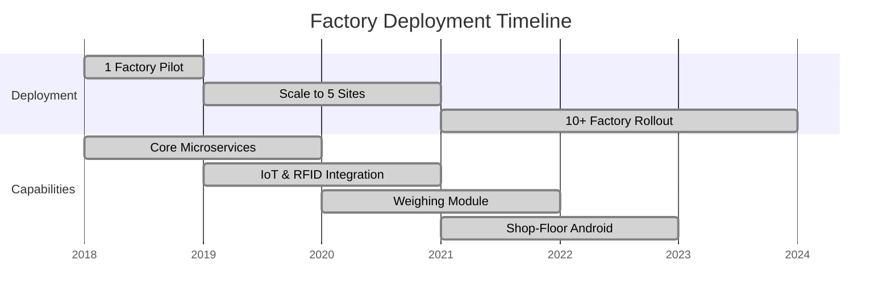
```mermaid
gantt
    title Factory Deployment Timeline
    dateFormat YYYY
    axisFormat %Y
    section Deployment
    1 Factory Pilot       :done, 2018, 2019
    Scale to 5 Sites      :done, 2019, 2021
    10+ Factory Rollout   :done, 2021, 2024
    section Capabilities
    Core Microservices    :done, 2018, 2020
    IoT & RFID Integration :done, 2019, 2021
    Weighing Module       :done, 2020, 2022
    Shop-Floor Android    :done, 2021, 2023
```

---

## Key Features

- **End-to-end order platform:** From customer order → factory scheduling → production → shipment
- **Multi-role portals:** Separate experiences for brands/customers, factory management, and workers
- **Android mobile client:** Task list with status filters, task detail (progress, tech pack, process & quality text), scan-centric navigation, and worker profile (duty status, logs, messages, scan settings)
- **Order allocation engine:** Distributes orders to different factories based on capacity and skills
- **Per-garment progress tracking:** Realtime view of each garment’s process and station
- **Microservice architecture:** Scalable, modular backend services
- **IoT integration:** Real-time tracking via RFID, barcode scanners, conveyors
- **Weighing integration:** Electronic scale data acquisition and synchronization to web/system
- **Production management:** Workflow orchestration and process tracking
- **Multi-site deployment:** Supports 10+ manufacturing locations
- **High availability:** High uptime maintained
- **CI/CD pipeline:** Automated deployment and testing
- **Real-time monitoring:** Live production status and alerts

---

## End-to-End Flow

1. **Customer Side**: Brands or customers place orders on the platform, configuring styles, sizes, delivery dates, and other requirements.
2. **Platform Scheduling**: The system splits and allocates orders to different factories and production lines based on capacity and capabilities.
3. **Factory Execution**:
   - Workshop terminals assign process tasks to workers;
   - Workers complete process reporting by scanning barcodes/cards on the production side;
   - RFID / barcode / production line equipment transmit progress and output in real-time;
   - Electronic scales report weight data via serial communication, monitored by Windows services and pushed to web pages and business systems.
4. **Progress Tracking**: Customers can view real-time production progress for each order, batch, or even individual garment on the platform.
5. **Shipping & Delivery**: After production is completed, the system generates shipping information and synchronizes it with customers, forming a closed-loop data link from order placement to receipt.

---

## Architecture

```
┌─────────────────────────────────────┐
│         Client Applications         │
│   (Android, Web Dashboard, IoT)    │
└─────────────┬───────────────────────┘
              │
┌─────────────▼───────────────────────┐
│          API Gateway (Nginx)        │
└─────────────┬───────────────────────┘
              │
┌─────────────▼───────────────────────┐
│      Microservices (Spring Cloud)    │
│  ┌─────────┐ ┌─────────┐ ┌────────┐│
│  │Production│ │ Inventory│ │ Device ││
│  │ Service  │ │ Service  │ │ Service││
│  └─────────┘ └─────────┘ └────────┘│
│     ┌──────────┐  ┌──────────┐     │
│     │ ActiveMQ │  │  Kafka   │     │
│     │ (Queues) │  │ (Events) │     │
│     └──────────┘  └──────────┘     │
└─────────────┬───────────────────────┘
              │
┌─────────────▼───────────────────────┐
│      Data Layer                    │
│  ┌─────────┐ ┌─────────┐ ┌────────┐│
│  │  MySQL  │ │  Redis  │ │ MongoDB││
│  └─────────┘ └─────────┘ └────────┘│
└─────────────────────────────────────┘
              │
┌─────────────▼───────────────────────┐
│      IoT Hardware Layer            │
│ (RFID, Barcode, Conveyors, Scales) │
└─────────────────────────────────────┘
```

---

## Technologies

### Frontend
- **Vue.js** - Web portals and dashboard development
- **JavaScript** - Frontend business logic and interaction handling
- **HTML/CSS** - Responsive UI implementation

### Backend
- **Java** - Primary development language
- **Spring Cloud** - Microservice framework
- **MyBatis** - Data access layer
- **ActiveMQ** - Message queuing for decoupled service communication
- **Kafka** - Event-driven streaming for production workflow coordination
- **RESTful APIs** - Service communication

### Data & Storage
- **MySQL** - Primary database
- **Redis** - Caching and session management
- **MongoDB** - Document storage

### DevOps & Infrastructure
- **Docker** - Containerization
- **Jenkins** - CI/CD automation
- **Nginx** - Load balancing and reverse proxy
- **CentOS** - Production servers

### IoT & Hardware
- **RFID** - Asset and inventory tracking
- **Barcode Scanners** - Product identification
- **Conveyors** - Automated material handling
- **UART/Serial** - Device communication
- **Electronic Scales** - Weight data capture for production/business workflows
- **Windows Service** - Serial listener, health monitoring, and auto-reconnect
- **RS232/RS485** - Stable scale communication channel

---

## Key Achievements

- ✅ **10+ factory sites** deployed and operational
- ✅ **30%+ efficiency improvement** in production
- ✅ **High uptime** maintained over years
- ✅ **Hundreds of workers** supported daily
- ✅ **Cross-functional team leadership** (6 members)
- ✅ **Agile practices** implementation

---

### Responsibilities

### Role Breakdown

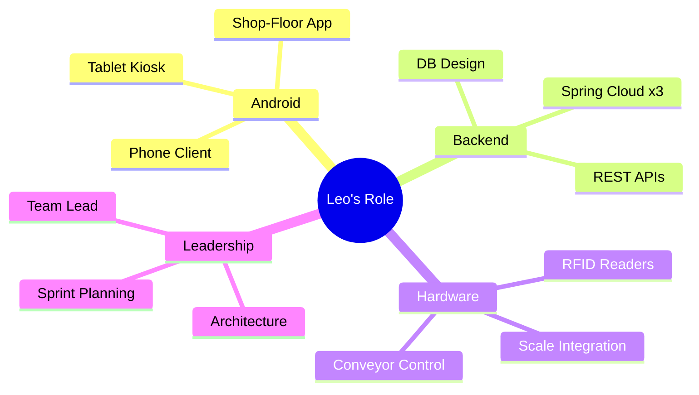
```mermaid
mindmap
  root((Leo's Role))
    Android
      Phone Client
      Tablet Kiosk
      Shop-Floor App
    Backend
      Spring Cloud x3
      DB Design
      REST APIs
    Hardware
      Scale Integration
      RFID Readers
      Conveyor Control
    Leadership
      Architecture
      Team Lead
      Sprint Planning
```

### Frontend Development (Vue.js)
- Developed web portals and operational dashboards with Vue.js
- Implemented production, equipment, and workflow visualization pages
- Built frontend modules for order progress, status monitoring, and data forms
- Integrated frontend with backend APIs and real-time update mechanisms

### Technical Leadership
- Designed overall system architecture
- Established coding standards and best practices
- Code review and technical mentoring
- Technology stack selection

### Backend Development
- Core microservices implementation
- Database design and optimization
- API design and documentation
- Performance tuning

### DevOps & Deployment
- CI/CD pipeline setup (Jenkins)
- Docker containerization
- Nginx configuration
- Production deployment management

### Team Management
- 6-person cross-functional team leadership
- Sprint planning and task allocation
- Stakeholder communication
- Delivery timeline management

### IoT Integration
- Hardware device integration (RFID, barcode, conveyors)
- Protocol design and implementation
- Real-time data processing
- System monitoring and maintenance
- Electronic scale serial data acquisition and parsing
- Windows service watchdog, reconnect, and exception recovery
- Scale data synchronization to web dashboards and backend business system

---

## Challenges & Solutions

### Challenge 1: Multi-site Synchronization
**Problem:** Keeping data consistent across 10+ factory locations  
**Solution:** Distributed architecture with centralized configuration management

### Challenge 2: Hardware Integration Complexity
**Problem:** Integrating diverse IoT devices with different protocols  
**Solution:** Unified device abstraction layer and protocol adapters

### Challenge 6: Usable Shop-Floor Mobile UX
**Problem:** Workers need fast lookup, scanning, and spec viewing on phones without leaving the line  
**Solution:** Android client with filtered task queues, task detail tabs for tech pack / process / requirements, and profile + scan configuration aligned to floor roles

### Challenge 3: High Availability Requirements
**Problem:** Manufacturing cannot tolerate system downtime  
**Solution:** Redundant deployments, automated failover, and comprehensive monitoring

### Challenge 4: Team Coordination
**Problem:** Coordinating Android, backend, and hardware teams  
**Solution:** Agile methodologies, clear documentation, and regular sync meetings

### Challenge 5: Stable Weighing Data Pipeline
**Problem:** Serial scale data may be noisy, interrupted, or disconnected in factory environments  
**Solution:** Implemented Windows service-based serial monitoring with heartbeat, auto-reconnect, buffering, and retry to ensure reliable web/system data sync

---

## Results & Impact

- **Operational Excellence:** System supports daily operations for hundreds of workers
- **Efficiency Gains:** Production efficiency improved by 30%+
- **Scalability:** Successfully scaled from 1 to 10+ sites
- **Reliability:** Maintained high uptime over multiple years
- **Team Development:** Successfully mentored and led 6-person team

---

## Evidence

### Mobile Worker App (Android)

Real screenshots from the **shop-floor Android** experience: production task list, task detail with progress and requirements, and worker profile with duty status and scan-related settings.

<table>
  <tr>
    <td align="center">
      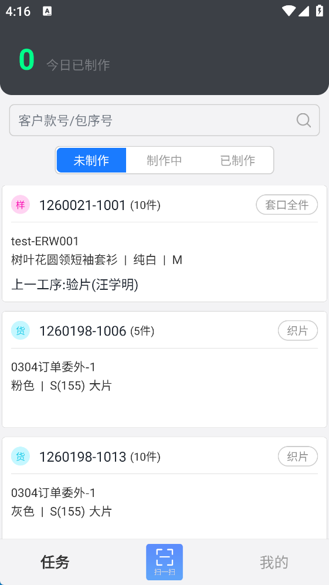<br/>
      <sub>Task list: today’s output, search, Not Started/In Progress/Completed tabs, bottom nav + Scan</sub>
    </td>
    <td align="center">
      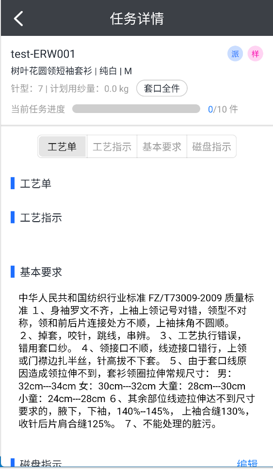<br/>
      <sub>Task detail: ID, spec, progress bar, Tech Pack/Process Instructions/Basic Requirements tabs, quality notes</sub>
    </td>
    <td align="center">
      <br/>
      <sub>My Profile: employee ID, On Duty, work log / messages / scan configuration / password, etc.</sub>
    </td>
  </tr>
</table>

### BI & Monitoring Dashboards

<table>
  <tr>
    <td align="center">
      <br/>
      <sub>Overall BI dashboard for factory KPIs</sub>
    </td>
    <td align="center">
      <br/>
      <sub>Web dashboard listing machines and status</sub>
    </td>
  </tr>
</table>

### Shop Floor Terminals

<table>
  <tr>
    <td align="center">
      <br/>
      <sub>Operator task list and completion progress</sub>
    </td>
    <td align="center">
      <br/>
      <sub>On-device numeric keypad for entering production data</sub>
    </td>
    <td align="center">
      <br/>
      <sub>Factory production terminal login screen</sub>
    </td>
  </tr>
</table>

### MOM Scenarios

<table>
  <tr>
    <td align="center">
      <br/>
      <sub>Quality management station with on-site terminals</sub>
    </td>
    <td align="center">
      <br/>
      <sub>Smart washer control UI with live hardware</sub>
    </td>
  </tr>
  <tr>
    <td align="center">
      <br/>
      <sub>Projector-assisted ironing station with size guidelines</sub>
    </td>
    <td align="center">
      <br/>
      <sub>Smart accessories cabinet workflow (login, open, statistics)</sub>
    </td>
  </tr>
  <tr>
    <td align="center">
      <br/>
      <sub>Mobile app for garment customization and 3D try-on</sub>
    </td>
    <td align="center">
      <br/>
      <sub>Design drawing of multi-compartment accessories cabinet</sub>
    </td>
    <td align="center">
      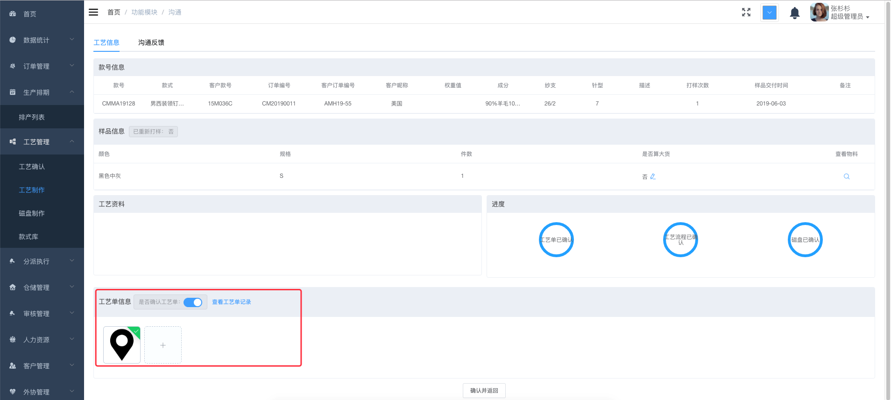<br/>
      <sub>Clothes design specification and production preview</sub>
    </td>
  </tr>
</table>

### Admin Web System

<table>
  <tr>
    <td align="center">
      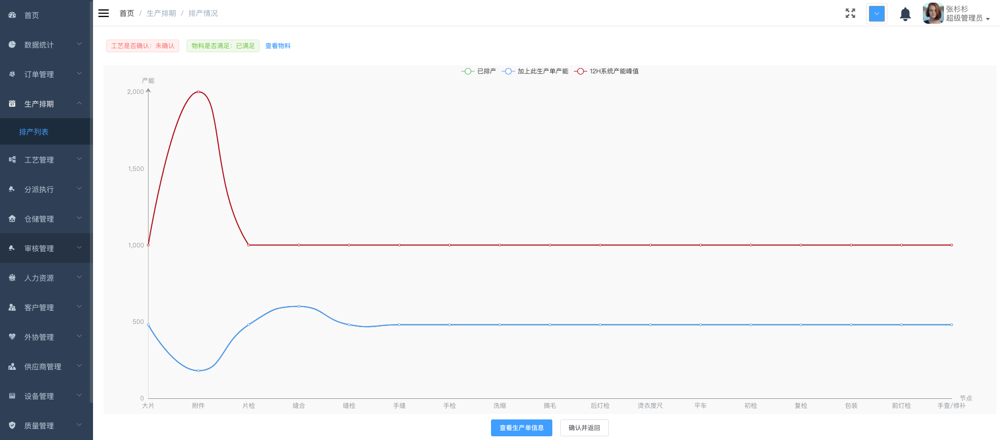<br/>
      <sub>Production scheduling dashboard with capacity analysis</sub>
    </td>
    <td align="center">
      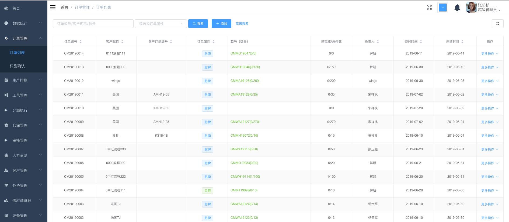<br/>
      <sub>Order management list with status tracking</sub>
    </td>
  </tr>
</table>

### Warehouse & Inventory

<table>
  <tr>
    <td align="center">
      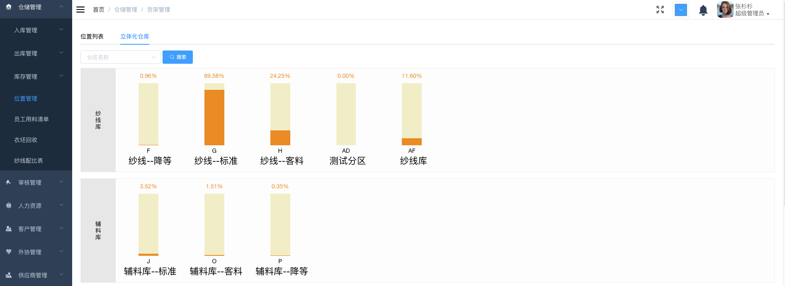<br/>
      <sub>Warehouse inventory tracking and material management</sub>
    </td>
  </tr>
</table>

### Factory Equipment & Production Line

<table>
  <tr>
    <td align="center">
      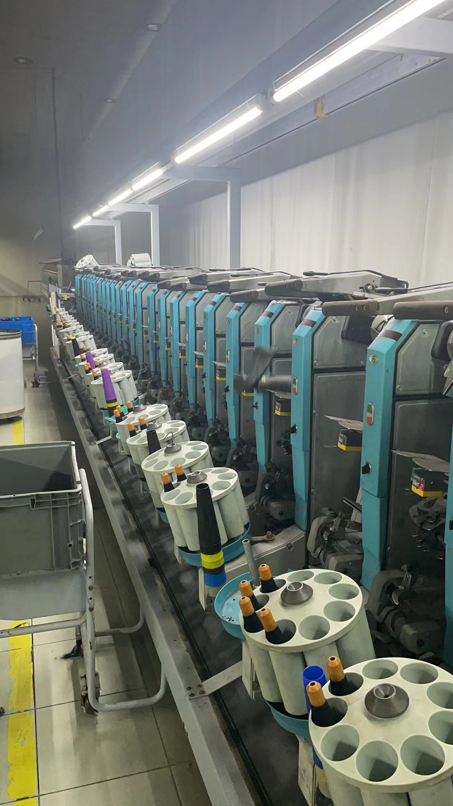<br/>
      <sub>Spinning frames on the production floor</sub>
    </td>
    <td align="center">
      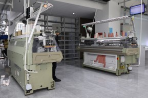<br/>
      <sub>Industrial knitting machines with worker</sub>
    </td>
    <td align="center">
      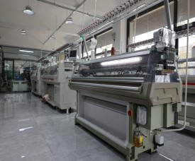<br/>
      <sub>Computerized weaving machine with control panel</sub>
    </td>
  </tr>
  <tr>
    <td align="center">
      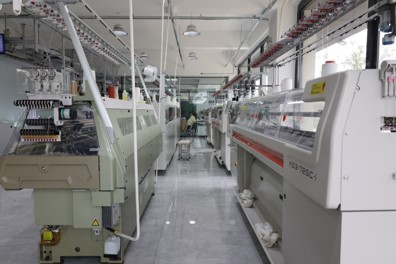<br/>
      <sub>Automated knitting machine production hall</sub>
    </td>
    <td align="center">
      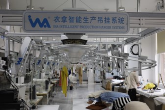<br/>
      <sub>Overhead garment hanging conveyor system</sub>
    </td>
    <td align="center">
      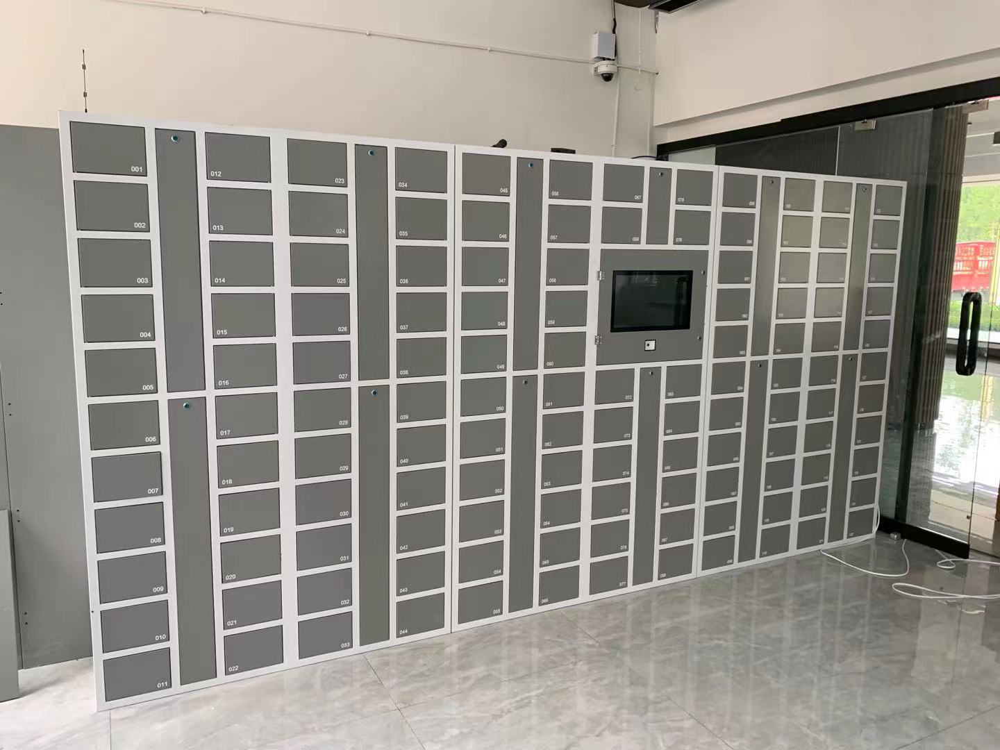<br/>
      <sub>Smart garment storage cabinet (indoor)</sub>
    </td>
  </tr>
  <tr>
    <td align="center">
      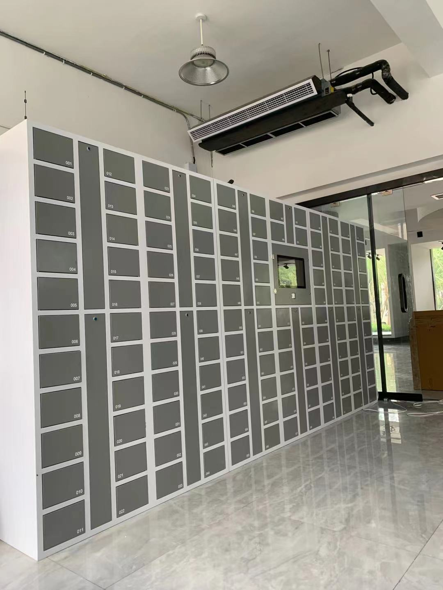<br/>
      <sub>Automated locker system with control screen</sub>
    </td>
  </tr>
</table>

### RFID Integration & IoT Devices

<table>
  <tr>
    <td align="center">
      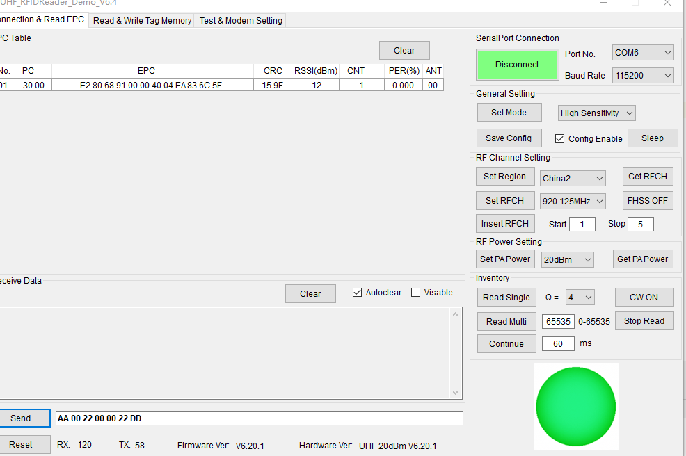<br/>
      <sub>UHF RFID Reader Demo desktop application</sub>
    </td>
    <td align="center">
      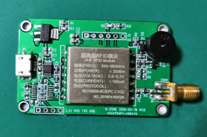<br/>
      <sub>UHF RFID module development board (PCB)</sub>
    </td>
    <td align="center">
      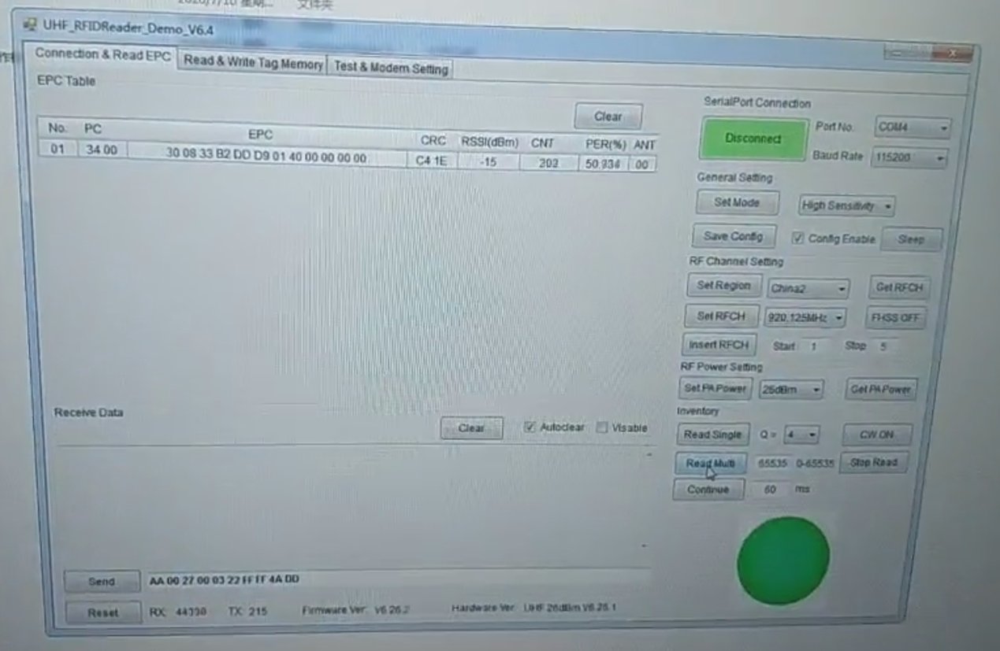<br/>
      <sub>USB device controller diagnostic tool</sub>
    </td>
  </tr>
  <tr>
    <td align="center">
      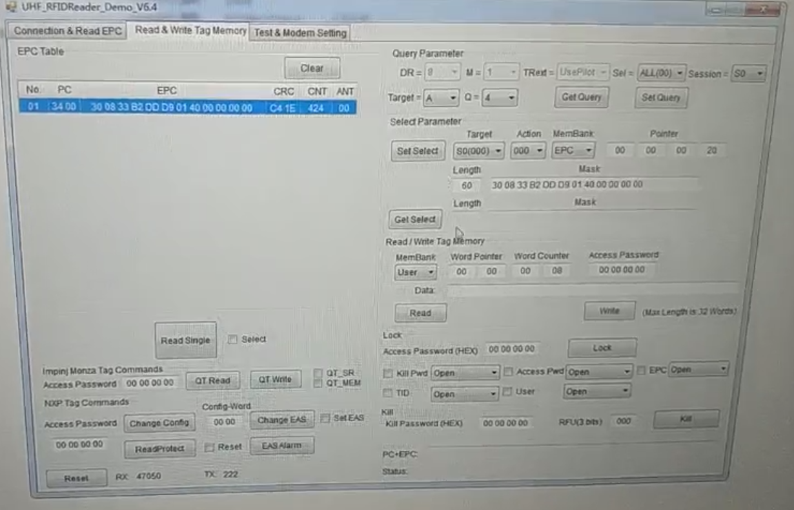<br/>
      <sub>RFID tag read/write LPC application</sub>
    </td>
    <td align="center">
      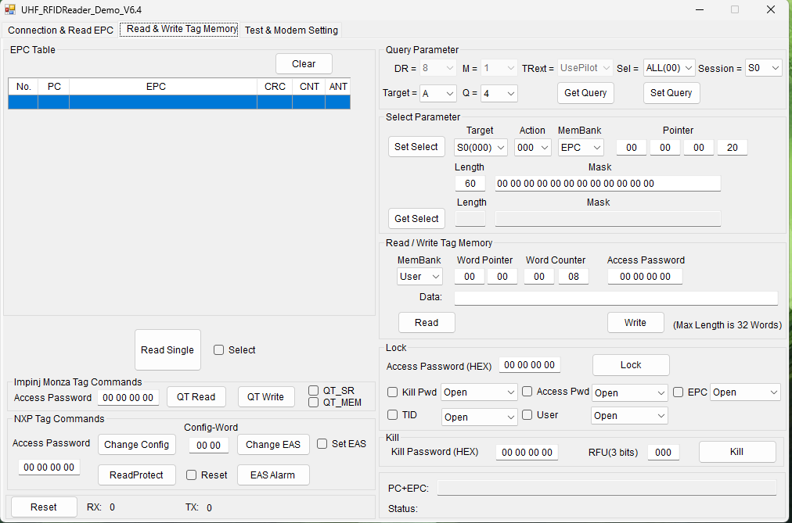<br/>
      <sub>RFID tag memory operations interface</sub>
    </td>
  </tr>
</table>

### Factory Planning & Quality

<table>
  <tr>
    <td align="center">
      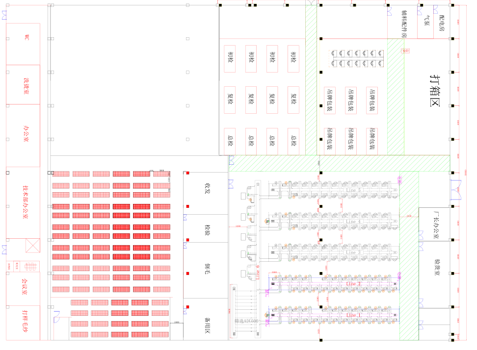<br/>
      <sub>Factory floor plan with IoT node placement</sub>
    </td>
    <td align="center">
      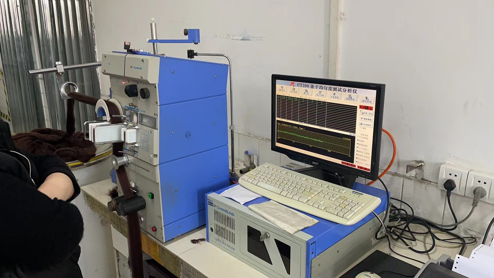<br/>
      <sub>Fiber uniformity quality testing station</sub>
    </td>
    <td align="center">
      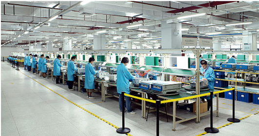<br/>
      <sub>Hanger node with IoT device on production line</sub>
    </td>
  </tr>
</table>

### Worker Tablet & Kiosk

<table>
  <tr>
    <td align="center">
      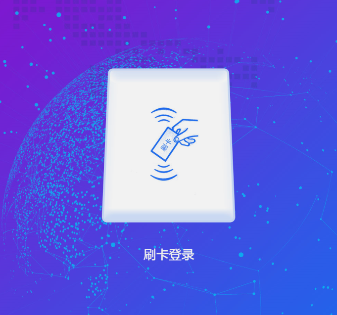<br/>
      <sub>Tablet card-based login screen</sub>
    </td>
    <td align="center">
      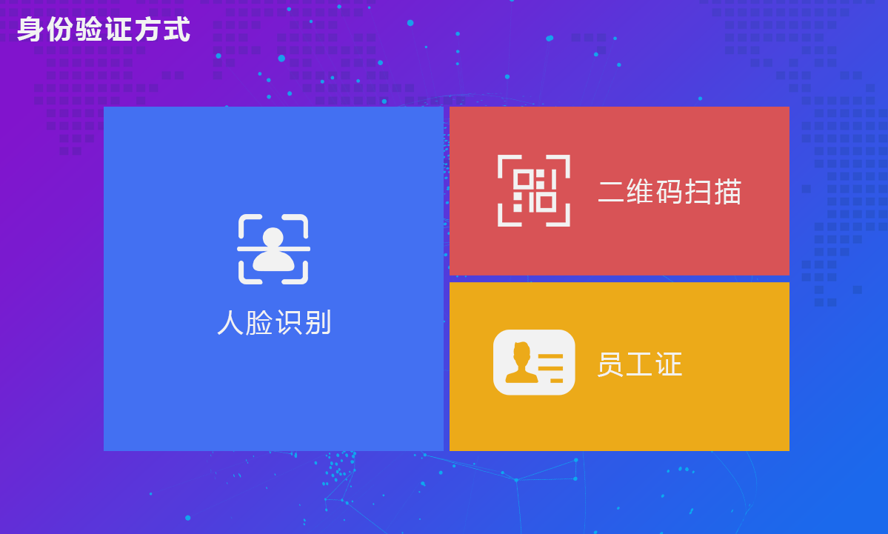<br/>
      <sub>Identity verification method selection (face/QR/ID)</sub>
    </td>
  </tr>
</table>

### Production Floor & Analytics

<table>
  <tr>
    <td align="center">
      <br/>
      <sub>Wide view of production floor with assembly line workstations</sub>
    </td>
    <td align="center">
      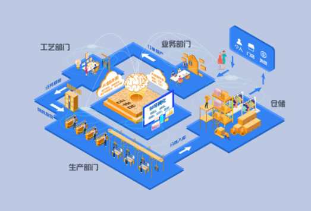<br/>
      <sub>3D isometric infographic of integrated enterprise operations system</sub>
    </td>
  </tr>
  <tr>
    <td align="center">
      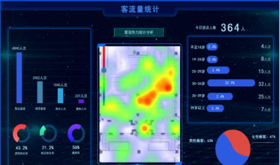<br/>
      <sub>Visitor flow analytics dashboard with heatmap and demographics</sub>
    </td>
  </tr>
</table>

---

## Skills Demonstrated

- **Backend Engineering:** Spring Cloud, microservices, REST APIs, ActiveMQ, Kafka
- **Database Design:** MySQL, Redis, MongoDB optimization
- **DevOps:** Docker, Jenkins, CI/CD, Linux administration
- **IoT Integration:** Hardware protocols, real-time processing
- **Industrial Data Acquisition:** Electronic scale serial communication (RS232/RS485)
- **Windows Services:** Process monitoring, fault recovery, and long-running device integration
- **Team Leadership:** Cross-functional team management, agile practices
- **System Architecture:** Scalable distributed systems design

---

**Tags:** #Java #SpringBoot #Microservices #IoT #DevOps #Docker #Jenkins #MySQL #Redis #TeamLeadership #ActiveMQ #Kafka
