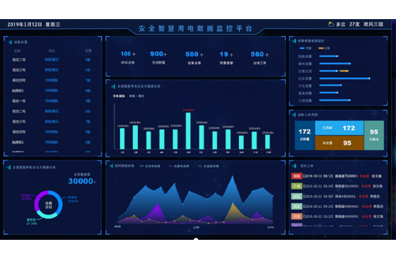
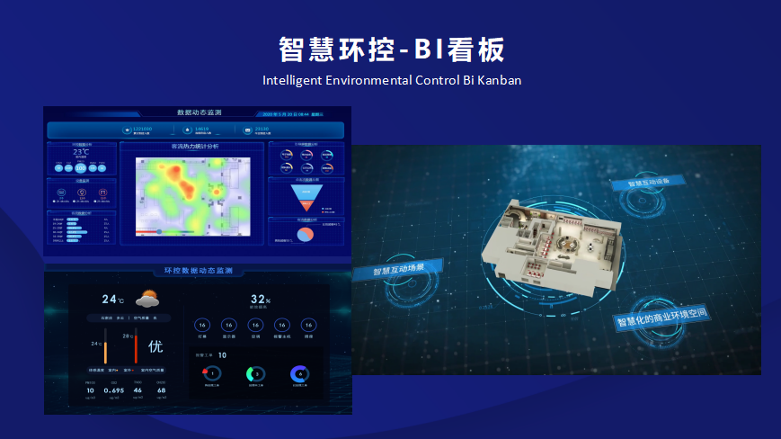
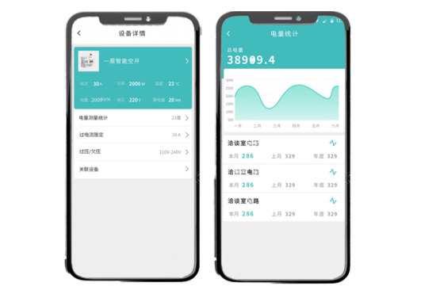
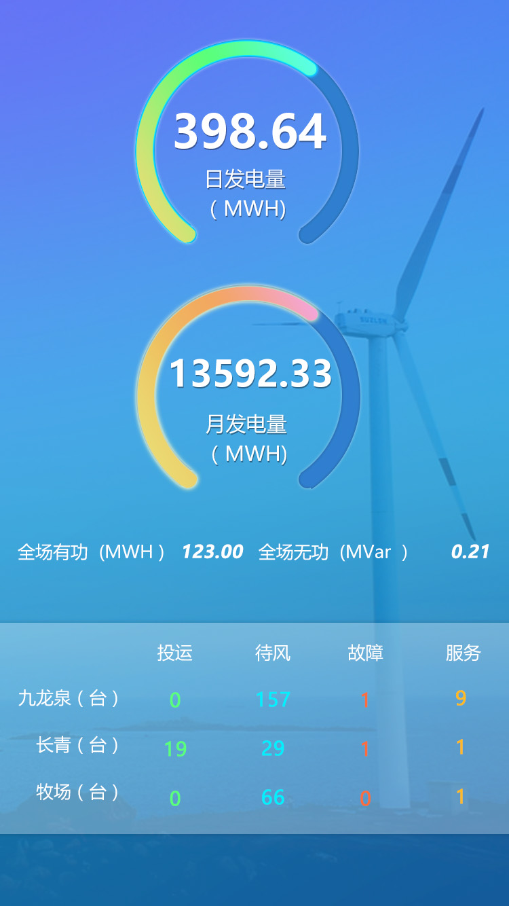
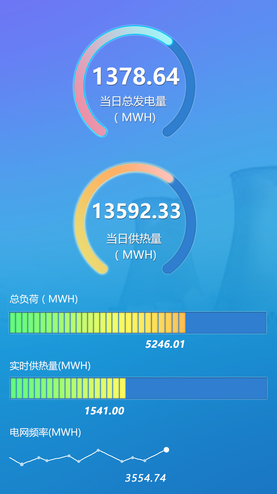
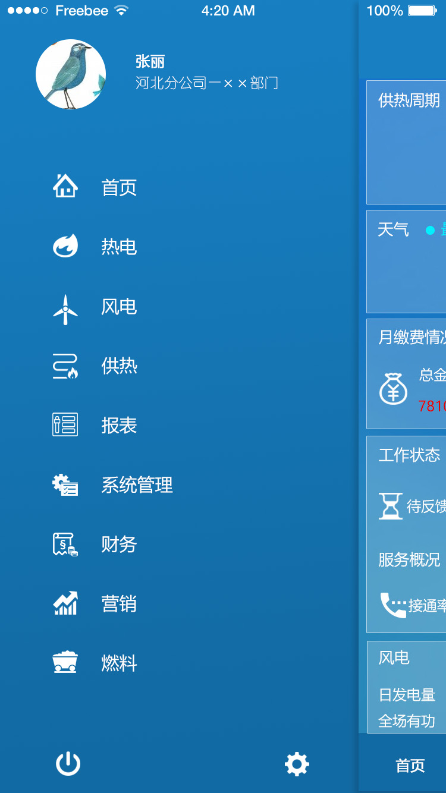
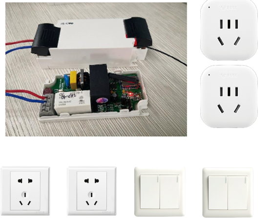

# Smart Power Management System > Enterprise power monitoring, energy analysis, and optimization for factories, buildings, and campuses. --- ## Overview Built a **smart power management platform** that connects **field devices, cloud services, web dashboards, and mobile apps** into one unified system. The platform provides real-time power data collection, energy analysis, alarm handling, and remote control, and exposes these capabilities as services to **factories, building managers, and campus operators** so they can monitor, analyze, and optimize energy usage collaboratively. **Project Type:** IoT / Energy Management / Industrial Automation **Timeline:** 2019 – 2022 **Role:** Full-stack Developer / System Architecture **Company:** Chunxiao Technology Co., Ltd., China --- ## Key Features - **Device onboarding platform:** Users can connect third-party smart switches, gateways, and meters to the cloud platform. - **Per-load monitoring:** View per-load current, voltage, power, energy, and other electrical parameters in real time. - **Remote control:** Switch loads on/off remotely, configure schedules, and apply control policies. - **Alarm & protection:** Configure thresholds and alerts for overload, leakage, over‑temperature, etc. - **Energy analysis:** Time-of-use stats, peak/valley analysis, consumption trends. - **Reporting:** Multi-dimensional reports with export for management and finance. - **Energy optimization:** Baseline comparison and optimization suggestions. - **Multi-tenant:** Multi-campus and multi-building hierarchy. - **Mobile:** App for real-time viewing and control. --- ## Device Access Flow 1. **Device Onboarding**: Users connect purchased smart gateways, smart switches, and smart meters to field distribution boxes, communicate with the gateway via RS485/Modbus, and securely access the cloud platform through the gateway. 2. **Automatic Discovery**: The platform automatically identifies and registers devices based on device addresses and models, creating digital profiles for each circuit/load. 3. **Real-time Monitoring**: Users can view key electrical parameters such as current, voltage, power, and energy for each load by building/floor/distribution box on web dashboards or mobile apps. 4. **Remote Control**: Remotely send switch commands, scene strategies, or scheduled tasks through the platform for unified control. 5. **Alarms & Policies**: Configure alarm thresholds and policies for different loads. When anomalies occur (such as overload, leakage, or high temperature), the platform pushes alarms and can automatically trip or shut down loads. --- ## Architecture ``` ┌─────────────────────────────────────────┐ │ Field Device Layer │ │ ┌────────┐ ┌────────┐ ┌──────────┐ │ │ │ Smart │ │Temp/ │ │Circuit │ │ │ │ Meters │ │Humidity│ │Breakers │ │ │ └───┬────┘ └────┬───┘ └────┬─────┘ │ │ ┌────────┐ ┌────────┐ ┌──────────┐ │ │ │Reactive│ │Harmonic│ │Leakage │ │ │ │Compens.│ │Monitor │ │Protection│ │ │ └───┬────┘ └────┬───┘ └────┬─────┘ │ └──────┼───────────┼──────────┼──────────┘ │ RS485 │ 4-20mA │ Modbus └───────────┴──────────┘ │ ┌──────────────────▼──────────────────────┐ │ Data Acquisition Gateway │ │ ┌─────────────────────────────────┐ │ │ │ - Modbus/RS485 protocol │ │ │ │ - Preprocessing & cache │ │ │ │ - Edge logic (thresholds) │ │ │ │ - Offline buffer & sync │ │ │ └─────────────────────────────────┘ │ └──────────────────┬──────────────────────┘ │ MQTT/HTTP ┌──────────────────▼──────────────────────┐ │ Cloud Platform │ │ ┌──────────┐ ┌──────────┐ ┌─────────┐ │ │ │ Data │ │ Analytics│ │ Alert │ │ │ │ Ingest │ │ Engine │ │ Center │ │ │ └──────────┘ └──────────┘ └─────────┘ │ │ ┌──────────┐ ┌──────────┐ ┌─────────┐ │ │ │ Reports │ │ Device │ │ User │ │ │ │ Service │ │ Mgmt │ │ Service │ │ │ └──────────┘ └──────────┘ └─────────┘ │ └─────────────────────────────────────────┘ ``` --- ## Technologies ### Hardware - **Smart meters** – Three-phase/single-phase multi-function - **Sensors** – Temperature, humidity, smoke - **Circuit breakers** – Smart breakers with remote control - **Reactive compensation** – Power factor correction - **Harmonic monitoring** – Power quality ### Protocols - **Modbus RTU/TCP** – Meter communication - **RS485** – Field bus - **MQTT** – IoT messaging - **DL/T645** – Power industry standard - **HTTP/REST** – APIs ### Backend - **Spring Cloud** – Microservices - **InfluxDB** – Time-series data - **MySQL** – Business data and config - **Redis** – Cache and real-time data - **RabbitMQ** – Message queue ### Data Processing - **Apache Flink** – Stream processing - **Elasticsearch** – Log and alert search - **Quartz** – Scheduled jobs ### Frontend - **Vue.js** – Admin UI - **ECharts** – Charts - **DataV** – Large-screen display - **UniApp** – Mobile app --- ## Key Achievements - ✅ **~15% energy reduction** – Via analysis and optimization - ✅ **<1s alerts** – Near real-time anomaly push - ✅ **99.9% collection rate** – Data completeness - ✅ **Multi-campus** – 3+ campuses under one platform - ✅ **Remote control** – Fast response to faults --- ## Responsibilities ### Architecture - Layered design (devices – gateway – platform) - Protocol and data format standards - High-throughput data pipeline - Alert rules and policy engine ### Gateway - Modbus/RS485 data collection - Edge computation and local alerts - Offline buffer and sync - Device discovery and auto-config ### Backend - Data ingestion and parsing - Real-time computation and aggregation - Alert engine and notifications - Report generation and export - Device management and remote control APIs ### Visualization - Energy dashboards and large screens - Real-time monitoring - Historical trends - Mobile app --- ## Challenges & Solutions ### Challenge 1: High Data Volume **Problem:** Thousands of meters, high-frequency data. **Solution:** InfluxDB time-series DB, tiered storage, hot/cold separation. ### Challenge 2: Real-Time Alerts **Problem:** Sub-second response to anomalies. **Solution:** Edge + cloud, multi-level alerts, message queue. ### Challenge 3: Device Compatibility **Problem:** Different meter vendors and protocols. **Solution:** Configurable protocol adapters for mainstream meters. ### Challenge 4: Data Accuracy **Problem:** Interference causing loss or errors. **Solution:** Validation, retry, anomaly cleaning. --- ## Results & Impact - **Energy savings** – ~15% average reduction, lower costs - **Safety** – Timely detection of overload, leakage, etc. - **Efficiency** – Remote reading replaced manual; ~80% efficiency gain - **Decision support** – Data-driven consumption strategy - **Sustainability** – Support for green/low-carbon goals --- ## Evidence ### Web ### Web & BI Dashboards / Web BI Dashboards <table> <tr> <td align="center"> <br/> <sub>Main smart power monitoring dashboard with multi-area KPIs</sub> </td> <td align="center"> <br/> <sub>Environmental control BI kanban (heatmap + 3D scene)</sub> </td> </tr> </table> ### Mobile App <table> <tr> <td align="center"> <br/> <sub>Mobile app for device details and energy statistics</sub> </td> </tr> </table> ### Extended Monitoring Dashboards <table> <tr> <td align="center"> <br/> <sub>Wind farm monitoring: daily/monthly generation and turbine status</sub> </td> <td align="center"> <br/> <sub>Utility monitoring: power generation, heat supply, grid frequency</sub> </td> </tr> </table> ### Mobile App Navigation <table> <tr> <td align="center"> <br/> <sub>Mobile app navigation menu with module categories and status cards</sub> </td> </tr> </table> ### Electrical Hardware <table> <tr> <td align="center"> <br/> <sub>Electrical hardware: power adapter, outlets, and toggle switches</sub> </td> </tr> </table> --- ## Skills Demonstrated - **IoT acquisition:** Modbus, RS485, smart meters, sensors - **Time-series DB:** InfluxDB, data modeling, query optimization - **Stream processing:** Apache Flink, aggregation - **Backend:** Spring Cloud, microservices, high concurrency - **Visualization:** ECharts, DataV, dashboard design - **Mobile:** UniApp, cross-platform --- **Tags:** #IoT #EnergyManagement #SmartMeters #Modbus #InfluxDB #Analytics #IndustrialAutomation 