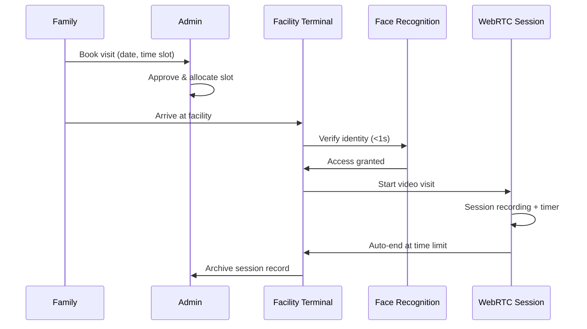

# Visit Booking & Access Management System

> Android terminal app + admin backend for prison inmate-family video visitation — WebRTC sessions with strict time limits and compliance recording

## Visit Lifecycle



## Overview

Prison visitation system. Prisons prohibit personal mobile phones, so the system provides an **Android terminal app running on facility-managed devices** for inmates to participate in video visits with family. Families book visit time slots in advance; prison staff approve via admin backend. WebRTC handles the real-time audio-video with session lifecycle management (create, join, leave, timeout) and compliance recording. Face recognition verifies visitor identity at facility entry.

## Context

- **Timeline**: 2020 – 2022
- **Role**: Full-stack Engineer
- **Client**: Prison facilities
- **Key Constraint**: No personal devices — all inmate-side interaction through facility-managed Android terminals

## Core System

| Component | Technology |
|-----------|-----------|
| Android Terminal App | Java/Kotlin, Face Recognition SDK, WebRTC client |
| Admin Backend | Spring Cloud, MySQL, Redis |
| Video Sessions | WebRTC (create/join/leave/timeout/recording) |
| Access Control | Face recognition + electromagnetic locks |

## Workflow

```
Family Books Visit → Admin Approves → Time Slot Allocated
    → Inmate Uses Facility Android Terminal → WebRTC Video Session Starts
    → Auto-end at Time Limit → Session Record Archived for Audit
```

## Key Features

- Android terminal app on facility-managed devices (no personal phones)
- Admin booking approval with time slot and quota management
- WebRTC real-time audio-video sessions with strict duration control
- Face recognition access control for visitor verification
- Audit trails and visit statistics for prison administration

## Key Numbers

| Metric | Detail |
|--------|--------|
| Face Recognition Speed | Sub-second (<1s) |
| Recognition Accuracy | 99.5% |
| Efficiency Improvement | 30% faster visit management |
| Deployment | Multiple prison departments |

## Challenges

- **No personal devices**: All inmate-side interaction required facility-managed Android terminals. Each session needed a clean start — logout previous user, clear local state, initialize a fresh WebRTC session.
- **Strict time enforcement**: Visits had fixed duration with server-side timer enforcement — 1-minute warning, 10-second countdown, then forcibly terminate the peer connection from the server side.
- **False rejection at the gate**: False rejections block real visitors and create confrontation. Mitigated by tuning recognition thresholds conservatively, providing QR code fallback with manual guard verification, and logging confidence scores for borderline case review.

## Achievements

- Sub-second face recognition (99.5% accuracy)
- 30% improvement in prison visit management efficiency
- Supported remote video visitation during pandemic period
- Complete visit lifecycle: booking → approval → video session → audit

**Tags:** #PrisonVisitation #WebRTC #FaceRecognition #Android #SpringCloud #AccessControl
